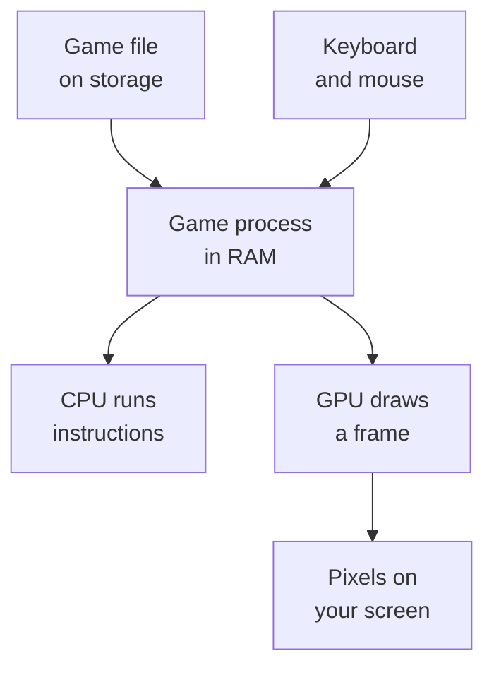

## The five parts we care about

A computer can look complicated, but this course mostly follows data through five places:

| Part | Plain-English job |
|---|---|
| Storage | Keeps files when the power is off |
| RAM | Holds the programs and data being used right now |
| CPU | Follows tiny instructions very quickly |
| GPU | Turns 2D and 3D data into pixels |
| Operating system | Helps programs use the hardware safely |


When you launch a game, the operating system copies its code and data from storage into RAM. The CPU begins running its instructions. The GPU draws frames. Your keyboard and mouse provide input. This repeats many times each second.



> Use the memory ladder: persistent storage holds files, RAM holds active pages,
> caches keep recently used blocks near the CPU, and registers hold the values an
> instruction is using now. Each layer trades capacity for access time.
{: .block-tip }

## Launching is a chain of handoffs

“Windows runs the EXE” hides several useful steps. A more accurate beginner model
is:

1. Windows creates a process and its virtual address space.
2. The loader maps the executable and the DLLs it depends on into that address
   space.
3. Windows prepares the main thread, its stack, and the program's starting
   register state.
4. The CPU fetches machine-code bytes from the mapped code pages and begins at
   the entry point.
5. The game asks Windows and its libraries for files, input, timers, sound, and
   graphics services.
6. The game update turns input and old state into new state; rendering commands
   turn that state into a frame.

The entry point is not necessarily the source-level `main` function. Loader and
language-runtime startup code may initialize libraries, thread-local state, security
features, and global objects before calling the programmer's main function. On exit,
other runtime code may run after `main` returns. When a debugger stops at the image
entry point, seeing startup machinery instead of gameplay code is expected.

“Maps” is more precise than “copies everything.” Windows can bring file-backed
pages into physical RAM when they are first needed. Likewise, a game can load a
map or texture later instead of reading every asset before the title screen appears.

Each handoff leaves different evidence. Process tools show the EXE and DLLs,
debuggers show instructions and threads, memory tools show live data, file tools
show asset and save access, and graphics tools show rendering commands. Reverse
engineering becomes easier when you first decide **which boundary could contain
the answer**.

```text
disk file -> mapped module -> instruction -> game state -> draw command -> pixel
               ^                  ^              ^
             loader            debugger      memory tool
```

## The CPU speaks in small steps

A CPU does not understand “move the knight” as one idea. It understands smaller instructions such as:

- move a value;
- add two values;
- compare two values;
- jump to a different instruction;
- read from or write to memory.

Registers are tiny storage spots built directly into the CPU. They are like the values currently in the CPU’s hands. In this x86-64 example, `eax` is a register:

```nasm
mov eax, 5
add eax, 4
```

After these instructions run, `eax` contains `9`.


{: .diagram-on-dark }

The CPU rarely waits for every value to travel all the way from ordinary RAM.
Modern computers keep recently used code and data in small **caches** close to the
CPU. The useful model is a ladder: registers are smallest and closest, then caches,
then RAM, then persistent storage. Capacity generally grows as you move down;
access time generally grows too.

This explains why two pieces of code that perform the same number of additions can
run at different speeds. Code that repeatedly touches nearby bytes often reuses
cached data. Code that jumps through scattered pointers may spend more time waiting
for memory. For this course, correctness comes first, but the memory-access pattern
helps explain why games store many similar entities in arrays and why scanners read
large bounded chunks instead of one byte at a time.

## One thread looks ordered even when the CPU overlaps work

The simple fetch-decode-execute story describes the visible contract, not every
internal circuit. A modern CPU can have several instructions in progress, predict a
branch, and begin independent work early. It must still **retire** instructions so
the thread's architectural state—registers, memory effects, and exceptions—matches
the allowed program order.

This distinction matters when reversing optimized code. The assembly listing tells
you the architectural operations the program depends on; it is not a clock-by-clock
diagram of the processor. For one thread, trace register and memory dependencies.
For several threads, also account for synchronization and memory-ordering rules,
because another core may observe shared writes at a different time.

## A high-level language groups those machine steps

Writing every instruction by hand would be exhausting. At source level, the same operation becomes a compact expression:

```rust
fn add_one(number: i32) -> i32 {
    // 🧠 The last expression becomes the return value; no `return` is needed.
    number + 1
}

fn main() {
    let starting_score = 8;
    let final_score = add_one(starting_score);

    println!("Score: {final_score}");
}
```

Read it from top to bottom:

1. `fn` creates a function—a named group of instructions.
2. `number: i32` means the input is a 32-bit signed integer.
3. `-> i32` means the function returns the same kind of integer.
4. `let` creates a value with a name.
5. `println!` prints text.

The compiler turns this into machine instructions for the CPU. A reverse engineer often travels in the other direction: start with machine instructions and work out the idea they represent.

## Branches are choices

Games constantly make decisions: Is the player alive? Did a shot hit? Is this unit visible? A choice can look like this:

```rust
fn change_score(score: i32, should_add: bool) -> i32 {
    // 🎯 Only one branch runs, so the function produces exactly one result.
    if should_add {
        score + 1
    } else {
        score - 1
    }
}
```

At the machine level, the CPU usually implements that `if` with a comparison and a conditional jump. You will see those instructions again in the assembly lessons.

## Binary and hexadecimal

People usually count in base 10. Computers store bits, and each bit is either `0` or `1`, so binary is base 2. Reverse-engineering tools often display hexadecimal, or base 16, because one hex digit neatly represents four bits.

| Decimal | Binary | Hexadecimal |
|---:|---:|---:|
| 5 | `0101` | `0x5` |
| 10 | `1010` | `0xA` |
| 16 | `1 0000` | `0x10` |
| 255 | `1111 1111` | `0xFF` |

The language accepts all three forms:

```rust
let decimal = 255_u32;
let binary = 0b1111_1111_u32;
let hexadecimal = 0xFF_u32;

// ✅ Different spellings, identical stored value.
assert_eq!(decimal, binary);
assert_eq!(binary, hexadecimal);
```

The underscores are only visual separators. They make long numbers easier to read.

## Processes and memory

An operating system gives each running program a **process**. A process has its own virtual address space: a numbered map where code and data live. An address such as `0x7FF6_1234_1000` is simply a location on that map.

Games are normal processes. Their health, gold, positions, and menus eventually become instructions or data in memory. Game hacking is the study of finding the right piece, understanding it, and changing it in a controlled lab.

This is the short introduction. [How Memory Actually Works]({{ site.baseurl }}/pages/1/03/)
builds the complete picture of RAM, virtual addresses, pages, modules, stacks,
heaps, layouts, pointers, offsets, lifetimes, and cross-process snapshots.

## Bits become meaning only when code interprets them

Computer memory does not contain labels such as “gold” or “player X.” It only
contains bits grouped into bytes. A **bit** is one `0` or `1`; a **byte** is
eight bits. The same four bytes can mean very different things:

```text
bytes: FF FF FF 3F

as an unsigned whole number: 1,073,741,823
as a signed whole number:   1,073,741,823
as a 32-bit float:          about 1.9999999
as four characters:         mostly non-printable data
```

The bytes do not announce which answer is right. The instruction that uses
them supplies the meaning. If an x86 instruction performs floating-point
addition, that is evidence for a float. If the game subtracts an integer unit
price, that is evidence for a whole-number resource.

This is a central computer-science idea: **data is a representation**. A model
connects raw bits to a useful meaning, and experiments test whether the model
is correct.

## A process is a protected container

Windows gives each process its own **virtual** address space. “Virtual” means
the address is part of a map managed by the operating system, not a label
printed on a physical RAM chip. Windows and the CPU translate that virtual
address to a physical location when the program accesses it.

The map is divided into pages. Each page has rules such as readable, writable,
or executable:

| Page rule | Why a game needs it |
|---|---|
| Readable | Code can look at player data or constants |
| Writable | Code can update health, positions, and state |
| Executable | The CPU may run machine instructions from it |
| Guard/no access | Windows blocks or reports an unexpected access |

Those rules explain why `ReadProcessMemory`, `WriteProcessMemory`, and
`VirtualProtect` exist. Our programs do not magically reach through a wall;
they request a checked operation through a process handle with matching access
rights.

## Processes contain threads

A **thread** is one path of instructions being executed. A game may have a main
thread for its update loop, another for audio, and others for loading or
networking. Threads in one process share its memory, but each thread has its
own instruction pointer, registers, and stack.

That explains three later lessons:

- a debugger pauses because Windows reports an event from one particular thread;
- a code cave must preserve the registers and stack that thread was using;
- an internal game function may fail when called from the wrong thread, even if
  its address and arguments are correct.

## Code is a precise language, not a spell

A programming language has **vocabulary** and **grammar**. Keywords such as
`fn`, `let`, and `if` are part of Rust's vocabulary. Braces, parentheses,
commas, and operators are part of its grammar, which programmers call
**syntax**.

Some symbols feel familiar. `3 + 2` resembles a calculator. But the language
and the types still decide what a symbol means. `+` can add numbers or combine
some custom types; it does not mean “plus” in every possible program.

A **function** is a named operation. Thinking of it as a game command can help
at first: provide the required input, run the operation, and receive a result.
Unlike a secret button sequence, however, a function has an exact contract:
its input types, output type, possible errors, and side effects all matter.

You can write your own functions, combine small functions into larger ones,
and use functions supplied by a module or crate. That is how a low-level
Windows call eventually becomes a friendly method such as
`process.read_u32(address)`.

When unfamiliar code will not “read like English,” use this ladder:

1. Say its intended job in one plain sentence.
2. Trace where each important value comes from.
3. Follow every choice and early return.
4. Predict the output, state change, or error.
5. Run a small test or pause in a debugger and compare the evidence.

Clear names make the first step easier, but names can be vague or wrong. You
understand the code when you can predict its behavior and boundaries, then
check that prediction—not merely when the sentence sounds readable. 🔍

## Programs are layers of abstraction

An **abstraction** hides details behind a smaller idea. A wrapper lets us say
`process.read_u32(address)` instead of repeating a Windows call, pointer casts,
buffer lengths, and error checks every time. The details still exist; they are
placed in one small, reviewable boundary.

Good low-level code moves between layers without confusing them:

```text
game idea       gold decreases when a unit is recruited
data model      a 32-bit whole number inside a side record
machine action  add/subtract an integer at [register + offset]
operating system read or write bytes in a process
hardware        CPU loads, changes, and stores bits
```

The book will walk down and back up this ladder for every real hack.

## Checkpoint

You are ready to continue if these sentences make sense:

- A game is copied into RAM and run as a process.
- The CPU follows small instructions.
- Source code is translated into those instructions.
- Hexadecimal is a compact way to write binary values.
- A memory address is a location, not the value stored there.
- Bytes gain meaning from the code and data model that interpret them.
- A process may contain several threads that share memory.

{% include quiz.html
  id="bytes-get-meaning"
  type="multiple-choice"
  title="Connect bytes to meaning"
  prompt="A debugger shows the four bytes `64 00 00 00`. What tells you whether they mean health, a color, part of an instruction, or something else?"
  options="The hexadecimal digits by themselves||The code and data model that use those bytes||The amount of RAM in the computer||The folder containing the game"
  answer="1"
  explanation="Bytes are only stored patterns. Their meaning comes from how an instruction reads them, the type and byte order the program expects, and the surrounding game data model. The same four bytes can be interpreted in several valid ways."
%}
