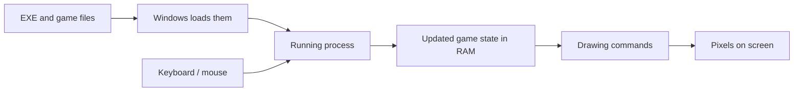

When you run a game, several parts of the computer work together. You do not
need to memorize every hardware detail yet. You need to know which part stores
the game, which part runs instructions, and which part holds the changing game
state.

## The main parts involved

| Part | What it does while a game runs |
|---|---|
| storage drive | keeps the game files when the game is not running |
| RAM | holds code and data the running game needs soon |
| CPU (central processing unit) | executes instructions that update the game |
| GPU (graphics processing unit) | turns drawing commands into pixels on the screen |
| input devices | send keyboard, mouse, or controller events |

The operating system coordinates these parts. On this course that operating
system is Windows.

## What happens when you start a game

Suppose you double-click `wesnoth.exe`:

1. Windows reads the executable file from storage.
2. Windows creates a **process**, which is one running instance of the game.
3. The process receives its own virtual address space and operating-system
   resources.
4. Windows loads the game's code and required DLLs into memory.
5. A thread begins executing the game's startup instructions.
6. The game creates windows, loads assets, and enters its main loop.

An executable file and a process are not the same thing. The file is stored
bytes. The process is the running state created from those bytes.



## The game loop repeats while you play

Most games repeatedly do three broad jobs:

1. read input and incoming events;
2. update the game state;
3. draw or submit the next frame.

Real engines divide those jobs into many systems, and some systems run at
different rates. The simple loop is still useful because it tells you where to
ask questions:

- input problem — did the game receive the event?
- state problem — did the simulation update the value?
- drawing problem — did the renderer show the current state?

Changing a value used only for drawing may change what you see without changing
the simulation. Later lessons will show how to tell those copies apart.

## The CPU executes instructions

An **instruction** is one small operation the CPU can execute. An instruction
might copy a value, add two numbers, compare values, or jump to another part of
the code.

Source code groups many small CPU operations into names humans can understand:

```rust
fn can_buy(gold: u32, cost: u32) -> bool {
    gold >= cost
}
```

Read it directly:

- `fn can_buy` defines a function named `can_buy`;
- it receives `gold` and `cost`;
- both are non-negative 32-bit integers;
- `-> bool` means the answer is `true` or `false`;
- `gold >= cost` performs the comparison.

The compiler translates this function into instructions for the target CPU.
Chapter 2 teaches how to read those instructions in assembly.

## RAM holds the changing state

During a match, values such as health, gold, position, and the current map must
be available quickly. The game keeps active values in RAM.

RAM is temporary. Its contents do not survive a normal power-off. A save file
is different: the game deliberately encodes selected state and writes it to
storage.

A location in memory has an **address**. The address answers “where?” The bytes
stored there answer “what pattern is present?” The code that reads those bytes
decides what that pattern means.

For example, the bytes `64 00 00 00` represent the integer 100 when read as a
32-bit number on an x86 machine, which stores the smallest-valued byte first.
The next lesson works through that ordering. The same four bytes could be part
of something entirely different if the program reads them using another type.
Bytes do not contain labels such as “health” or “gold.” Meaning comes from the
code that reads them and from the data around them.

## A process contains one or more threads

A **process** owns an address space and resources such as handles and loaded
modules. A **thread** is an execution path inside that process.

A game may use different threads for rendering, audio, file loading, or network
work. Threads in the same process share the same memory, which is what makes
them useful and also what makes them awkward to observe.

This matters the first time you pause a game. When a Windows debugger breaks,
it normally suspends every thread in that process, so the game really does hold
still. But “still” has limits. The pause ends the instant you continue, and
anything outside that process — a game server sending an update, another
program, a device — was never suspended at all. A value you read while paused
is a fact about one moment, not a fact that stays true.

You only need this distinction for now:

- process = the running game's resources and memory;
- thread = one path currently executing the game's instructions.

## Binary and hexadecimal are ways to write numbers

Computers store information as bits. A **bit** is either 0 or 1. Eight bits make
one **byte**.

Writing long bit patterns is inconvenient, so debuggers commonly show
**hexadecimal** numbers. Hex uses sixteen digits: `0` through `9`, then `A`
through `F`.

```text
decimal 15 = hexadecimal F
decimal 16 = hexadecimal 10
decimal 255 = hexadecimal FF
```

Hexadecimal is not chosen for elegance. It is chosen because sixteen is two
multiplied by itself four times, so one hex digit stands for exactly four bits
and two hex digits stand for exactly one byte:

```text
bits   1111 1111
hex       F    F     ->  0xFF, one byte
```

That fixed relationship is what makes hex readable in a debugger. Written as
`0xFF` you can see one whole byte at a glance. Written as decimal 255 the byte
boundary is invisible, and a number like decimal 4096 gives no hint that it is
a round figure in memory terms, while the same value written `0x1000` obviously
is.

The prefix `0x` tells you a number is written in hex, so `0xFF` means decimal
255. Hex does not create a different value; it is another way to write the same
number.

Do not stop to memorize conversion tables. Learn to recognize `0x`, and use a
calculator while the notation becomes familiar.

## Software is built in layers

Your code can call a library. The library can call a Windows **API** — an application programming interface, meaning the set of functions Windows offers and the rules for calling them. Windows can
ask a driver to communicate with hardware. Each layer offers the layer above it
a simpler set of operations and hides the details of the layer below it.

A single key press passes through several named layers before your code sees an
answer:

```text
your code               "is the F1 key currently down?"
  -> user32.dll         GetAsyncKeyState
    -> Windows kernel   input handling
      -> keyboard driver
        -> the physical keyboard
```

Every arrow in that list is a place where the answer can be produced, delayed,
filtered, or supplied by something other than a real key press. Knowing the
layers is what lets you say *which* arrow your observation actually came from.

That structure matters because a bug or observation belongs to a particular
layer. If a window message arrives but the game ignores it, the input reached
the window-message layer; that does not prove the game's device-input system
accepted it. Later lessons follow these boundaries directly.

## Checkpoint

You should now be able to explain:

- the difference between a game file and a running process;
- how storage, RAM, the CPU, and the GPU contribute to a frame;
- what a CPU instruction is;
- why an address and the value stored there are different;
- the difference between a process and a thread;
- why debuggers use hexadecimal.
