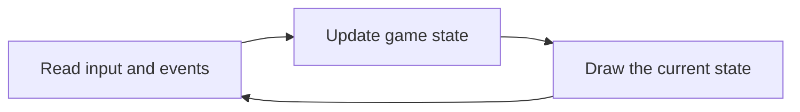

A game must remember what exists and what is happening now. That information is
the game's **state**: player health, unit positions, inventory items, current
animation, map tiles, score, and thousands of other values.

The code updates that state. The renderer and user interface read parts of it to
show you a frame.

## The game loop reads, updates, and draws



Real engines have more stages and may use several threads, but this order gives
you three separate questions:

1. What input or event entered the game?
2. Which state changed because of it?
3. Which state did the renderer or interface display?

Those questions prevent you from assuming that a number on screen is the one
the simulation uses.

## Related values are grouped into records

Values that describe one thing are often stored together. In source code, that
record might look like this:

```rust
#[derive(Debug, Clone)]
struct Player {
    id: u32,
    health: u32,
    max_health: u32,
    position: [f32; 3],
    team: u8,
}
```

Each named value is a **field**. The whole `Player` value is one record.

The game can then store many records in a collection:

```rust
let players: Vec<Player> = Vec::new();
```

This source-level view is useful, but a compiled game does not store field names
beside the bytes. Reverse engineering recovers the likely record from field
offsets, access patterns, and behavior.

## The same game state can use different memory layouts

One engine may keep every player's fields together:

```text
[player 0: id health position team]
[player 1: id health position team]
[player 2: id health position team]
```

Another may keep each kind of field in its own array:

```text
ids:       [id0 id1 id2]
health:    [h0  h1  h2 ]
positions: [p0  p1  p2 ]
teams:     [t0  t1  t2 ]
```

An entity-component system may store position, health, and rendering components
in separate pools connected by an entity ID.

Engines choose between these for a practical reason. The first layout keeps one
player's fields side by side, which suits code that handles one player at a
time. The second keeps each field's values side by side, which suits code that
sweeps across every player touching only one field: a physics step that reads
positions and ignores everything else moves far less unrelated data through the
CPU's cache. You cannot tell which choice an engine made by staring at a single
value. You can tell by looking at what sits immediately around it and by
watching which addresses one instruction visits as a loop repeats.

These layouts describe the same ideas differently. Do not force the first
layout onto evidence that shows the second. Follow the instructions that read
the values.

## Identity, address, and lifetime answer different questions

Suppose an enemy object is currently stored at address `0x5000`.

- **Identity:** which enemy is this?
- **Address:** where are its bytes right now?
- **Lifetime:** during which time is that address still the same enemy?

Games often reuse memory. After one enemy disappears, a new enemy may later use
address `0x5000`. The address stayed the same while the identity changed.

Many engines solve this with a **handle** made from an index plus a generation
number. The index chooses a slot, and the generation is a counter that goes up
every time that slot is reused. Code compares the generation carried by the
handle against the generation currently sitting in the slot:

```text
handle {slot: 12, generation: 3}    slot 12 holds generation 3    -> accepted
    ... that enemy dies, and slot 12 is reused for a new enemy ...
handle {slot: 12, generation: 3}    slot 12 holds generation 4    -> rejected
```

Notice what the stale handle points at: a real, living object at a valid
address. Nothing about the memory looks broken. The generation mismatch is the
only thing that reveals this is not the object the holder meant. That idea is
worth copying into your own tools — when you record an object, record something
that proves which object it is, not only where it was.

## Rules are relationships that must remain true

A single value can look reasonable while the whole object is impossible. Useful
relationships include:

```text
0 <= health <= max_health
inventory_count <= inventory_capacity
entity_generation matches slot_generation
position coordinates are finite numbers
```

Such a rule is called an **invariant** when valid game state must keep it true.

Checking a relationship is stronger than checking one field, because a single
field can rarely look wrong on its own. A health of 80 is entirely plausible —
until you read `max_health` from the same object and find 60. Each number is
believable by itself; together they prove the pair did not come from one valid
object. In practice that is how you discover that an offset is wrong, that a
structure shifted in a newer game build, or that you accidentally read two
fields from two different objects.

## A displayed value may be a copy

One idea can exist in several places:

- the simulation's current health;
- a cached copy prepared for rendering;
- text such as `"Health: 80"`;
- a previous value used for animation;
- a network prediction waiting for confirmation.

If you change a display copy, the number on screen may change while damage rules
still use the simulation value. If you change a previous-frame copy, the change
may vanish immediately.

To identify a field, observe both reads and writes:

- which code writes it when the game changes;
- which code reads it before an important decision;
- whether the value survives another update;
- whether related invariants still hold.

## Data processing depends on shape

Before writing code that processes game data, ask:

1. Is there one item or a collection?
2. Does order matter?
3. Does each item have named fields?
4. Do items form parent/child or graph relationships?
5. Can the collection change while it is being read?

The answers guide your choice of data structure and algorithm. A list of
players, a tile grid, a tree of scene nodes, and a network of waypoints should
not all be processed as if they had the same shape.

## Single-player and multiplayer can have different owners

In a single-player game, the local process often owns the state used to decide
the result.

In a multiplayer game, the local client may keep a predicted copy while a server
owns the official shared state. Changing the local copy can affect one screen
without changing what the server accepts.

The technical question is not simply “where is the number?” It is “which system
uses this value to make the decision I care about?”

## A practical checklist

When you inspect game data, ask:

1. What object or collection does this value belong to?
2. What type and field layout fit the observed instructions?
3. Which code writes the value?
4. Which code reads it before a decision or draw?
5. What identifies the object if its address is reused?
6. Which relationships should always remain true?
7. Is this the deciding state, a cache, a display copy, or a prediction?

Later chapters answer these questions with breakpoints, memory snapshots,
object-layout recovery, rendering traces, and network captures.
