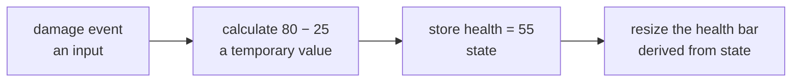
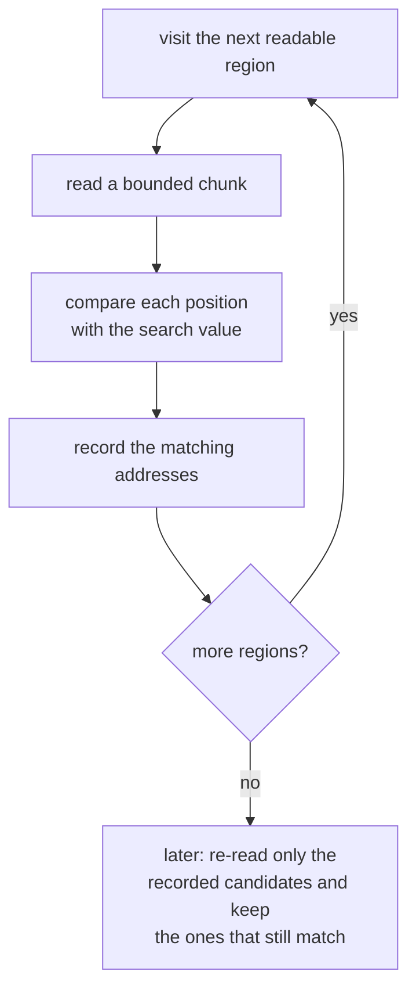
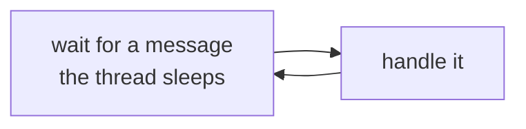
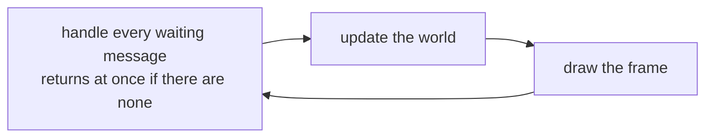
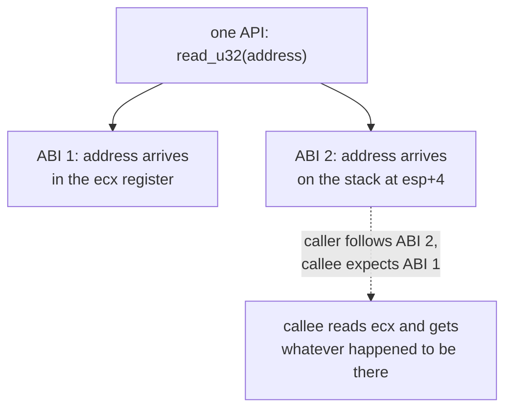
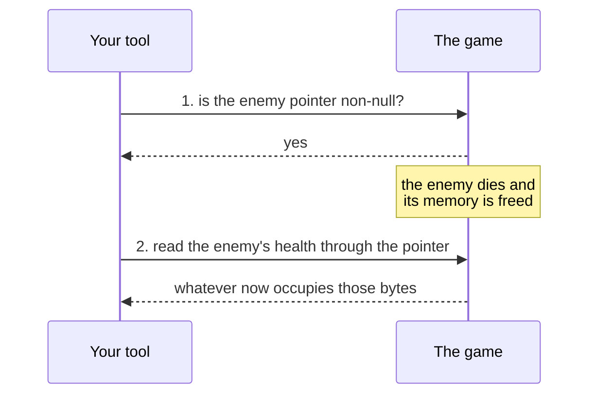

Technical words are useful when they name a precise idea. They are not useful
when they only make a simple idea sound harder. This lesson defines the words
that later chapters use often.

You do not need to memorize the page. Return to it when a term appears in code.

## Data, values, and types

Start with three words that get used interchangeably and really should not be.

**Data** is stored information — bytes sitting somewhere. A **value** is one
piece of that data, interpreted a particular way. A **type** is the thing that
says which interpretation to use, and therefore which operations make sense.

The bytes `50 00 00 00` are data. Read as a `u32`, the value is 80:



Doubling that value is a sensible thing to do; adding the text `"Ada"` to it is not, and the type is
how the compiler knows the difference before you ever run the program.

```rust
let health: u32 = 80;
let player_name: &str = "Ada";
let is_alive: bool = true;
```

Here, `80`, `"Ada"`, and `true` are values. Their types are `u32`, `&str`, and
`bool`.

Types catch mistakes before the program runs. They also document meaning. A
`PlayerId(u32)` and a `Health(u32)` store identical bits, but giving them
separate types means the compiler refuses to let you pass one where the other
belongs:

```rust
struct PlayerId(u32);
struct Health(u32);

fn damage(target: PlayerId, amount: Health) { /* ... */ }

// damage(Health(50), PlayerId(3));   // rejected: the arguments are swapped
```

Written as two plain `u32` parameters, that swap compiles happily and misbehaves
at runtime instead. This is the cheapest bug prevention available, and later
chapters lean on it constantly to keep addresses, offsets, and game values from
being mistaken for one another.

## State is information that can change

The **state** of a program is the information that describes it at one moment.
If health changes from 80 to 55, the program moved from one state to another.

Some values are inputs, some are temporary calculations, and some become stored
state. Naming that difference helps you trace cause and effect:



The stored simulation health and the displayed health-bar width are related,
but they are not necessarily the same value.

## An algorithm is a repeatable procedure

An **algorithm** is a clear sequence of steps for solving a kind of problem.
For example, a basic value scanner:

1. visits readable memory regions;
2. reads a bounded chunk;
3. compares each possible value with the search value;
4. records matching addresses;
5. repeats later using only the previous candidates.

The same steps, drawn as a loop:



An algorithm is not tied to one programming language. Code is one exact way to
express it.

Most program logic combines three control-flow forms:

- **sequence** — do steps in order;
- **selection** — choose a branch with `if` or `match`;
- **repetition** — repeat with a loop or iterator.

```rust
for player in players {
    if player.health > 0 {
        println!("{} is alive", player.name);
    }
}
```

This code repeats over players and selects only living ones.

## A data structure organizes values

A **data structure** is a chosen arrangement of data. The arrangement affects
which operations are easy or expensive.

| Structure | Good fit |
|---|---|
| `Vec<T>` | ordered items scanned by index |
| `HashMap<K, V>` | values looked up by a key |
| queue | work handled in arrival order |
| grid | tiles addressed by row and column |
| graph | waypoints or objects connected by edges |

Ask what the program does most often: search, access, insert, remove, or walk
relationships. Choose a structure that supports those operations clearly.

## A function gives a name to a behavior

A **function** accepts inputs, performs work, and may return an output.

```rust
fn is_valid_health(health: u32, max_health: u32) -> bool {
    health <= max_health
}
```

The name describes the question. The parameters describe the required inputs.
The return type describes the answer.

Small functions make a tool easier to test. A parser, for example, can be
tested with saved bytes without launching a game.

## Event-driven programs wait, then respond

Most code in this lesson runs from top to bottom: do this, then this, then stop.
A great deal of real software does not work that way. A game window, a
debugger, and a server all spend most of their time waiting for something to
happen, then responding to it.

That style is called **event-driven programming**. An **event** is a record that
something happened: a key was pressed, a network message arrived, a timer ran
out, the window was resized. The program is built around an **event loop** that
waits for the next event and passes it to the code written for that kind of
event:

```text
loop forever:
    event = wait for the next event
    find the handler for this kind of event
    call the handler
```

The handler is usually a **callback**: a function you give to someone else so
that they can call it later. You never call it yourself. You register it, and
the loop calls it when a matching event arrives. That is why "callback" appears
all over this book — a debugger, a Lua host, and a game engine all call code
that someone else wrote, at moments they choose.

### Every Windows window has one

Windows makes this concrete. The operating system keeps a queue of messages for
each window: `WM_KEYDOWN` when a key goes down, `WM_SIZE` when the window is
resized, `WM_CLOSE` when the close button is clicked. The program takes them out
one at a time and hands each one to a function it registered for the window,
called the **window procedure**:

```text
while GetMessage waits for, and receives, a message:
    TranslateMessage    turn raw key presses into character messages
    DispatchMessage     call the window procedure with the message
```

### Why a game cannot simply wait

`GetMessage` waits. If no message arrives, the thread sits there doing nothing.
A text editor wants exactly that, because there is nothing to do until you
type. A game cannot work that way: enemies keep moving and the screen keeps
redrawing when you touch nothing at all.

So games check the queue with `PeekMessage` instead, which returns at once
whether or not a message was waiting. The event handling is folded into the
game loop from Lesson 1.4:

```text
every frame:
    while PeekMessage finds a waiting message:
        handle it              key presses, resizing, closing
    update the world           runs whether or not anything happened
    draw the frame
```

Compare the two loops. A text editor, using `GetMessage`:



A game, using `PeekMessage`:



A game is therefore both at once: a loop that runs every frame regardless, and
an event handler that clears out whatever arrived since the last frame.

### A slow handler holds up everything behind it

A handler must finish quickly, because while it runs, no other event is
handled. If one handler reads a large file or waits for a lock, every event
queued behind it waits too:



You have probably seen the result. Windows adds "(Not Responding)" to a
window's title when the thread that owns it has not taken a message from its
queue for about five seconds. In a game the same mistake shows up sooner, as a
stutter or a frozen frame. This is why Lesson 4.8 keeps slow work away from the
code that samples a game, and why Lesson 5.3 warns that a hook sits on the
game's critical path: a hook is extra code running inside someone else's
handler.

### Polling is the alternative when nobody will tell you

The opposite of waiting for an event is **polling**: checking a value
repeatedly on your own schedule to see whether it has changed. An event loop
does work only when something happens, while polling does work on every check,
even when nothing has changed.

Polling still has its place, and this book uses it constantly for one reason: a
game does not send your tool an event when its health changes. An external tool
reading another program's memory has nothing to wait on, so it has to look.
Lesson 4.7 shows how to turn repeated looks into events of your own, by
comparing each snapshot with the one before it and reacting only to the
difference.

## An abstraction hides details behind a smaller interface

An **abstraction** lets one part of a program use a service without knowing all
of its internal steps.

```rust
trait MemoryReader {
    fn read_u32(&self, address: usize) -> anyhow::Result<u32>;
}
```

Code that searches for health can call `read_u32`. It does not need to repeat
the Windows handle, buffer, and error logic for every read.

The abstraction does not make bad addresses safe by magic. It gives validation
and error handling one clear place to live.

## APIs and ABIs describe boundaries

An **API** — application programming interface — is the agreement as written in source code: what the function is
called, what you hand it, what it hands back, and what it promises to do. It is
the level you are working at when you write `reader.read_u32(address)`.

An **ABI** — application *binary* interface — is that same agreement expressed in machine terms, after the compiler
has finished: which register or stack slot each argument actually occupies,
where the return value comes back, and which registers the called function has
to leave untouched.



The distinction becomes real when the two disagree. Two functions can have
identical APIs — same name, same parameters, same return type — and still be
completely incompatible, because one expects its argument in the `ecx` register
and the other expects it on the stack. Nothing in the source code shows that
mismatch. The program just reads the wrong place and carries on as if nothing
happened.

You usually meet the API first:

```rust
let value = reader.read_u32(address)?;
```

You meet the ABI when calling Windows functions, reconstructing compiled
functions, or writing hooks. Chapter 2 explains calling conventions with
assembly examples.

## Encodings and parsers turn bytes into meaning

An **encoding** assigns meaning to byte patterns. UTF-8 is a text encoding.
Little endian is a byte-order rule for multi-byte numbers.

**Serialization** arranges values into bytes for a file or message. A **parser**
checks those bytes and constructs typed values.

```text
raw bytes → validate length and tags → typed message → program logic
```

Never let an untrusted length decide an allocation or index without a limit.
Picture a message that starts with a four-byte length followed by that many
bytes of text:





Nothing about the second message is malformed at the byte level. It is a
well-formed message whose length field simply lies. Code that believes it will
try to reserve four gigabytes for a twelve-byte message, or will index far past
the end of what was actually received. The fix is not to detect the lie; it is
to refuse to act on any length before checking it against both a configured
maximum and the number of bytes genuinely present.

Parsing is the boundary where uncertain bytes become trusted program state, so
errors and bounds belong in the design rather than being bolted on afterward.

Compression is different from encoding or encryption. Compression tries to use
fewer bytes. Encryption tries to hide content from someone without a key.

## Concurrency means state can change between steps

**Concurrency** means more than one task can make progress during the same
stretch of time. Two threads may share memory, or a game may keep updating while
your external tool reads it.

The awkward part is that code you wrote as a list of steps stops behaving like
one. This looks obviously correct:

```text
1. check that the enemy pointer is not null
2. read the enemy's health through that pointer
```

Between step 1 and step 2, the game is free to delete that enemy. Your check was
true when you made it and false by the time you used it, and no individual line
of your code is wrong. The bug lives in the gap between two lines:



This creates questions that single-step code does not answer:

- Can another thread change the value between our check and our use?
- Does one thread free an object while another still has its address?
- What happens when a queue fills faster than it can be drained?

Later lessons answer those questions with snapshots, locks, atomics (single
operations the hardware guarantees cannot be seen half-finished), bounded
channels, and explicit lifecycles.

## An invariant is a rule valid state must keep true

An **invariant** is a condition that must remain true whenever the system is in
a valid state.

```rust
fn valid_player(health: u32, max_health: u32) -> bool {
    health <= max_health
}
```

Examples include:

- `health <= max_health`;
- a message length fits inside the received frame;
- an installed patch still matches the expected game build;
- a handle is closed exactly once;
- a collection length does not exceed its capacity.

Invariants help reverse engineering because they connect fields and behavior.
One matching number is weak evidence; several relationships that stay true
across controlled changes are much stronger.

## Read unfamiliar code in a fixed order

When a code block feels dense, do not stare at the whole block. Ask:

1. What enters this function?
2. What type does each important value have?
3. Which checks can stop the work?
4. Which state is read or changed?
5. What is returned, logged, or displayed?

If one line still cannot be explained in ordinary words, split it into smaller
expressions or read the called function. Difficulty may mean the code is doing
too much at once—not that you are supposed to guess.

## Checkpoint

You should now be able to distinguish:

- data, values, types, and state;
- algorithms and data structures;
- functions and abstractions;
- an event loop that waits for events, a game loop that runs every frame, and
  polling that checks on its own schedule;
- APIs and ABIs;
- encoding, serialization, parsing, compression, and encryption;
- sequential behavior and concurrent behavior;
- an ordinary condition and an invariant.
