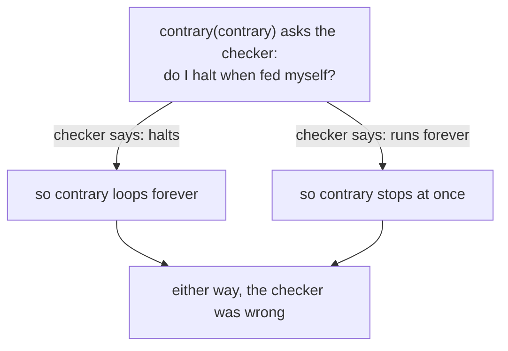

Your computer can run a game, a web browser, and a program that pretends to be a
console from 1985. Nobody built it separately for each job. Why can one machine
run all of them? And why can no tool ever tell you, for certain, what an
arbitrary program will do?

Both answers come from a model of computing published in 1936, years before
anyone built an electronic computer. This lesson builds that model by hand, then
draws out three consequences you will lean on for the rest of the book.

## A machine small enough to hold in your head

The mathematician Alan Turing wanted to pin down exactly what "following a
procedure" means. He imagined the simplest mechanism that could still carry out
any step-by-step method a person could follow with pencil and paper:

- a **tape** divided into cells, each holding one symbol, as long as it needs to
  be;
- a **head** that sits over one cell at a time and can read or overwrite it;
- a **state**, which is a single named setting the machine is in, such as
  `carry` or `done`;
- a **rule table** that says, for every combination of current state and symbol
  under the head, what to write, which way to move, and which state comes next.

That mechanism is a **Turing machine**. It runs by repeating one step: look up
the rule for the current state and the symbol under the head, write, move one
cell left or right or stay put, and switch state. When no rule matches, the
machine stops. The usual word for stopping is **halting**.

Here is a complete machine that adds one to a binary number. It starts in state
`carry` with the head on the rightmost digit:

| State | Symbol under the head | Write | Move | Next state |
|---|---|---|---|---|
| `carry` | `1` | `0` | left | `carry` |
| `carry` | `0` | `1` | stay | `done` |
| `carry` | blank | `1` | stay | `done` |

The state `done` has no rules, so reaching it halts the machine. Put `1011`
(eleven) on the tape, with blank cells, drawn `_`, on either side. The
highlighted cell is the one under the head:









This is ordinary school addition. Adding one to a 1 gives 0 and carries one to
the left; adding the carry to a 0 gives 1 and the carry is used up. The third
rule handles `111`: the carry runs past the leftmost digit into a blank cell,
and the machine writes a new leading 1, giving `1000`.

Three rows are the whole program, yet they handle a number of any length.
Notice also what the machine does *not* know. Nothing in the table mentions
"eleven" or "twelve". The machine moves symbols around, and the meaning — binary
numbers — comes from us. Lesson 1.2 said the same thing about bytes in memory:
meaning comes from the code that reads them, not from the bytes.

## Every real computer is this machine, with faster furniture

Line the parts up with the computer you are using now:

| Turing machine | Your computer |
|---|---|
| the tape | memory |
| where the head is | an address |
| the current state | the CPU's registers, including the instruction pointer |
| the rule table | the program, carried out through the CPU's instruction set |
| one step | one instruction |

Two differences are worth naming, and neither changes what can be computed.

A real CPU can jump straight to any address, while the head walks one cell at a
time. That makes real computers far faster, not more capable: anywhere a jump
can reach, the head could eventually walk to.

A real computer also has a fixed amount of memory, while the tape never runs
out. In practice, billions of bytes are enough tape that the model's
conclusions still hold for the programs you will meet.

## The universal machine: programs are data

Turing's most important idea came next. A rule table is itself only a list of
symbols, so it can be written onto a tape like anything else. He then described
a single machine, the **universal Turing machine**, that reads another
machine's rule table from its tape and carries out that machine's steps one by
one. One fixed machine can therefore imitate every other machine. To change what
it does, you change what is on the tape, not the machine.

Every computer you use works this way. A program's instructions sit in the same
memory as its data, as ordinary bytes. A computer built like this is called a
**stored-program computer**, and it is the reason this book is possible at all.
Here are a few bytes of a running game, part code and part data:



That has three consequences you will use constantly:

- **Code can be read like data.** A disassembler reads code bytes and names the
  instructions they encode. That is how Chapter 2 turns a game's machine code
  into readable assembly.
- **Code can be written like data.** A software breakpoint is a single byte,
  `0xCC`, written over the first byte of an instruction (Lesson 2.3). A code cave
  is new instructions written into memory, and a patch is old ones overwritten
  (Lesson 2.6).
- **Code can run other code.** Lua's virtual machine in Lesson 12.7 is a program
  whose data is another program. An emulator, in Lesson 14.6, is a program whose
  data is the software of an entire other computer.

Here is the second point in bytes. A debugger sets a breakpoint on the first
instruction above:



If code is just bytes, what stops a program from overwriting its own
instructions? Nothing in the model does. The protection comes from outside it:
the operating system marks each page of memory as readable, writable,
executable, or some combination, and the CPU refuses any access the marks
forbid. That is why Lesson 10.5 treats a page that is both writable and
executable as worth a second look. It is a place where data can become code.

## Turing complete: when a system can compute anything

A system is **Turing complete** when it can carry out anything a Turing machine
can, given enough time and memory. Every general-purpose programming language
is: Rust, C++, Lua, and assembly all qualify. So do systems nobody designed as
computers. Conway's Game of Life, a grid of cells that live or die by four simple
rules, can be arranged to compute anything. Players have built working
processors inside Minecraft out of redstone circuits.

The useful consequence for you concerns what a game loads. A texture or a sound
file is data: the game reads it in one fixed way, so the most a strange one can
usually do is trip over a bug in the code that reads it. A script is different.
A Wesnoth add-on can contain Lua, and a mod that ships a script is shipping a
program. A Turing-complete script can compute anything, and what it is allowed
to *touch* is limited only by what its host exposes. That is why Chapter 12
spends so much effort on what a Lua host hands to its scripts.

## Some questions no program can answer

The universal machine raises an obvious hope. If one program can *run* any other
program, perhaps one program could also *examine* any other program and tell you
what it will do. Turing showed in the same 1936 paper that this is impossible.
The version below is the standard modern form of his argument, and it is short
enough to follow in full.

Take the simplest question you could ask: will this program eventually stop, or
run forever? Suppose someone hands you a checker, `halts(program, input)`, that
always answers that question correctly. Now write this program and call it
`contrary`:

```text
contrary(program):
    if halts(program, program):     ask what program does when fed itself
        loop forever
    else:
        stop
```

Now feed `contrary` to itself:



If the checker says `contrary(contrary)` halts, `contrary` loops forever. If the
checker says it runs forever, `contrary` stops at once. Whatever the checker
answers, it is wrong, so a checker that is always right cannot exist. This is the **halting problem**: no program can correctly
decide, for every program and every input, whether that program halts.

The damage does not stay with halting. A later result, Rice's theorem, extends
it to essentially every question about what a program *does*, as opposed to how
its text is written. "Does it ever write to this address?" "Does it ever send a
network message?" "Is this instruction ever executed?" For each one, no single
method answers correctly for every possible program. A question like that is
called **undecidable**.

## What that means for the tools in this book

Undecidable does not mean hopeless. It means no tool can be right about every
program. Real tools cope by approximating, and every approximation has a known
way to be wrong:

- **A disassembler** has to decide which bytes are instructions and which are
  data. On x86, instructions have different lengths, so starting one byte too
  early or too late produces a listing that looks plausible and is completely
  wrong. Disassemblers use good heuristics and usually get it right. When a
  listing looks odd, check it against what the program actually executes in a
  debugger.
- **A decompiler** rebuilds loops, variables, and types that the compiler threw
  away. Its output is a well-informed guess, so treat it as one.
- **A signature scanner**, whether antivirus or anti-cheat, cannot decide what
  arbitrary code does. It looks for known byte patterns and known behavior
  instead, so it can miss what it has never seen and occasionally flag something
  harmless.
- **A step budget**, the limit Lesson 12.7 builds into its virtual machine's
  loop, exists because a host cannot know in advance whether a script will ever
  finish. All it can decide is how long it is willing to wait.

The practical rule follows directly. Reading code tells you what *might*
happen. Running it under control, on a specific input, tells you what *did*
happen. That is why this book pairs every static reading with an experiment,
and why the four-step method in Lesson 1.6 ends with an observation rather than
an argument.

## Run the machine yourself

The portable lab [`turing_machine_lab.rs`]({{ site.baseurl }}/rust-labs/src/bin/turing_machine_lab.rs)
is a short Turing machine simulator. Its rule tables
are plain text that the simulator reads when it starts, so the simulator is a
small universal machine: one fixed program that carries out whatever machine its
input describes.

```text
carry 1 -> 0 L carry   # 1 plus a carry is 0, and the carry moves left
carry 0 -> 1 S done    # 0 plus a carry is 1, and the carry is used up
carry _ -> 1 S done    # ran off the left end: write a new leading 1
```

The heart of the simulator is the step loop. It looks up a rule, gives up if the
budget is spent, and otherwise writes, moves, and switches state:

```rust
fn run(machine: &Machine, tape: &mut Tape, head: i64, state: usize, budget: u64) -> Outcome {
    let mut head = head;
    let mut state = state;
    let mut steps = 0;
    loop {
        let Some(rule) = machine.rules.get(&(state, tape.read(head))) else {
            return Outcome::Halted { state, steps };
        };
        if steps == budget {
            return Outcome::OutOfBudget { steps };
        }
        tape.write(head, rule.write);
        head += rule.movement.delta();
        state = rule.next;
        steps += 1;
    }
}
```

The order of the two checks matters. A machine that reaches `done` on its very
last budgeted step has halted, and the loop reports it that way rather than
calling it a timeout.

Build it, then run it from the `rust-labs` folder:

```powershell
cargo run --bin turing_machine_lab
```

The lab adds one to three numbers, including `111` so you can watch the carry
run off the end. Then it runs a one-rule machine that writes 1s forever and
stops it with a budget. Finally, it feeds the simulator a malformed rule table to
show that a program which is only data still has to be validated before it
runs. The tests beside it check every number from 0 to 64 and the budget edge
case.

Then add a machine of your own. One that flips every digit of a binary number,
turning `1011` into `0100`, needs only two rules, because the machine halts by
itself when it reaches a blank that no rule mentions. Before you run it, predict
how many steps it will take.

## Checkpoint

You should now be able to explain:

- the four parts of a Turing machine and the one step it repeats;
- how the three-rule incrementer adds one, including when the carry runs off the
  left end;
- how memory, addresses, registers, and instructions map onto the tape, the
  head, the state, and the rule table;
- why a stored-program computer lets a debugger place a breakpoint by writing a
  byte;
- what Turing complete means, and why a mod containing a script is a program
  rather than data;
- why no tool can decide whether every program halts, and what that means for
  disassemblers, decompilers, scanners, and step budgets.
