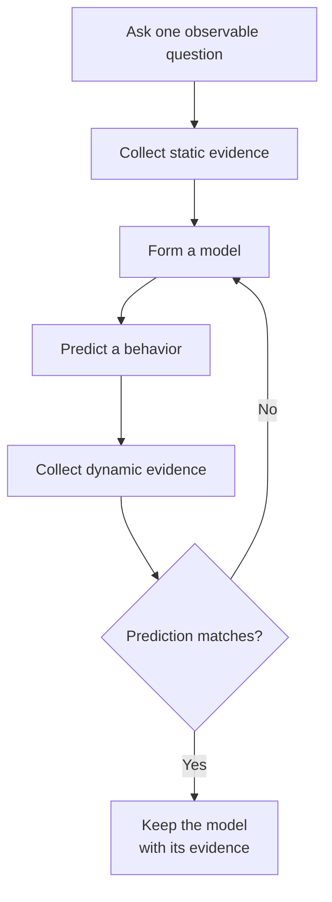

## A debugger can pause and inspect a running program

A memory scanner answers, “Where might this value live?” A debugger answers, “Which instruction just touched it?”

When a debugger pauses a process, you can inspect:

- the next instruction the CPU will run;
- register values;
- the call stack;
- nearby memory;
- the condition flags used by branches.

This is not a special “hacking mode.” Developers use the same ideas to find bugs in their own programs.

## What actually happens when a debugger attaches

A debugger is a separate process. It requests the required process and thread
access rights from Windows, and Windows begins sending it **debug events**. An
event can mean:

- a process or thread started;
- a DLL was loaded;
- an exception happened;
- a breakpoint was reached;
- the process exited.

When an event stops a thread, the debugger can ask Windows for that thread’s
**context**. A context is a snapshot of its registers, including the
instruction pointer that says where the CPU will continue. The debugger can
also copy memory from the process and show the copied bytes in friendlier
forms.

The target and debugger do not merge into one program. Windows remains the
gatekeeper between them:

```text
target reaches breakpoint
→ Windows pauses and reports an event
→ debugger reads thread context and memory
→ you choose how to continue
→ debugger replies to Windows
→ target resumes
```

Many debuggers pause the rest of the process while you inspect one event. That
prevents other game threads from changing the evidence underneath you, but it
also means audio, rendering, and network work temporarily stop.

## Disassembly versus debugging

**Disassembly** translates machine-code bytes into assembly instructions. It is a snapshot of what the bytes *could* mean.

**Debugging** watches those instructions run. It lets you see what the registers and memory contain at that exact moment.

The stronger model is **static evidence versus dynamic evidence**:

| View | What it can establish |
|---|---|
| Disassembly | possible instructions, branch targets, referenced constants, and call relationships |
| Live debugging | the path actually taken, concrete register values, live addresses, and the thread that executed it |

Neither view replaces the other. Static analysis shows paths your one test did not
take. Dynamic analysis tests whether your interpretation matches a real game event.
Use them as two measurements of the same program.

A **decompiler** goes one step further and guesses at higher-level expressions,
loops, and function arguments. Those guesses can be useful, but the machine
code is the final record of what the CPU executes. A friendly decompiler name
such as `player_health` is a hypothesis until behavior supports it.

## What a decompiler can recover—and what it cannot

Compilation keeps the effects a computer must perform, but it can discard many
choices that only helped the original programmer. Local names, comments, source
file boundaries, and the exact spelling of a loop may be gone. Optimizations can
inline a function, reuse one register for unrelated values, remove a variable, or
turn a branch into arithmetic.

A decompiler therefore works upward through several reconstructions:

```text
instruction bytes
    ↓ decode
assembly instructions
    ↓ connect jumps
basic blocks and a control-flow graph
    ↓ trace values
expressions, arguments, and possible types
    ↓ choose readable syntax
pseudocode
```

Every upward step is useful, but it adds interpretation. Two different source
programs can compile to the same machine behavior, so exact original source is
often unknowable. The goal is a model that explains the observed behavior, not
a perfect historical transcript.

Treat pseudocode as an editable notebook:

- rename a value only after you can explain the evidence;
- change a type when instruction width, signedness, API contracts, and live
  values agree;
- check the control-flow graph when an `if` or loop looks strange;
- return to assembly when one incorrect type makes later expressions look
  impossible.

This prevents a common failure chain: one guessed pointer becomes a guessed
structure, which gives every field a confident-looking but incorrect name. 🔎

## Test explanations against recorded evidence

Reverse engineering is an inference problem. You cannot see the missing source
directly, so you build a model that predicts what the compiled program should
do and compare that prediction with an observation. One loop looks like this:



Static evidence includes bytes, imports, strings, and possible control-flow
paths. Dynamic evidence includes the path actually taken, live values, timing,
and effects. A useful model must explain both kinds. Change one input at a time
so a different observation can be connected to a specific cause.

Different practice targets may use 32-bit or 64-bit code, different calling
conventions, and different build settings. Transfer the investigation process,
not literal addresses or register choices from a worked example.

## Write the debugging question before using the tools

Do not scroll through thousands of instructions hoping one looks important. Begin with a question:

> Which instruction changes my gold when I recruit a unit?

Then:

1. Find the gold address with a memory scanner.
2. Set a breakpoint on writes to that address.
3. Perform exactly one gold-changing action.
4. Inspect the instruction that triggered the pause.

You used a visible value as a trail back to the code.

## Registers hold values the CPU is using now

Assembly uses names such as `rax`, `rbx`, `rcx`, and `rdx`. These are registers. On a 64-bit x86 CPU, `rax` is 64 bits wide. `eax` refers to its lower 32 bits, `ax` to the lower 16, and `al` to the lowest 8.

```text
rax  [63 ........................................ 0]
eax                                  [31 ........ 0]
 ax                                         [15 . 0]
 al                                             [7:0]
```

The names look odd because they are old, not because the idea is complicated.

## Memory, registers, and the stack answer different questions

Registers are the values this thread needs immediately. Memory holds far more
data but is slower to access. The stack is one memory area used to organize
function calls.

Suppose the debugger stops here:

```nasm
sub dword ptr [ebx+30h], eax
```

- `eax` contains one immediate input, perhaps a price;
- `ebx` contains a base address, perhaps a pointer to a side object;
- `30h` is an offset, a distance from that base;
- `[ebx+30h]` means “access memory at the calculated address”;
- `dword ptr` says the memory operation is four bytes wide.

The register names alone do not prove those meanings. Compare the calculated
address with the gold address, compare `eax` with the known unit price, and
repeat the action. Debugging turns guesses into evidence by joining instruction,
state, and behavior.

The **call stack** answers another question: “Which chain of function calls
brought this thread here?” A low-level update function may be called by a
recruit action, an AI simulation, and a save loader. The caller helps explain
which use you observed.

## Recover source-level meaning from machine state

At source level, the compiler chooses registers for you. For example:

```rust
fn spend(gold: u32, price: u32) -> Option<u32> {
    gold.checked_sub(price)
}
```

The compiler may turn this into a comparison, a subtraction, and a branch. In a debugger, you see those smaller pieces instead of the original variable names.

`Option<u32>` also tells us more than a raw number: the result is either `Some(remaining_gold)` or `None` when the player cannot afford the item. Decompiled code often loses that friendly meaning, so your job is to rebuild it from behavior.

## A safe first session

Use the VM snapshot and offline target from section one. Attach x64dbg, pause the game, look at the CPU view, then resume without changing anything.

Success for this lesson is simple: you can pause and resume the process, and you know which panels show instructions, registers, memory, and the stack.
