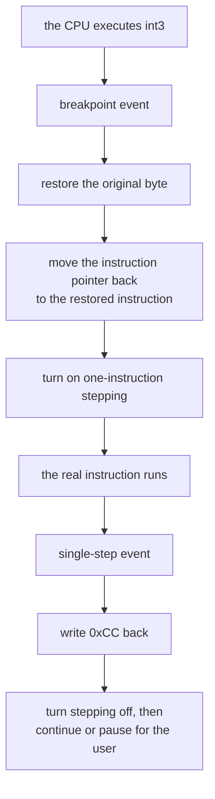
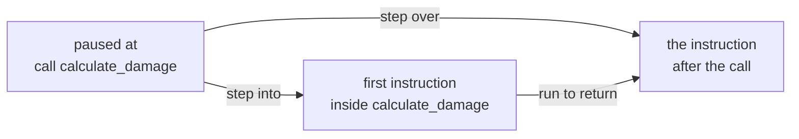

## What a breakpoint does

A breakpoint asks the debugger to pause when a specific event happens. The two kinds we use most are:

- **code breakpoint** — pause when the CPU reaches an instruction;
- **memory breakpoint** — pause when code reads, writes, or executes at an address.

The pause is useful because the thread's register state and current instruction are still available. You get one precise sample of execution: what this thread was about to do, which values it held, and how it reached this point.

A breakpoint is a condition for collecting evidence, not proof by itself. A
write breakpoint on health may fire for damage, healing, loading, respawning,
and initialization. Record the triggering action and call stack so you can tell
those uses apart.

## A pause is one instant on one thread

A process can contain many threads. When one thread hits a breakpoint, another may have updated nearby state just before the debugger stopped everything. The snapshot is real, but it is not automatically the whole causal story.

Record four kinds of context:

- **time:** what player action immediately preceded the pause;
- **thread:** which thread executed the instruction;
- **data:** which registers and memory locations the instruction used;
- **control:** which call path and branches led here.

Then repeat the same action. A useful breakpoint fires at a consistent point for the behavior you are studying. A noisy breakpoint may still be correct, but it needs a stronger filter such as a specific thread, object pointer, call site, or condition.

This is the difference between a **trace** and an **explanation**. A trace records what executed. An explanation connects that execution to a game rule and survives repeated tests.

## Code breakpoints

On x86, a debugger often implements a software breakpoint by temporarily replacing the first byte of an instruction with `0xCC`, the `int3` instruction.





When the CPU executes `int3`, Windows reports a breakpoint exception. The debugger:

1. pauses the process;
2. restores the original byte;
3. lets you inspect or step;
4. replaces the breakpoint when execution continues.

That bookkeeping is why you should remove breakpoints through the debugger instead of editing the byte by hand.

It also means a software breakpoint is not invisible. While it is set, the
program's own code genuinely contains `0xCC` where the original byte used to
be, and nothing prevents the program from reading its own bytes and noticing.
A routine that adds up the bytes of a function and compares the total against
a figure recorded when the game was built will disagree the moment you place a
breakpoint inside that function.

Notice what such a routine has actually established: that its code changed. It
has not detected a debugger, and it cannot tell your breakpoint apart from any
other modification to those bytes. Chapter 13 returns to this, because it is
the same self-checking idea used to notice a patch.

## How a software breakpoint pauses and resumes

The original instruction still has to execute. A debugger normally handles the
`0xCC` pause in two events:



The instruction pointer needs rewinding because the CPU has already consumed
the one-byte `int3`. The one-instruction step lets the real instruction run
before the breakpoint byte is restored. Lesson 7.6 models this as explicit
`Armed` and `Stepping` states so the byte is never restored at the wrong time.

On x86, single stepping uses the **trap flag** in the thread’s flags register.
When set, the CPU raises a debug exception after the next instruction. The flag
belongs to one thread, which is why debugger state records thread IDs.

## Memory breakpoints

A hardware breakpoint uses CPU debug registers to watch a small address range. It is ideal when you know the gold address but not the instruction that changes it.



The debug registers can watch for a write, for a read *or* write, or for an
execute — x86 has no read-only setting. A debugger that offers a pure read
breakpoint implements it another way, usually with page protection.

Choose the narrowest event that answers your question:

- **write** when looking for code that changes a value;
- **read** when looking for code that uses a value;
- **access** only when you truly need both.

Access breakpoints can fire constantly. More pauses do not automatically mean more understanding.

Hardware watchpoints are limited resources—x86 provides only a small number of
debug-address registers per thread—and supported widths/alignment are
restricted. A debugger may emulate larger memory watches with guarded pages,
which is noisier because unrelated data on the same page can trigger.

Be precise about the event:

- an instruction **reads** when it needs the old bytes;
- it **writes** when it stores new bytes;
- a read-modify-write instruction such as `sub [address], eax` does both;
- **execute** means the watched bytes are being treated as code.

Watching four bytes does not tell the debugger that they are a `u32`. Width is
about overlapping addresses. Type meaning still comes from the instruction and
behavior.

## Step, step over, and run to return

When paused at a `call`, you have choices:

| Action | What it does |
|---|---|
| Step into | Enter the called function |
| Step over | Run the called function and pause after it |
| Run to return | Continue until the current function returns |
| Resume | Continue until another event pauses the process |



Step into code you need to understand. Step over code that is not part of your question.

“Step over” is not one special CPU instruction. At a `call`, the debugger can
place a temporary breakpoint at the instruction after the call and resume. If
the call never returns normally, that temporary breakpoint may never fire.

“Run to return” relies on the current call frame and can be confused by tail
calls, exceptions, corrupted stacks, or optimized code. These controls are
convenient ways to express a debugging goal, not guarantees about source-level
functions.

## `nop`: do nothing once

`nop` means “no operation.” Replacing an instruction with one or more `nop` bytes is a quick, temporary way to test what that instruction does.

```nasm
sub [rcx+30], eax
```

If this removes gold and you temporarily replace the whole instruction with `nop` bytes, recruiting may stop costing gold. That result supports your theory.

NOPing an instruction removes all of its effects, including effects that are
easy to overlook. Arithmetic instructions often update flags used by the next
conditional branch. A floating-point store may also pop a value from an x87
stack. A test that appears visually correct can still damage later control flow
or machine state.







Before patching, ask:

1. How many complete bytes does the instruction occupy?
2. Which registers, memory, flags, or special stacks does it change?
3. Does later code rely on those changes?
4. What exact observation would support the hypothesis?
5. How will the original bytes be restored?

> Always record the original bytes before patching. An incomplete replacement can make the CPU decode the remaining bytes as a completely different instruction.
{: .block-danger }

## A disciplined breakpoint note

When a breakpoint fires, record:

```text
Triggering action:
Instruction address:
Instruction:
Registers that look like pointers:
Memory value before:
Memory value after:
Call stack clue:
Next question:
```

Do not try to understand every register. Identify the one that connects the instruction to your question.

## Represent debug events as explicit states

Later, our debugger will receive the same breakpoint events from Windows. We will model them with an enum:

```rust
enum DebugEvent {
    Breakpoint { thread_id: u32, address: usize },
    ProcessExited { code: u32 },
    Other,
}
```

An enum gives each event a clear shape. Pattern matching then forces us to decide how every event should be handled instead of silently ignoring surprises.

{% include quiz.html
  id="breakpoint-evidence"
  type="multiple-choice"
  title="Treat a pause as evidence"
  prompt="A write breakpoint on the player's health fires while damage is taken. What is the best next step?"
  options="Assume the instruction only handles damage||Delete every other breakpoint and patch immediately||Record the instruction, registers, old value, new value, and triggering action||Change all writable values near the address"
  answer="2"
  explanation="A breakpoint tells you that the condition happened; it does not explain every role of the instruction. Recording the surrounding evidence lets you compare damage, healing, loading, and respawning before deciding what the code means."
%}
