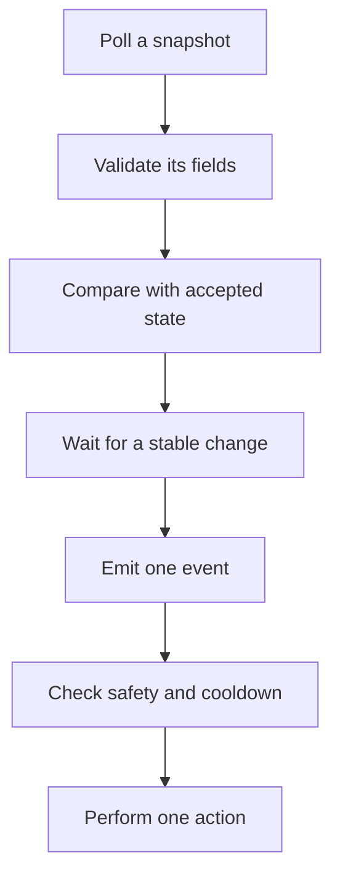

## Polling is not the same as reacting

An observer might read the same fact twenty times per second:

```text
gold = 120
gold = 120
gold = 120
gold = 145
gold = 145
```

A responsive system should usually produce one event:

```text
GoldChanged { before: 120, after: 145 }
```

The event says **what changed**, while a snapshot says **what is true now**. Keeping both ideas separate prevents a bot from performing the same action on every poll.

A responsive loop should turn noisy observations into one deliberate action in
stages, rather than connecting every poll directly to a click:



Validation protects the model, debouncing protects it from flicker, and the
cooldown prevents a valid event from producing frantic repeated input.

## Level facts and edge facts answer different questions

A snapshot contains **level facts**: “the menu is open” or “gold equals 145.” An event describes an **edge** between two accepted snapshots: “the menu opened” or “gold increased by 25.”

That difference controls behavior. A level-triggered rule such as `if menu_open { click() }` may click on every poll. An edge-triggered rule acts only on the transition from closed to open. Neither form is always better:

- use a level fact to keep a safety condition true, such as “stop while the target is absent”;
- use an edge event for one-time work, such as recording that a turn began;
- use both when an action needs a starting event and an ongoing confirmation.

Events are interpretations, not raw truth. If the observer misses snapshots, `120 -> 145` proves the endpoints but not whether the game passed through `130`. Name an event `GoldChanged`, not `GoldEarned`, unless other evidence proves why it changed.

## Diff two validated snapshots

```rust
#[derive(Clone, Debug, PartialEq)]
struct StrategySnapshot {
    turn: u32,
    gold: u32,
    selected_unit: Option<u32>,
    menu_open: bool,
}

#[derive(Clone, Debug, Eq, PartialEq)]
enum GameEvent {
    TurnChanged { before: u32, after: u32 },
    GoldChanged { before: u32, after: u32 },
    SelectionChanged { before: Option<u32>, after: Option<u32> },
    MenuOpened,
    MenuClosed,
}

fn diff(before: &StrategySnapshot, after: &StrategySnapshot) -> Vec<GameEvent> {
    let mut events = Vec::new();

    if before.turn != after.turn {
        events.push(GameEvent::TurnChanged { before: before.turn, after: after.turn });
    }
    if before.gold != after.gold {
        events.push(GameEvent::GoldChanged { before: before.gold, after: after.gold });
    }
    if before.selected_unit != after.selected_unit {
        events.push(GameEvent::SelectionChanged {
            before: before.selected_unit,
            after: after.selected_unit,
        });
    }
    match (before.menu_open, after.menu_open) {
        (false, true) => events.push(GameEvent::MenuOpened),
        (true, false) => events.push(GameEvent::MenuClosed),
        _ => {}
    }

    events
}
```

Why use an enum? Each variant defines exactly which data belongs to that event. A typo in a string such as `"turn_chagned"` cannot silently create a new event type.

## Debouncing asks for stability

Some values flicker while a game changes scenes. Debouncing waits for the same candidate value to appear several times before accepting it.

It helps to know *why* a value flickers, because that tells you how long to
wait. During a scene change the game is often rebuilding the very object you
are reading. The pointer is briefly null, or it points at a freshly allocated
record whose fields have not been filled in yet. Your read succeeds and hands
back a real number that was never a real game state:

```text
poll 1   health 100            the old scene
poll 2   health 0              object freed, memory not yet reused
poll 3   health 0
poll 4   health 3452816845     new allocation, uninitialized bytes (0xCDCDCDCD)
poll 5   health 100            the new scene, fully constructed
```

Debouncing buys correctness with latency, and that trade is exactly why the
sample count deserves thought. Requiring three consistent samples at twenty
polls per second delays every genuine change by roughly 150 milliseconds. That
is cheap for "the match ended" and far too slow for "an enemy appeared." Choose
the requirement per value rather than once for the whole bot.

```rust
#[derive(Debug)]
struct Debouncer<T> {
    accepted: T,
    candidate: Option<(T, u8)>,
    required_samples: u8,
}

impl<T: Clone + Eq> Debouncer<T> {
    fn observe(&mut self, value: T) -> Option<T> {
        if value == self.accepted {
            self.candidate = None;
            return None;
        }

        match &mut self.candidate {
            Some((candidate, count)) if *candidate == value => *count += 1,
            _ => self.candidate = Some((value.clone(), 1)),
        }

        let stable = self.candidate
            .as_ref()
            .is_some_and(|(_, count)| *count >= self.required_samples);
        if stable {
            self.accepted = value.clone();
            self.candidate = None;
            Some(value)
        } else {
            None
        }
    }
}
```

Debouncing adds delay, so use it for noisy or safety-critical transitions, not every coordinate in a smooth animation.

Debouncing is a small trade: it exchanges **latency** for **confidence**. Requiring three matching samples makes a one-sample glitch less likely to trigger an action, but it also delays every real transition. Choose the count together with the polling rate and the speed of the game state; “three samples” has no useful meaning without time.

## Add cooldowns after actions

After requesting “end turn,” wait for evidence that the turn changed. Do not send the same input again merely because the next 50 ms poll still shows the old turn.

A useful action record contains:

- the requested action;
- the time it was requested;
- the state change that will confirm success;
- a timeout;
- a cancellation reason.

```rust
enum PendingAction {
    EndTurn { old_turn: u32, polls_left: u8 },
}

fn update_pending(action: &mut Option<PendingAction>, snapshot: &StrategySnapshot) {
    let Some(PendingAction::EndTurn { old_turn, polls_left }) = action else {
        return;
    };

    if snapshot.turn != *old_turn || *polls_left == 0 {
        *action = None; // confirmed or timed out; either way, stop repeating input.
    } else {
        *polls_left -= 1;
    }
}
```

In a full program, distinguish confirmed success from timeout in the result. The short sample focuses on the stop condition.

## A safe responsive loop

1. Copy and validate a snapshot.
2. Diff it against the previous accepted snapshot.
3. Debounce noisy state.
4. Feed events to the state machine.
5. Propose at most one bounded action.
6. Wait for its confirmation or timeout.
7. Stop immediately if the target disappears or the user cancels.

This design is useful far beyond game automation. File watchers, user interfaces, network clients, and monitoring tools all turn repeated observations into meaningful events while controlling duplicate work.

Make repeated requests **idempotent** when you can: sending the same request twice should have the same final effect as sending it once. “Select entity 7” can be idempotent; “move selection to the next entity” is not. Idempotence does not replace cooldowns, but it limits damage when a timeout hides a successful first action.
