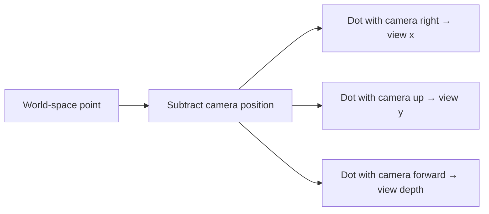
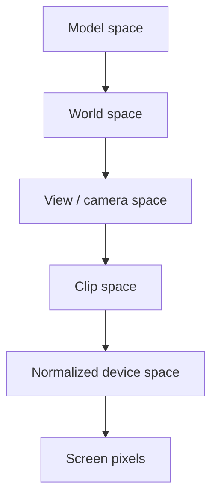

## Extend 2D coordinates to three dimensions

A 2D game often describes a position with `x` and `y`.


A 3D game adds a third axis:

```rust
#[derive(Clone, Copy, Debug, PartialEq)]
struct Vec3 {
    x: f32,
    y: f32,
    z: f32,
}
```

A `Vec3` is not special hardware. It is a **vector**: an ordered group of numbers that we choose to treat as one mathematical object. The order matters because each slot has a role. Swapping `x` and `z` changes the meaning even when the three numbers stay the same.

Vectors are useful because one operation can apply to the whole idea. Adding a movement vector to a position moves the position. Subtracting two positions gives the difference between them.

Games disagree about which axis means “up.” Never assume. Move in one direction at a time and observe which field changes.

🧭 **Coordinate check:** change one axis while keeping the others still. The field that follows the movement tells you what that axis means in this game.
{: .emoji-note }


## A coordinate frame is an origin plus directions

Coordinates are not properties a point owns by itself. The numbers make sense only
inside a **coordinate frame**: an origin and three axis directions. The point
`(10, 0, 0)` means “ten units along this frame's x-axis from this frame's origin.”
Change the frame and the same place receives different numbers.

A practical frame description answers four questions:

1. Where is the origin?
2. Which axis points right or forward?
3. Which axis points up?
4. Do positive rotations follow a left-handed or right-handed convention?

These are not cosmetic choices. If an overlay reads an engine that uses `z` as up
but performs math as though `y` were up, the result may look almost correct near
the origin and drift badly elsewhere.

### Handedness tells you which way positive rotation goes

Point your right thumb along the positive axis. In a **right-handed** coordinate
system, the curl of your fingers shows positive rotation around that axis. A
left-handed system reverses that convention. Handedness also fixes the direction
of a cross product: in a right-handed frame, `right × up = forward` for one common
choice of basis directions.

Do not infer handedness from axis labels alone. An engine may call an axis
`forward` while using a different sign than a math library. Confirm it with three
known movements or by reading the matrix construction code.

## Position versus direction

A position answers “where?” A direction answers “which way?” Both can use three numbers, but they mean different things.

```rust
impl Vec3 {
    fn subtract(self, other: Self) -> Self {
        Self {
            x: self.x - other.x,
            y: self.y - other.y,
            z: self.z - other.z,
        }
    }

    fn length(self) -> f32 {
        (self.x * self.x + self.y * self.y + self.z * self.z).sqrt()
    }
}

let direction = enemy_position.subtract(player_position);
let distance = direction.length();
```

Subtracting two positions gives the direction from one to the other.

A point and a direction can both be stored as three floats, but the allowed math is
different:

| Expression | Meaning |
|---|---|
| point − point | direction and distance between places |
| point + direction | a new place after moving |
| direction + direction | combined movement |
| point + point | usually has no useful geometric meaning |

This is a good example of why a memory layout does not tell the whole story. Three
adjacent floats could be a position, velocity, color, scale, or Euler angles. Watch
how the game uses them before assigning a name.

## Length, normalization, and alignment

The length of a direction is its distance. **Normalizing** divides by that length so
the result keeps only direction and has length one. Check for a near-zero length
first; there is no meaningful direction from a point to itself.

```rust
fn normalized(value: Vec3) -> Option<Vec3> {
    let length = value.length();
    if !length.is_finite() || length <= f32::EPSILON {
        return None;
    }
    Some(Vec3 {
        x: value.x / length,
        y: value.y / length,
        z: value.z / length,
    })
}
```

The **dot product** measures alignment. For two normalized directions it is near
`1` when they face the same way, `0` when perpendicular, and `-1` when opposite.
A field-of-view test can compare the camera's forward direction with the direction
to a target. This avoids turning both vectors into angles merely to ask whether they
point roughly the same way.

For vectors `a = (aₓ, aᵧ, a_z)` and `b = (bₓ, bᵧ, b_z)`:

```text
a · b = aₓbₓ + aᵧbᵧ + a_zb_z

if a and b have length 1:
a · b = cos(θ)
```

That second line is why a dot product can become an angle with
`acos(clamp(dot, -1, 1))`. Clamp first because floating-point rounding can produce
`1.0000001`, which is outside the mathematical input range of `acos`.

Worked through, a field-of-view test is three multiplications and two
additions. Suppose the camera faces straight along positive x, and a target
sits ahead and a little to the side:

```text
camera_forward      = (1.0, 0.0, 0.0)     already length 1
direction_to_target = (0.8, 0.6, 0.0)     already length 1

dot = (1.0 x 0.8) + (0.0 x 0.6) + (0.0 x 0.0) = 0.8
```

`0.8` is the cosine of roughly 37 degrees, so the target sits about 37 degrees
off the centre of view. If the rule is “visible within a 45-degree cone,” you
never need `acos` at all: compare the dot product against `cos(45°)`, which is
about `0.707`, and anything above that threshold is inside the cone. Comparing
cosines is cheaper than converting to angles, and it sidesteps the rounding
trap described above.

The **cross product** produces a direction perpendicular to two input directions:

```text
a × b = (
    aᵧb_z - a_zbᵧ,
    a_zbₓ - aₓb_z,
    aₓbᵧ - aᵧbₓ
)
```

Its length is the area of the parallelogram between the vectors. Camera code uses
it to construct perpendicular `right`, `up`, and `forward` directions. The order
matters: `a × b = -(b × a)`.

## A basis defines the local axes

A **basis** is the set of directions you measure coordinates against — the
rulers you are holding up. A camera basis usually holds `right`, `up`, and
`forward`.

They have to be *independent*, meaning no one of them can be built by combining
the others. If `up` were just `forward` tilted slightly, the two would partly
measure the same thing and some positions would have no unique description at
all.

When those directions are additionally all exactly length one and all at right
angles to each other, the basis is called **orthonormal**. That is worth
insisting on, because it makes measuring cheap: to find how far along a
direction a point lies, you take a dot product and stop. No division, no
correction for skew.



This is the view transform in plain English. First express the point relative to
the camera, then ask how much of that displacement lies along each camera ruler:

```text
d = world_point - camera_position
view_x = dot(d, camera_right)
view_y = dot(d, camera_up)
view_z = dot(d, camera_forward)
```

The sign of `view_z` depends on the convention. OpenGL camera space traditionally
looks down negative z; many other descriptions use positive forward. A correct
formula with the wrong convention is still a wrong result.

## Yaw and pitch

Many first-person games describe view direction with:

- **yaw**—turn left or right;
- **pitch**—look up or down;
- **roll**—tilt sideways.

To point toward a target, first find the difference:

```rust
let delta = target.subtract(camera);
```

Then derive angles. The exact axis names and signs depend on the game:

```rust
fn aim_angles(delta: Vec3) -> (f32, f32) {
    let yaw = delta.y.atan2(delta.x).to_degrees();
    let flat_distance = delta.x.hypot(delta.y);
    let pitch = delta.z.atan2(flat_distance).to_degrees();
    (yaw, pitch)
}
```

`atan2` handles all four directions around a circle. Ordinary `atan(y / x)` loses information and breaks when `x` is zero.

## World space to screen space

A 3D point cannot be drawn directly on a 2D monitor. The renderer transforms it through several spaces:



A **coordinate space** is one specific choice of where the origin sits and which way each axis points. The same physical spot in the level gets different numbers in each space, so a coordinate is meaningless until you say which space it belongs to.

- Model space describes a vertex relative to its own model. A character’s hand can be “half a meter from the character’s center.”
- World space describes everything relative to the level’s origin.
- View space moves the world so the camera behaves like the origin looking forward.
- Clip space prepares points for perspective and clipping.
- Screen space uses the pixel dimensions of the window.

The point is not physically moving through five worlds. We keep expressing the same point relative to a different reference frame.

The spaces can be summarized as contracts:

| Space | Origin | Axes/basis | Typical units |
|---|---|---|---|
| Model/local | model pivot | model's own orientation | model units |
| World | level origin | level axes | world units |
| View/camera | camera position | camera right/up/forward | world units |
| Clip | projection-defined | not yet divided by `w` | homogeneous |
| NDC | center of visible volume | API convention | usually `-1..1` |
| Screen | viewport top-left or bottom-left | pixel axes | pixels |

Never add values from different spaces. `world_position + model_offset` is valid
only after the model offset has been rotated/scaled into world space.

## What a matrix actually does

A **matrix** is a rectangular table of numbers. By itself that is just storage.
What makes it useful is one fixed rule for combining it with a point, and the
rule is smaller than it looks.

```rust
#[derive(Clone, Copy, Debug)]
struct Mat4 {
    values: [f32; 16],
}
```

To produce one number of the output, walk one row of the matrix alongside the
point, multiply each pair, and add the results:

```text
point  = (x, y, z, 1)
row 0  = (a, b, c, d)

output x = a*x + b*y + c*z + d*1
```

Do that once per row and you have the whole output point. For a 4×4 matrix that
is four multiply-and-add passes. Nothing more mysterious is happening.

Every transform a renderer uses is just a choice of numbers in those rows. Ones
down the diagonal and zeros elsewhere copy the point unchanged. Twos down the
diagonal double every coordinate, which scales the model. The `d` entry is added
no matter what the input was, which is exactly what moving something requires —
and it is why a 3D point is carried as four numbers rather than three. That
trailing `1` exists to give `d` something to multiply.

So a matrix is a compact way of writing “here is how to work out the new
coordinates from the old ones.” Multiplying two matrices together produces a
single matrix that performs both operations, one after the other.

You do not need to memorize sixteen formulas to use one carefully. Start with the promise:

```text
input point in one coordinate space
× transformation matrix
= output point in another coordinate space
```

Matrix **layout** matters. Some engines store rows next to each other; others store columns next to each other. Some math libraries multiply vectors on the left and others on the right. A transposed or wrongly ordered matrix can produce believable-looking nonsense, which is why we verify it by moving the camera along one axis at a time.

Transform order matters too. Rotation followed by translation usually differs from
translation followed by rotation. In plain English, “turn the model around its own
origin, then place it in the world” is not the same operation as “place it, then turn
the whole world-space position around the origin.” Matrix multiplication records
that order, so swapping two matrices is not a harmless style change.

For one common column-vector convention, the complete transform is written:

```text
clip = projection × view × model × local_point
```

The rightmost operation happens first. A row-vector engine may write the reverse
order. “Row-major versus column-major” describes storage, while “row vectors versus
column vectors” describes the multiplication convention; people often mix up
these two separate choices.

## Why 3D graphics uses four numbers for a 3D point

A 3D translation cannot be represented by an ordinary 3×3 linear matrix because
linear transforms must keep the origin fixed. That restriction is easy to
confirm for yourself: multiplying any 3×3 matrix by the point `(0, 0, 0)`
multiplies every entry in the matrix by zero, so the answer is always
`(0, 0, 0)` again. No arrangement of nine numbers can shift the origin
somewhere else — and shifting everything by a fixed amount is precisely what
translation means. **Homogeneous coordinates** add a
fourth component so translation fits into the same matrix pipeline as rotation and
scale:

```text
position  (x, y, z) becomes (x, y, z, 1)
direction (x, y, z) becomes (x, y, z, 0)
```

A translation matrix affects the position because its `w` is `1`, but it does not
move a direction because its `w` is `0`. This distinction is mathematical, not
just extra padding.

After projection, `(x, y, z, w)` also represents the same Euclidean point as
`(kx, ky, kz, kw)` for any nonzero `k`. Dividing by `w` chooses the familiar form
where the last component is one.

A 4×4 view-projection matrix commonly combines the camera and projection steps. The transformed `w` value helps determine whether a point is in front of the camera.

## Why perspective uses `w`

Far-away objects look smaller. After the matrix transformation, perspective division divides the transformed `x`, `y`, and `z` by `w`:

```text
ndc_x = clip_x / clip_w
ndc_y = clip_y / clip_w
```

The reason this creates perspective at all is that the projection matrix is
built so that the resulting `w` carries the point's distance from the camera.
Dividing by `w` is therefore dividing by depth, and dividing by depth is
precisely what makes distant things small: double the distance and the object
covers half as much screen.

If `w` is zero, the division is undefined. If `w` is negative, the point is
behind the camera — and the division still yields a perfectly ordinary-looking
coordinate, with both signs flipped. This is the classic overlay bug: an enemy
standing directly behind the player gets drawn on screen in front, mirrored to
the opposite side, with the box sliding the wrong way as they move. Nothing
crashes and no number looks obviously wrong, which is why the check has to be
written out explicitly:

```text
if clip_w <= small_positive_threshold {
    the point is not visible; skip it
}
```

That is why world-to-screen code checks `w` before producing pixels.

For a symmetric perspective camera, the projected scale is proportional to
`1 / depth`. Ignoring signs and API details, the central idea is:

```text
screen_x ∝ view_x / view_depth
screen_y ∝ view_y / view_depth
```

Double the depth while keeping the sideways offset unchanged and the point moves
half as far from the screen center. A perspective matrix stores this division in
`w` so the GPU can delay it until after clipping.

## What field of view and aspect ratio change

The vertical field of view `fov_y` determines how much of the world fits from top
to bottom. The aspect ratio is `width / height`. A common perspective scale is:

```text
y_scale = 1 / tan(fov_y / 2)
x_scale = y_scale / aspect
```

A smaller field of view makes `tan(fov_y / 2)` smaller, so the scale grows and the
scene looks zoomed in. Using degrees where a function expects radians can make the
matrix appear completely broken; convert units at the boundary and name them.

## Screen coordinates

After projection and perspective division, normalized coordinates are often in `-1..=1`. Convert them to pixels:

```rust
fn ndc_to_screen(x: f32, y: f32, width: f32, height: f32) -> (f32, f32) {
    let screen_x = (x + 1.0) * 0.5 * width;
    let screen_y = (1.0 - y) * 0.5 * height;
    (screen_x, screen_y)
}
```

The `1.0 - y` flips an upward math axis into a downward screen-pixel axis.

## Coordinate sanity checks

Before using values:

```rust
fn valid_point(point: Vec3) -> bool {
    [point.x, point.y, point.z]
        .into_iter()
        .all(|value| value.is_finite() && value.abs() < 1_000_000.0)
}
```

Also verify:

- standing still gives stable coordinates;
- moving along one axis changes the expected field;
- distance grows and shrinks sensibly;
- yaw wraps where expected;
- points behind the camera are rejected.

When a transform fails, identify the earliest wrong space:

| Symptom | First assumption to check |
|---|---|
| every point follows camera translation backward | view translation/sign |
| left and right are mirrored | handedness or x sign |
| correct at center, increasingly wrong near edges | field of view/aspect ratio |
| correct until camera rotates | basis or matrix order |
| behind-camera points appear mirrored | `w` test |
| correct shape but wrong location | viewport origin or window/client-area offset |

## How the coordinate spaces connect

Do not memorize every engine’s coordinate system. Remember the pipeline:

```text
find positions
→ subtract to get a direction
→ use atan2 for angles
→ transform through the camera
→ convert normalized coordinates to pixels
```

Later lessons reuse this math in offline observer tools.


