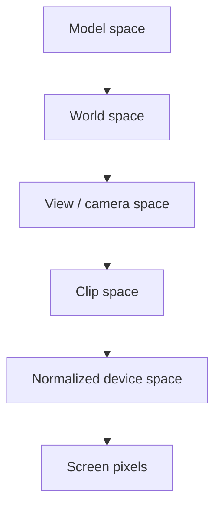

## Add one more direction

A 2D game often describes a position with `x` and `y`.


A 3D game adds a third axis:

```rust
#[derive(Clone, Copy, Debug, PartialEq)]
struct Vec3 {
    x: f32,
    y: f32,
    z: f32,
}
```

A `Vec3` is not special hardware. It is a **vector**: an ordered group of numbers that we choose to treat as one mathematical object. The order matters because each slot has a role. Swapping `x` and `z` changes the meaning even when the three numbers stay the same.

Vectors are useful because one operation can apply to the whole idea. Adding a movement vector to a position moves the position. Subtracting two positions gives the difference between them.

Games disagree about which axis means “up.” Never assume. Move in one direction at a time and observe which field changes.

🧭 **Coordinate check:** change one axis while keeping the others still. The field that follows the movement tells you what that axis means in this game.
{: .emoji-note }


## A coordinate frame is an origin plus directions

Coordinates are not properties a point owns by itself. The numbers make sense only
inside a **coordinate frame**: an origin and three axis directions. The point
`(10, 0, 0)` means “ten units along this frame's x-axis from this frame's origin.”
Change the frame and the same place receives different numbers.

A practical frame description answers four questions:

1. Where is the origin?
2. Which axis points right or forward?
3. Which axis points up?
4. Do positive rotations follow a left-handed or right-handed convention?

These are not cosmetic choices. If an overlay reads an engine that uses `z` as up
but performs math as though `y` were up, the result may look almost correct near
the origin and drift badly elsewhere.

## Position versus direction

A position answers “where?” A direction answers “which way?” Both can use three numbers, but they mean different things.

```rust
impl Vec3 {
    fn subtract(self, other: Self) -> Self {
        Self {
            x: self.x - other.x,
            y: self.y - other.y,
            z: self.z - other.z,
        }
    }

    fn length(self) -> f32 {
        (self.x * self.x + self.y * self.y + self.z * self.z).sqrt()
    }
}

let direction = enemy_position.subtract(player_position);
let distance = direction.length();
```

Subtracting two positions gives the direction from one to the other.

A point and a direction can both be stored as three floats, but the allowed math is
different:

| Expression | Meaning |
|---|---|
| point − point | direction and distance between places |
| point + direction | a new place after moving |
| direction + direction | combined movement |
| point + point | usually has no useful geometric meaning |

This is a good example of why a memory layout does not tell the whole story. Three
adjacent floats could be a position, velocity, color, scale, or Euler angles. Watch
how the game uses them before assigning a name.

## Length, normalization, and alignment

The length of a direction is its distance. **Normalizing** divides by that length so
the result keeps only direction and has length one. Check for a near-zero length
first; there is no meaningful direction from a point to itself.

```rust
fn normalized(value: Vec3) -> Option<Vec3> {
    let length = value.length();
    if !length.is_finite() || length <= f32::EPSILON {
        return None;
    }
    Some(Vec3 {
        x: value.x / length,
        y: value.y / length,
        z: value.z / length,
    })
}
```

The **dot product** measures alignment. For two normalized directions it is near
`1` when they face the same way, `0` when perpendicular, and `-1` when opposite.
A field-of-view test can compare the camera's forward direction with the direction
to a target. This avoids turning both vectors into angles merely to ask whether they
point roughly the same way.

## Yaw and pitch

Many first-person games describe view direction with:

- **yaw**—turn left or right;
- **pitch**—look up or down;
- **roll**—tilt sideways.

To point toward a target, first find the difference:

```rust
let delta = target.subtract(camera);
```

Then derive angles. The exact axis names and signs depend on the game:

```rust
fn aim_angles(delta: Vec3) -> (f32, f32) {
    let yaw = delta.y.atan2(delta.x).to_degrees();
    let flat_distance = delta.x.hypot(delta.y);
    let pitch = delta.z.atan2(flat_distance).to_degrees();
    (yaw, pitch)
}
```

`atan2` handles all four directions around a circle. Ordinary `atan(y / x)` loses information and breaks when `x` is zero.

## World space to screen space

A 3D point cannot be drawn directly on a 2D monitor. The renderer transforms it through several spaces:



A **coordinate space** is a reference frame—an agreement about where the origin is and what the axes mean.

- Model space describes a vertex relative to its own model. A character’s hand can be “half a meter from the character’s center.”
- World space describes everything relative to the level’s origin.
- View space moves the world so the camera behaves like the origin looking forward.
- Clip space prepares points for perspective and clipping.
- Screen space uses the pixel dimensions of the window.

The point is not physically moving through five worlds. We keep expressing the same point relative to a different reference frame.

## What a matrix actually does

A **matrix** is a rectangular table of numbers used as a transformation rule. A 4×4 matrix has four rows and four columns:

```rust
#[derive(Clone, Copy, Debug)]
struct Mat4 {
    values: [f32; 16],
}
```

When a renderer multiplies a point by a matrix, each output component becomes a weighted combination of the input components. The weights can encode rotation, scale, translation, camera orientation, and perspective.

You do not need to memorize sixteen formulas to use one carefully. Start with the promise:

```text
input point in one coordinate space
× transformation matrix
= output point in another coordinate space
```

Matrix **layout** matters. Some engines store rows next to each other; others store columns next to each other. Some math libraries multiply vectors on the left and others on the right. A transposed or wrongly ordered matrix can produce believable-looking nonsense, which is why we verify it by moving the camera along one axis at a time.

Transform order matters too. Rotation followed by translation usually differs from
translation followed by rotation. In plain English, “turn the model around its own
origin, then place it in the world” is not the same operation as “place it, then turn
the whole world-space position around the origin.” Matrix multiplication records
that order, so swapping two matrices is not a harmless style change.

A 4×4 view-projection matrix commonly combines the camera and projection steps. The transformed `w` value helps determine whether a point is in front of the camera.

## Why perspective uses `w`

Far-away objects look smaller. After the matrix transformation, perspective division divides the transformed `x`, `y`, and `z` by `w`:

```text
ndc_x = clip_x / clip_w
ndc_y = clip_y / clip_w
```

If `w` is zero or behind the camera’s accepted direction, the division is invalid or the point should not be drawn. That is why world-to-screen code checks `w` before producing pixels.

## Screen coordinates

After projection and perspective division, normalized coordinates are often in `-1..=1`. Convert them to pixels:

```rust
fn ndc_to_screen(x: f32, y: f32, width: f32, height: f32) -> (f32, f32) {
    let screen_x = (x + 1.0) * 0.5 * width;
    let screen_y = (1.0 - y) * 0.5 * height;
    (screen_x, screen_y)
}
```

The `1.0 - y` flips an upward math axis into a downward screen-pixel axis.

## Coordinate sanity checks

Before using values:

```rust
fn valid_point(point: Vec3) -> bool {
    [point.x, point.y, point.z]
        .into_iter()
        .all(|value| value.is_finite() && value.abs() < 1_000_000.0)
}
```

Also verify:

- standing still gives stable coordinates;
- moving along one axis changes the expected field;
- distance grows and shrinks sensibly;
- yaw wraps where expected;
- points behind the camera are rejected.

## The useful mental model

Do not memorize every engine’s coordinate system. Remember the pipeline:

```text
find positions
→ subtract to get a direction
→ use atan2 for angles
→ transform through the camera
→ convert normalized coordinates to pixels
```

Later lessons reuse this math in offline observer tools.


