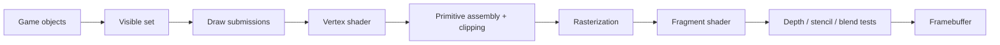

## Use a setting as an anchor

Urban Terror 4.3.4 has console variables that visibly affect rendering. In an offline local session, toggling entity drawing gives us a clean experiment.


When entities disappear, the game is likely checking a flag before submitting their draw work.

## Follow state through the rendering pipeline

A frame crosses several representations before pixels appear:

```text
game objects -> visible draw list -> vertices and materials -> GPU commands -> fragments -> framebuffer
```

A CPU-side flag can stop an entity before a draw call exists. Graphics state can change how an existing draw is tested. A shader can change the final color. Similar screenshots can therefore come from very different layers.

Locate the earliest layer that explains the observation. If no call is submitted, inspect culling or entity selection. If the call exists but pixels disappear, inspect transforms, clipping, depth, and blending. Keeping those stages separate prevents the vague conclusion that “rendering is broken.”



The names differ between graphics APIs, but the responsibilities remain useful:

- the game decides which objects exist and which may be visible;
- a draw submission selects geometry, shader programs, textures, and state;
- a vertex shader transforms each submitted vertex and may calculate values for
  later stages;
- primitive assembly groups vertices into triangles, lines, or points;
- clipping trims or rejects primitives outside the camera's clip volume;
- rasterization finds the pixel-sized **fragments** covered by each primitive;
- a fragment shader computes candidate colors and other outputs;
- depth, stencil, and blending rules decide how candidates affect stored pixels.

A fragment is not yet a final pixel. Several triangles may produce fragments for
the same pixel, and tests may reject most of them.

## Geometry is vertices plus an interpretation

A **mesh** is usually a collection of vertices plus enough information to connect
them into primitives. A vertex is a record, not merely a position:

| Attribute | What it commonly represents |
|---|---|
| position | model-space location |
| normal | local surface direction used for lighting |
| texture coordinate | location in a 2D image |
| color | per-vertex tint or data |
| bone indices/weights | how an animation skeleton moves the vertex |

An **index buffer** stores integer vertex references. For example, two triangles
forming a square can share four vertices instead of duplicating six. In an indexed
draw, `count` usually says how many indices to consume—not how many unique vertices,
triangles, or objects exist. With triangle topology and no primitive restart,
`count / 3` is the submitted triangle count, but clipping and degenerate triangles
mean it is still not the number of visible triangles.

## Render state is context for interpreting a draw

A draw call does not contain every fact needed to explain its pixels. Its meaning
depends on state already bound to the graphics context:

```text
geometry + topology + transforms + shaders + textures + render state = draw meaning
```

Important state includes face culling, depth comparison, depth writes, stencil
operations, blending, scissor rectangles, color masks, and the current framebuffer.
Changing `depth_test_enabled` is different from changing the depth comparison from
`LESS` to `ALWAYS`, and both are different from leaving the test on while disabling
depth writes.


## Search for the flag

Scan for the flag’s current integer value. Toggle it, filter, and repeat. Then set a read breakpoint on a confirmed candidate and render one frame.


Look for a conditional pattern:

```nasm
cmp dword ptr [render_flag], 0
je skip_entities
call draw_entities
```

Your actual build may use `test` instead of `cmp`, invert the condition, or store the setting in a structure.

## Name the behavior, not just the address

Represent observations:

```rust
#[derive(Debug)]
struct RenderSettingsSnapshot {
    draw_entities: bool,
    depth_test_enabled: bool,
}

fn decode_bool(raw: u32) -> Result<bool, u32> {
    match raw {
        0 => Ok(false),
        1 => Ok(true),
        unexpected => Err(unexpected),
    }
}
```

Rejecting unexpected values protects you from silently using the wrong address.

## Trace into an entity record

Pause where one entity is prepared for drawing. Compare the pointer across:

- the local player;
- another player;
- a weapon;
- a map object.


Record only confirmed fields:

```rust
struct EntityLayout {
    kind: usize,
    position: usize,
    model_id: usize,
    team: usize,
}
```

One field rarely identifies a category by itself. Combine several observations.

## Depth testing in plain English

After geometry is transformed and clipped, it produces candidate screen fragments. Each fragment carries a depth value. The depth test compares that value with the one already stored for the same screen location. When the comparison passes, the fragment may update the color and depth buffers; when it fails, the nearer surface remains.

Depth is therefore not a distance flag stored on one entity. It is a per-fragment comparison performed after projection. If depth testing is disabled or changed to always pass, later fragments can appear on top even when their geometry is behind a wall.

There are two related operations:

1. **depth test:** compare the candidate fragment's stored depth with the current
   depth-buffer value;
2. **depth write:** if the fragment survives, optionally replace the stored value.

Transparent objects often keep the depth test but disable depth writes and render
back-to-front. Turning off the test entirely is not equivalent.

Perspective depth is normally **nonlinear**. More of the depth buffer's numeric
precision is concentrated near the camera. With the traditional mapping, making
the near plane extremely small compared with the far plane wastes precision and
can cause two nearby surfaces to alternate visibility, called *z-fighting*.
Modern engines may use a floating-point reversed-z buffer, where farther values and
the comparison direction are reversed to improve precision. Never hard-code “small
depth means near” until the projection and comparison convention are confirmed.

The depth buffer answers “which submitted fragment wins at this sample?” It does
not answer whether an object is logically visible to gameplay. Collision queries,
portals, fog-of-war systems, and server state may use entirely different data.


That visual result proves a rendering rule changed; it does **not** prove which objects a call represents. You still need classification tests.

## Keep experiments frame-local

Graphics state is shared. If you change a setting for one draw:

1. save the previous state;
2. apply the temporary state;
3. perform the one draw;
4. restore the previous state.

Forgetting restoration can break the entire frame, menus, or later effects.

A restore guard makes the cleanup rule explicit:

```rust
struct RestoreOnDrop<F: FnOnce()>(Option<F>);

impl<F: FnOnce()> Drop for RestoreOnDrop<F> {
    fn drop(&mut self) {
        if let Some(restore) = self.0.take() {
            restore();
        }
    }
}
```

The actual graphics calls may need FFI, but the “restore no matter how this scope exits” pattern stays in ordinary safe code.

Older OpenGL behaves like a state machine: many calls change context state that later draw calls inherit. Treat each temporary change as a scoped transaction. Capture the exact old value, apply the experiment, perform the intended draw, and restore even on early return. “Set it back to the usual default” is weaker than restoring the value that was actually present.

Also restore state on the same thread and context where it was captured. OpenGL
context state belongs to a current context; a worker thread cannot safely repair
render-thread state merely because it has the same function pointers.

## Separate visibility failures by stage

Use the earliest observable difference to narrow the cause:

| Observation | Likely stage |
|---|---|
| object absent from visible list | game filtering or CPU culling |
| draw call absent | submission/batching path |
| vertices leave clip volume | transform, camera, or clipping |
| fragments exist but fail depth | depth state or existing occluder |
| fragments pass but write no color | color mask, shader discard, stencil |
| color appears but looks wrong | shader inputs, texture, lighting, blend, color space |

This table is a diagnostic order, not proof. Some engines merge or reorder stages,
and GPU-driven pipelines can construct visible lists on the GPU.

## Build the Urban Terror 4.3.4 memory wallhack

The `r_drawentities` trace in this exact build leads through the call at `0x0052F71F`. Inside the entity loop, `ebx` holds the current render entity at `0x0052D2FD`. The field at `[ebx+4]` cycles through values such as `0x0D`, `0x40`, `0x82`, and `0x83`.

Hook this exact point:

```text
hook:    0x0052_D2FD
resume:  0x0052_D303
change:  write 0x0D to dword ptr [ebx+4]
replay:  mov dword ptr [0x0102_AE98], ebx
```

A 32-bit detour cave has the same shape as the Wesnoth cave:

```rust
#[cfg(target_arch = "x86")]
#[unsafe(naked)]
unsafe extern "C" fn render_flag_cave() {
    core::arch::naked_asm!(
        "pushfd",
        "pushad",
        "mov dword ptr [ebx + 4], 0x0D",
        "popad",
        "popfd",
        "mov dword ptr [0x0102_AE98], ebx",
        "jmp {resume}",
        resume = const 0x0052_D303,
    );
}
```

Install a six-byte verified detour at `0x0052D2FD`, enter a local game, enable `cg_thirdperson`, and add bots. The local player and bots should render through walls exactly as in the screenshot. Values `0x83` and `0x40` should not create the same effect; that comparison is how you prove `0x0D` is the relevant render state.

Restore the original six hook bytes when the feature is disabled. This memory-based wallhack is intentionally kept as a full target-specific lab before the more general OpenGL approach.

The DLL already contains the complete verified implementation. Build and inject it into `Quake3-UrT.exe`, enter a local bot match, and press **F1** to toggle this memory wallhook. Press **End** to stop and restore all six bytes. See [`install_urban_terror_memory_wallhook`]({{ site.baseurl }}/windows-labs/src/windows_impl/game_hooks.rs) and the Urban Terror hotkey worker in [`dll.rs`]({{ site.baseurl }}/windows-labs/src/windows_impl/dll.rs).

## What the experiment proves

The comparison isolates how one CPU-side flag changes GPU behavior. It does not prove that every build uses the same flag, address, or rendering path, so keep the executable fingerprint and original bytes beside the result.
