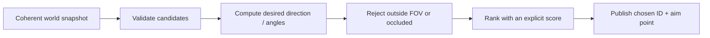

## Break the problem into layers

An aim-assistance experiment contains three different problems:

1. **Observation** — where are the camera and candidates?
2. **Decision** — which candidate is valid and closest to the crosshair?
3. **Action** — where and when should the verified view-angle update happen?

Keep these layers separate. Most of the interesting work belongs in safe, testable code.


{: .diagram-on-dark }



Every arrow has a contract. If the snapshot mixes two frames, perfect trigonometry
still points at an old position. If validation confuses an entity slot with a live
identity, ranking can choose a reused object. Math cannot repair bad observations.

## Confirm the view angles

Use AssaultCube’s local debug commands and memory scanning to find yaw and pitch. Rotate only horizontally while searching for yaw, then only vertically for pitch.


Validate:

- one full turn changes yaw by the expected range;
- looking up and down changes pitch;
- standing still keeps both stable;
- values are finite;
- the sign and zero direction match your formulas.

Write the convention beside the values, for example:

```text
yaw_degrees: increases clockwise when viewed from above
pitch_degrees: positive means looking down
forward_at_zero: +Y
up_axis: +Z
```

This prevents “fixes” such as unexplained `+90` or sign changes from leaking into
generic math. Convert from the engine convention at one boundary, perform the
calculation in one documented convention, then convert back.

## Read player snapshots

```rust
#[derive(Clone, Debug)]
struct PlayerSnapshot {
    id: EntityId,
    position: Vec3,
    head: Vec3,
    team: u32,
    health: i32,
}

impl PlayerSnapshot {
    fn is_valid_target(&self, local_team: u32) -> bool {
        self.health > 0
            && self.team != local_team
            && valid_point(self.head)
    }
}
```

Find a verified player count or bounded list. Reject impossible counts before allocating or looping.

## Exact AssaultCube 1.2.0.2 layout

The nametag function from the previous lesson reveals the entity loop. In this build:

```text
local player pointer:  0x0050_9B74
entity-list pointer:   0x0050_F4F8
current player count:  0x0050_F500
entity-list stride:    4 bytes (one 32-bit pointer)
```

Enable `dbgpos 1` and `showstats 1`, search for the displayed yaw as a float, and follow its writer back to `[0x509B74]`. Viewing the object as floats confirms these offsets:

```rust
#[repr(C)]
struct AssaultCubePlayer {
    unknown_00: [u8; 0x04],
    x: f32,                    // +0x04
    y: f32,                    // +0x08
    z: f32,                    // +0x0C
    unknown_10: [u8; 0x30],
    yaw: f32,                  // +0x40
    pitch: f32,                // +0x44
    unknown_48: [u8; 0x2F0],
    dead: i32,                 // +0x338: 0 alive, 1 dead
}

const LOCAL_PLAYER: *const *mut AssaultCubePlayer =
    0x0050_9B74 as *const *mut AssaultCubePlayer;
const ENTITY_LIST: *const *const *mut AssaultCubePlayer =
    0x0050_F4F8 as *const *const *mut AssaultCubePlayer;
const PLAYER_COUNT: *const i32 = 0x0050_F500 as *const i32;
```

First prove the layout by adding `1.0` to `(*local).yaw` once per update. Your view should spin smoothly. If it does not, stop—the build or layout is wrong.

## Calculate desired angles

```rust
#[derive(Clone, Copy, Debug)]
struct Angles {
    yaw: f32,
    pitch: f32,
}

fn angles_to(camera: Vec3, target: Vec3) -> Option<Angles> {
    if !valid_point(camera) || !valid_point(target) {
        return None;
    }

    let delta = target.subtract(camera);
    let horizontal = delta.x.hypot(delta.y);
    if horizontal < f32::EPSILON && delta.z.abs() < f32::EPSILON {
        return None;
    }

    Some(Angles {
        yaw: delta.y.atan2(delta.x).to_degrees(),
        pitch: delta.z.atan2(horizontal).to_degrees(),
    })
}
```

The math helpers avoid two tempting shortcuts:

```diff
 fn aim_error(camera: Vec3, target: Vec3, current: Angles) -> Angles {
     let delta = target.subtract(camera);
-    let yaw = (delta.y / delta.x).atan().to_degrees();
-    let pitch = (delta.z / delta.x).atan().to_degrees();
-    let yaw_error = yaw - current.yaw;
+    let horizontal = delta.x.hypot(delta.y);
+    let yaw = delta.y.atan2(delta.x).to_degrees();
+    let pitch = delta.z.atan2(horizontal).to_degrees();
+    let yaw_error = (yaw - current.yaw + 180.0)
+        .rem_euclid(360.0) - 180.0;
     Angles { yaw: yaw_error, pitch: pitch - current.pitch }
 }
```

> **Why this version?** Division loses which quadrant the target occupies and
> behaves badly when the divisor is zero. `atan2(y, x)` uses both signs and
> handles axis-aligned directions. `hypot` measures horizontal distance without
> choosing one axis. `rem_euclid` then folds equivalent angles into the range
> `-180°..180°`, so crossing the wrap point chooses a two-degree turn instead of
> a 358-degree turn.
{: .block-why }

Your target may need a yaw offset, inverted pitch, or different axes. Derive those adjustments from known directions.

### Why the formulas have this shape

Project `delta` onto the horizontal plane first:

```text
horizontal = √(delta_x² + delta_y²)
yaw        = atan2(delta_y, delta_x)
pitch      = atan2(delta_z, horizontal)
```

Yaw asks for the direction of the horizontal projection. Pitch asks how far the
full vector rises above that projection. Using total 3D distance as the second
pitch argument would measure a different angle.

When `horizontal = 0`, the target is directly above or below. Pitch remains
defined, but yaw is mathematically unconstrained because every horizontal heading
points to the same vertical line. Preserve the current yaw in that case rather
than letting an arbitrary `atan2(0, 0)` result cause a snap.

### Angle error can be measured without Euler angles

For normalized current forward vector `f` and target direction `d`:

```text
angular_error = acos(clamp(dot(f, d), -1, 1))
```

This gives the true angle between two directions and avoids yaw wraparound. It is
often the cleanest field-of-view test:

```rust
fn inside_cone(forward: Vec3, toward: Vec3, half_angle_degrees: f32) -> bool {
    let Some(forward) = normalized(forward) else { return false };
    let Some(toward) = normalized(toward) else { return false };
    let threshold = half_angle_degrees.to_radians().cos();
    let dot = forward.x * toward.x + forward.y * toward.y + forward.z * toward.z;
    dot >= threshold
}
```

Cosine decreases from `1` to `-1` over `0..π`, so a smaller cone has a larger
threshold. Comparing dots avoids calling `acos` for every candidate.

## Measure angular difference

Angles wrap around. The distance between `179°` and `-179°` is `2°`, not `358°`.

```rust
fn shortest_angle_delta(current: f32, desired: f32) -> f32 {
    (desired - current + 180.0).rem_euclid(360.0) - 180.0
}

fn angular_error(current: Angles, desired: Angles) -> f32 {
    let yaw = shortest_angle_delta(current.yaw, desired.yaw);
    let pitch = desired.pitch - current.pitch;
    yaw.hypot(pitch)
}
```



## Select the smallest valid error

```rust
fn best_target<'a>(
    players: &'a [PlayerSnapshot],
    camera: Vec3,
    current: Angles,
    local_team: u32,
    max_error: f32,
) -> Option<(&'a PlayerSnapshot, Angles)> {
    players.iter()
        .filter(|player| player.is_valid_target(local_team))
        .filter_map(|player| {
            let desired = angles_to(camera, player.head)?;
            let error = angular_error(current, desired);
            (error <= max_error).then_some((player, desired, error))
        })
        .min_by(|a, b| a.2.total_cmp(&b.2))
        .map(|(player, angles, _)| (player, angles))
}
```

This is an iterator pipeline: filter invalid players, calculate candidates, enforce a field-of-view limit, then select the smallest error.

Be precise about the score. Nearest world distance, smallest angular error, and
smallest screen-pixel distance answer different questions:

| Score | Favors | Important limitation |
|---|---|---|
| world distance | physically nearest target | may be far from crosshair |
| angular error | smallest camera rotation | ignores viewport aspect/FOV shape |
| pixel distance | nearest rendered marker | depends on current projection and resolution |
| weighted score | chosen trade-off | weights need units and testing |

Do not compare mixed units directly. If a score is
`angle_degrees + distance_metres`, its weights silently claim that one degree is
worth one metre. Normalize each term or state the conversion intentionally.

Tie-breaking must also be stable. If two scores differ only by floating-point
noise, prefer the current target or a stable entity ID. Otherwise the choice can
oscillate every frame.

## Choose an aim point, not merely an entity origin

An entity's position often refers to its feet, collision-cylinder center, or model
pivot. A head position may come from a bone transform, tagged attachment point, or
fixed offset. Animation changes bone positions each frame.

```text
bone_world = entity_world × skeleton_pose × bone_bind_inverse × local_point
```

The exact matrix order depends on convention. The important distinction is that a
bone's local coordinates are not world coordinates until the hierarchy has been
accumulated. A constant z offset may work for one stance and fail while crouching,
jumping, or using a different model.

## Account for time only when the model requires it

For an instantaneous hitscan query, aim at the current coherent target point. For
a projectile with constant speed `s`, target position `p`, target velocity `v`, and
shooter position `o`, solve for a positive time `t`:

```text
|p + vt - o| = s t

(v·v - s²)t² + 2((p-o)·v)t + (p-o)·(p-o) = 0
```

Choose the smallest positive finite root, then aim at `p + vt`. If there is no
positive root, the constant-velocity target is not interceptable at that projectile
speed. Gravity, drag, network interpolation, and launch delay require a richer
model; do not hide them inside a guessed multiplier.

## Test with synthetic data

You can prove the math without writing to a game:

```rust
#[test]
fn wraparound_uses_shortest_turn() {
    let delta = shortest_angle_delta(179.0, -179.0);
    assert!((delta - 2.0).abs() < 0.001);
}
```

Add tests for targets above, below, behind, at the same position, and outside the allowed error.

Add convention tests with known basis directions. If the engine says forward is
`+Y` at `90°`, encode that as a test. Also check `NaN`, infinity, a vertical target,
wrap boundaries on both sides, and deterministic tie-breaking.

## Visualization before action

For the offline lab, first print the chosen ID and desired angles or draw a separate indicator. Confirm that the selected target matches what you see.


## Write the working offline aimbot

The in-process update resolves the list, chooses the nearest live entity, and writes the calculated angles:

```rust
/// # Safety
/// Call only in AssaultCube 1.2.0.2 while a local bot match is active.
unsafe fn update_aimbot() -> anyhow::Result<()> {
    // 🛡️ SAFETY: exact-build globals verified before the feature was enabled.
    let local = unsafe { LOCAL_PLAYER.read() };
    anyhow::ensure!(!local.is_null(), "local player is unavailable");

    // 📏 SAFETY: exact-build entity globals; count is bounded before iteration.
    let list = unsafe { ENTITY_LIST.read() };
    let count = unsafe { PLAYER_COUNT.read() };
    anyhow::ensure!(!list.is_null() && (1..=32).contains(&count), "bad entity list");

    // 🔍 Copy the three coordinates while the pointer is known-good. The math
    // below then works on ordinary copied values instead of repeated raw reads.
    let local_position = unsafe { Vec3 {
        x: (*local).x,
        y: (*local).y,
        z: (*local).z,
    }};

    let mut best: Option<(f32, Angles)> = None;
    for index in 0..count as usize {
        // ✅ SAFETY: `index` is inside the verified 32-entry list bound.
        let enemy = unsafe { list.add(index).read() };
        if enemy.is_null() || enemy == local || unsafe { (*enemy).dead != 0 } {
            continue;
        }

        let enemy_position = unsafe { Vec3 {
            x: (*enemy).x,
            y: (*enemy).y,
            z: (*enemy).z,
        }};
        let Some(mut desired) = angles_to(local_position, enemy_position) else {
            // ⚠️ Coincident points have no useful direction; skip them instead
            // of allowing a divide-by-zero/NaN to reach the game's camera.
            continue;
        };
        desired.yaw += 90.0; // AssaultCube's forward direction is 90°
        let delta = enemy_position.subtract(local_position);
        let distance = delta.x.hypot(delta.y);

        // 🎯 Keep both the comparison score and its angles together so a later
        // candidate cannot accidentally update only half of the chosen target.
        if best.is_none_or(|(best_distance, _)| distance < best_distance) {
            best = Some((distance, desired));
        }
    }

    if let Some((_, desired)) = best {
        // 🎯 SAFETY: `local` is the verified live player object for this tick.
        unsafe {
            (*local).yaw = desired.yaw;
            (*local).pitch = desired.pitch;
        }
    }
    Ok(())
}
```

Run it every few milliseconds in the injected worker. In a local match with idle bots, the view should lock to the nearest live player and switch after that bot dies. The `+90°` correction is target-specific and comes from AssaultCube starting forward at 90 degrees.

Notice that this exact implementation ranks horizontal world distance, while
`best_target` above ranks angular error. That is an intentional contrast, not two
names for the same rule. Replace the score only after deciding which behavior the
tool should implement.

## Diagnose aim errors geometrically

| Symptom | Likely assumption |
|---|---|
| constant 90° horizontal error | zero-forward convention |
| correct yaw, inverted pitch | pitch sign or screen/axis orientation |
| accurate nearby, trails moving targets | stale snapshots or missing motion model |
| selects targets behind camera | unwrapped angle or missing dot/FOV test |
| snaps when target is straight above | undefined yaw at zero horizontal distance |
| switches rapidly between two targets | unstable tie-breaking or noisy positions |
| points at feet while model animates | entity origin used instead of aim point/bone |

This is the complete path for the exact build: static globals → reversed player struct → target math → live yaw/pitch write.

The course DLL already runs that loop. Build and inject it into `ac_client.exe`, start a local bot match, and press **F4** to toggle the aimbot:

```powershell
cargo build --release --target i686-pc-windows-msvc
.\target\i686-pc-windows-msvc\release\injector.exe `
  ac_client.exe `
  .\target\i686-pc-windows-msvc\release\gha_windows_labs.dll
```

The full compiled implementation is [`assaultcube_tools.rs`]({{ site.baseurl }}/windows-labs/src/windows_impl/assaultcube_tools.rs). It bounds the player count to 32, rejects null pointers and non-finite coordinates, skips dead entities, chooses the closest live target, and performs the real volatile yaw/pitch writes. [`dll.rs`]({{ site.baseurl }}/windows-labs/src/windows_impl/dll.rs) owns the F4 state and stops the update loop before cleanup.

{% include quiz.html
  id="angle-wraparound"
  type="multiple-choice"
  title="Choose the shortest turn"
  prompt="Your current yaw is `179°` and the desired yaw is `-179°`. What signed angular change follows the shortest path?"
  options="-358°||-180°||+2°||+358°"
  answer="2"
  explanation="Angles wrap at the edge of their range. Turning forward by 2° crosses from 179° to -179° and is much shorter than turning backward by 358°. The normalization function exists so target selection compares this wrapped difference instead of ordinary subtraction."
%}
