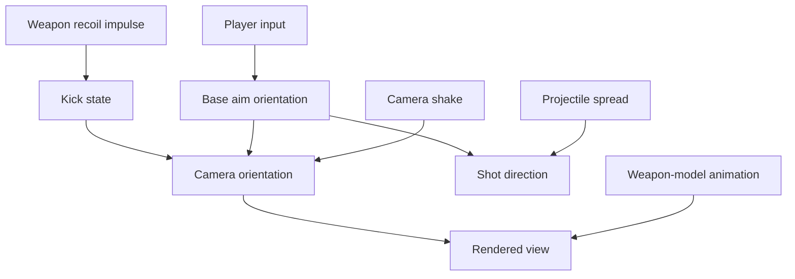

## What recoil is inside a program

On screen, recoil looks like the weapon pushing the camera. In code, it is
usually one or more numbers added to a view model over time.

The game may keep separate values for:

- the player’s intended yaw and pitch from the mouse;
- an immediate weapon kick;
- a recovery amount that eases back toward zero;
- random spread used by projectile calculations;
- camera shake used only for presentation;
- the weapon model’s animation.

Those systems can produce similar movement while controlling different things.
Removing a camera kick should not be assumed to remove projectile spread, and
changing the weapon animation should not be assumed to change aim.



This diagram deliberately gives rendered view and shot direction separate paths.
If two systems read the same base aim but add different offsets, changing one will
not necessarily change the other.

An **angle** describes rotation. Yaw usually turns left and right around a
vertical axis. Pitch looks up and down. Games may store degrees, radians, fixed
point units, or normalized values, so the number `90.0` has meaning only after
measurement.

## Observe one axis at a time

In an offline AssaultCube session, record view angles while:

- standing still;
- moving the mouse;
- firing one shot;
- firing a burst;
- switching weapons.

Recoil may change the same yaw and pitch values as the mouse, or it may update separate kick values that are combined later.

Record time as well as values. A single before-and-after pair shows total
movement; a short time series shows whether the kick happens instantly and how
recovery behaves across later frames.

Use a monotonic timestamp and record the frame or simulation tick when available.
Wall-clock timestamps can jump; a monotonic clock measures elapsed duration. Also
record the weapon, fire mode, and whether the shot was accepted. Otherwise a reload
or dry-fire sample can be mistaken for zero recoil.

## Break on the angle write

Set a write breakpoint on the confirmed pitch field and fire once.


Compare the call stack with an ordinary mouse movement. A path that appears only after firing is a useful lead.

Step upward until you can explain the inputs:

```text
weapon fired
→ recoil amount selected
→ horizontal and vertical kick calculated
→ camera/view state updated
```


## Model recoil separately

```rust
#[derive(Clone, Copy, Debug, Default)]
struct Recoil {
    yaw: f32,
    pitch: f32,
}

impl Recoil {
    fn is_reasonable(self) -> bool {
        self.yaw.is_finite()
            && self.pitch.is_finite()
            && self.yaw.abs() <= 90.0
            && self.pitch.abs() <= 90.0
    }
}
```

Do not assume the units are degrees. Compare known view changes and weapon differences.

`is_finite` rejects `NaN` and infinity. Those special floating-point values can
spread through later math and make comparisons or drawing unreliable. The
`90.0` limits are a lab sanity check, not proof of the game’s real unit system.

Name samples with units:

```rust
#[derive(Clone, Copy, Debug)]
struct TimedKick {
    seconds_after_shot: f32,
    yaw_degrees: f32,
    pitch_degrees: f32,
}
```

Degrees per frame and degrees per second are different quantities. A per-frame
recovery constant produces different behavior when frame rate changes unless the
engine runs that update on a fixed simulation tick.

## Recoil is often an impulse plus recovery

A simple model keeps a kick displacement `x` and velocity `v`. Firing adds an
impulse; each update pulls the displacement toward zero and damps velocity:

```text
on shot:  v ← v + impulse
update:   acceleration = -stiffness × x - damping × v
          v ← v + acceleration × dt
          x ← x + v × dt
```

This damped-spring model explains overshoot and smooth return. Other games use a
fixed curve, exponential decay, a table of weapon-specific offsets, or direct
angle changes. Fit the simplest model supported by measured samples rather than
assuming every recovery is a spring.

For exponential recovery, `x(t) = x₀e^(-kt)`. Equal fractions disappear in equal
time intervals. For linear recovery, equal absolute amounts disappear. Plotting a
few samples makes the difference visible.

## Prefer measurement over removal

First build an observer that logs a short sequence:

```rust
#[derive(Debug)]
struct RecoilSample {
    shot: u32,
    before: Angles,
    after: Angles,
}

impl RecoilSample {
    fn delta(&self) -> Recoil {
        Recoil {
            yaw: shortest_angle_delta(self.before.yaw, self.after.yaw),
            pitch: self.after.pitch - self.before.pitch,
        }
    }
}
```

This can reveal:

- a fixed pattern;
- random spread;
- weapon-specific values;
- accumulation and recovery over time.

Repeat the same shot many times. Compute mean kick to expose a fixed pattern and
the spread around that mean to expose randomness. If shot number inside a burst
matters, group by shot index instead of averaging the whole magazine together.

```text
mean = sum(samples) / count
variance = sum((sample - mean)²) / (count - 1)   when count > 1
```

Variance describes observed variation; it does not prove which random-number
source or probability distribution produced it.

## Test a code hypothesis carefully

A temporary debugger patch can show whether one instruction contributes to recoil. Record and restore the original bytes, change one instruction, and compare the same controlled shot.


If weapon animation still moves but the camera does not, you may have isolated view kick. If accuracy changes too, the instruction controls more than presentation.

Compare at least these observables separately:

| Observable | What it can tell you |
|---|---|
| stored base yaw/pitch | player-input orientation |
| final camera matrix | presentation actually rendered |
| shot direction or impact | gameplay trajectory |
| weapon-model transform | view-model animation |
| kick accumulator over time | recovery state |

## Apply the AssaultCube 1.2.0.2 no-recoil patch

The firing path begins around `0x0046363A`; after breaking on the live pitch field while firing, the recoil store is found at **`0x0045BAAD`**. Replace its complete three-byte instruction with:

```rust
const RECOIL_STORE: usize = 0x0045_BAAD;
const ORIGINAL_RECOIL_STORE: [u8; 3] = [0xD9, 0x5B, 0x44];
const NO_RECOIL: [u8; 3] = [0xDD, 0xD8, 0x90];
```

These bytes pop the pending x87 value with `fstp st(0)` and pad the remaining byte, so the recoil value is discarded instead of being stored to `[ebx+0x44]`, the pitch field.

The older x87 floating-point unit behaves like a small stack of number
registers. The original store removes its top value after writing it. Merely
NOPing the whole instruction would leave that value on the x87 stack and could
break later calculations. `fstp st(0)` discards the value while preserving the
original stack effect; `nop` fills the final byte so the patch length remains
three.

Use a verified patch:

```rust
let plan = PatchPlan::new(
    RECOIL_STORE,
    &ORIGINAL_RECOIL_STORE,
    &NO_RECOIL,
)?;
let mut no_recoil = plan.apply(&process)?;
```

Fire a single shot before and after enabling it. Ammo and firing animation should still work, but the camera should no longer kick upward. Restore the original three bytes and confirm recoil returns.

## What the recoil experiment proves

Many effects are layers:

```text
input angle
+ recoil kick
+ camera shake
+ animation sway
= final view
```

Do not label the first changing float “recoil.” Trace when it is produced and where it is combined.

Composition order matters for 3D rotations. Adding small yaw/pitch offsets is a
common approximation, but full orientations may be matrices or quaternions. Large
rotations do not generally commute: applying yaw then pitch can differ from pitch
then yaw. Identify where the engine converts or combines its representation before
assigning meaning to one component.

## Common false conclusions

| Observation | What it does **not** prove |
|---|---|
| camera no longer rises | projectile spread is gone |
| weapon model stops moving | aim direction is unchanged |
| pitch write disappears | no later camera transform adds kick |
| repeated shots look similar | recoil is fully deterministic |
| one weapon uses an offset table | every weapon uses that table |

Keep this experiment offline. Its value is learning to separate a visible effect into measurable contributions.

The compiled in-process implementation is
[`enable_assaultcube_no_recoil`]({{ site.baseurl }}/windows-labs/src/windows_impl/game_hooks.rs).
After injection, **F2** toggles it and restoration puts `D9 5B 44` back.
