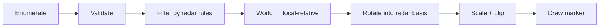

## A radar is a small rendering pipeline

A radar normally does not own the authoritative player state. It reads a list
of entities, rejects entries it should not show, transforms surviving world
positions into radar coordinates, and asks a drawing system to render markers.

That creates several separate questions:

```text
enumeration  which entity records are visited?
validation   which records are active and usable?
filtering    which valid entities are allowed on this radar?
projection   where should each marker appear?
drawing      which icon, color, and size should be used?
```



If an opponent is absent, do not immediately assume its position is missing.
The radar loop may read the opponent correctly and skip it at the filtering
step. A breakpoint on the team field helps locate that decision.

## Track coordinate spaces explicitly

“Position” is incomplete without a coordinate space. A radar marker commonly passes through these spaces:

1. **world space:** both players have coordinates in the map;
2. **local-relative space:** subtract the local player's position;
3. **view-aligned space:** rotate so the local facing direction becomes radar-up;
4. **radar space:** scale into pixels or normalized marker units;
5. **clipped space:** clamp or reject markers outside the radar shape.

Attach units and spaces to your notes: `world_metres`, `relative_xy`, or `radar_pixels`. A sign error can look like a wrong pointer, and a degrees-versus-radians error can look like corrupt data. Test known directions first: directly north, east, south, and west of the local player.

There are two common display conventions:

- **north-up:** world north remains at the top; the local-player arrow rotates;
- **heading-up:** the local player's forward direction remains at the top; the
  world and other markers rotate by the negative heading.

The code later in this lesson implements heading-up. Applying `-yaw` is an inverse
rotation: it undoes the local orientation so coordinates are expressed in the
player's basis.

## Start with two contrasting entities

In an offline AssaultCube match with bots, compare:

- a teammate that appears on radar;
- an opponent that does not.

The radar loop probably visits both and applies a condition before drawing.

Use two contrasting entities because one example cannot reveal a rule. A
teammate and opponent that are both alive, active, and nearby differ mainly by
team, which makes the experiment more specific.


## Trace the team field

Find the local player’s team value, then compare nearby player records. Validate it by switching teams in a local setup if the target supports that.

Set a read breakpoint on a confirmed remote player’s team field while the radar is visible.


The logic may resemble:

```text
for each player:
    skip if inactive
    skip if it is the local player
    skip if not on local team
    draw radar marker
```

The list order, object layout, and exact checks are target-specific. Repeatedly
inspect the same two records and note which branch chooses different paths.

## Write the rule before changing it

```rust
#[derive(Debug)]
struct RadarEntity {
    id: EntityId,
    team: u32,
    active: bool,
    alive: bool,
    position: Vec3,
}

fn should_show_teammate(entity: &RadarEntity, local_id: EntityId, local_team: u32) -> bool {
    entity.id != local_id
        && entity.active
        && entity.alive
        && entity.team == local_team
        && valid_point(entity.position)
}
```

This plain function helps verify your reconstructed rule against several recorded entities.

Keep “allowed to appear” separate from “has a drawable marker.” An entity can pass
team and alive filters but still fail coordinate validation, be outside range, or
have no icon. One boolean that merges all stages is difficult to reverse because a
missing marker no longer tells you which rule rejected it.

## Convert world position to radar position

A radar usually translates the entity relative to the local player, rotates by the camera yaw, scales, then clamps to the radar bounds.

```rust
fn rotate_2d(x: f32, y: f32, degrees: f32) -> (f32, f32) {
    let radians = degrees.to_radians();
    let (sin, cos) = radians.sin_cos();
    (x * cos - y * sin, x * sin + y * cos)
}

fn radar_offset(local: Vec3, entity: Vec3, yaw: f32, scale: f32) -> (f32, f32) {
    let dx = entity.x - local.x;
    let dy = entity.y - local.y;
    let (rx, ry) = rotate_2d(dx, dy, -yaw);
    (rx * scale, ry * scale)
}
```

Axis order and yaw sign must be confirmed for the target.

The subtraction must happen before rotation because the radar is centered on the local player. Rotation and uniform scaling can be exchanged mathematically, but clipping usually happens after both because it is defined in radar coordinates. Writing the stages separately makes those assumptions visible.

The 2D rotation is the matrix:

```text
[x']   [ cos θ  -sin θ ] [x]
[y'] = [ sin θ   cos θ ] [y]
```

Its columns are the rotated basis directions. Rotation preserves length because
the basis remains orthonormal: `x'² + y'² = x² + y²` apart from floating-point
rounding. If marker distance changes while only yaw changes, the transform or units
are wrong.

## Map scale and range are one contract

If `pixels_per_world_unit = s`, then a relative displacement `(x, y)` becomes
`(sx, sy)`. A radar with radius `R` pixels displays an unclamped world radius of
`R / s`. Doubling `s` zooms in and halves the visible world range.

Choose one out-of-range policy:

1. reject the marker;
2. clamp it to the edge and mark it as out-of-range;
3. switch to a directional arrow.

For a circular radar, clamp a pixel offset `p` to radius `R`:

```rust
fn clamp_to_circle(x: f32, y: f32, radius: f32) -> (f32, f32, bool) {
    let length = x.hypot(y);
    if !length.is_finite() || radius < 0.0 {
        return (0.0, 0.0, true);
    }
    if length <= radius || length <= f32::EPSILON {
        return (x, y, false);
    }
    let scale = radius / length;
    (x * scale, y * scale, true)
}
```

Clamping x and y independently would clamp to a square, distort direction near
corners, and make diagonal markers appear farther from the center.

## Height needs an explicit visual rule

A top-down radar discards one world axis. That is a projection, not proof that
height is irrelevant. Floors above and below may share the same 2D position.
Common encodings use an up/down arrow, brightness, marker shape, or a height limit.
Record the chosen height policy separately from the team/visibility filter.

## Prefer a separate lab display

Instead of patching the game’s team condition, use your copied snapshots to print or draw a separate local observer. That keeps the original rules intact and makes your model easy to compare.


## Patch the actual AssaultCube radar branch

In AssaultCube 1.2.0.2, breaking on the team field while the radar draws leads through `0x00415322` and eventually to the six-byte team comparison at **`0x00409FB3`**. NOPing that comparison lets the existing radar draw path handle every player:

```rust
const RADAR_TEAM_FILTER: usize = 0x0040_9FB3;
const SHOW_ALL_PLAYERS: [u8; 6] = [0x90; 6];

let mut radar_patch = LocalPatch::apply_masked(
    RADAR_TEAM_FILTER,
    &[Some(0x0F), Some(0x85), None, None, None, None],
    &SHOW_ALL_PLAYERS,
)?;
```

`0F 85` is the opcode for a six-byte near `jne`. Its remaining four bytes
hold a signed relative destination. The masked verifier checks the opcode and
captures all six live bytes, so restoration returns the exact original branch
destination instead of guessing it.

`jne` means “jump when the previous comparison was not equal.” Replacing the
whole branch with NOPs forces execution to fall through to the next instruction.
It does not change the entity list or team field; it changes only this decision
in the radar path. That difference is why instruction-level explanations must
name both the data and the control flow.

Join a local team game with bots. Before the patch, the radar shows teammates. After the patch, it should also show the opposing team. Restore the original bytes and verify the team filter returns.

## What to verify

- dead and inactive players disappear;
- the local player is not duplicated;
- rotation follows camera yaw;
- markers remain bounded;
- invalid coordinates stop the update;
- team changes update the classification.

Also verify invariants that expose coordinate errors:

- rotating in place preserves every marker's radial distance;
- translating the local player and entity equally leaves the relative marker fixed;
- doubling world distance doubles unclamped pixel distance;
- directly forward maps to the documented radar-up direction;
- a marker crossing the edge follows one consistent reject/clamp policy;
- entities on different floors use the documented height cue.

## Diagnose radar failures

| Symptom | Check first |
|---|---|
| all markers orbit the wrong way | yaw sign/inverse rotation |
| marker distance changes when turning | rotation formula or degree/radian mix |
| diagonal markers stick to corners | square clamp used for circular radar |
| marker drifts as both players move together | subtraction order or mixed snapshots |
| upstairs and downstairs overlap | missing height policy |
| marker flickers at maximum range | noisy distance and no hysteresis |

As with fog of war, the concrete patch is tied to AssaultCube's offline local state. A server-owned visibility model would require a different explanation of where the authoritative state lives.

The compiled implementation is
[`enable_assaultcube_show_all_radar`]({{ site.baseurl }}/windows-labs/src/windows_impl/game_hooks.rs).
After injection, **F3** toggles it.
