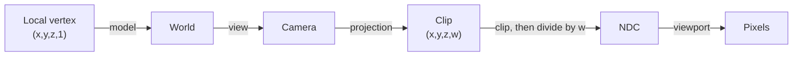

## World-to-screen uses the view-projection transform

An ESP-style observer needs to answer:

> Where would this 3D point appear on the 2D screen?

The reliable answer uses the game’s view-projection matrix. Hand-tuned angle formulas can teach geometry, but a matrix handles camera rotation, field of view, aspect ratio, and perspective together.


The matrix is not magic screen-coordinate data. It is a compact composition of
specific coordinate changes. If its convention, snapshot time, or viewport does
not match the rendered frame, the resulting pixels can be precise arithmetic and
still describe the wrong image.

## Name every coordinate space

“World to screen” is not one mysterious jump. It is a pipeline of smaller
changes, and every stage answers a different question:

```text
world space
  where the entity exists in the game world
      ↓ view transform
camera space
  where the entity is relative to the camera
      ↓ projection transform
clip space (x, y, z, w)
  a perspective-aware position before division
      ↓ divide x, y, and z by w
normalized device coordinates
  a small standard cube used for clipping
      ↓ viewport transform
screen pixels
  where the overlay may draw
```



Naming the stages makes bugs easier to locate. A marker that rotates the wrong
way usually points to the view transform. A marker that stretches after a
resolution change points to the viewport or aspect ratio. A point behind the
camera that appears mirrored points to the perspective divide or clipping.

The `w` value is not another world direction. It carries information needed for
perspective: after division, distant points become closer together on screen.
Reject unusable `w` values before dividing, then reject points outside the
target API's depth interval. OpenGL commonly uses `-1..=1` after projection;
Direct3D commonly uses `0..=1`. The matrix and convention must come from the
same game pipeline.

## The view matrix is the inverse camera pose

A camera pose says where the camera exists in world space. Rendering needs the
opposite question: where does the world appear relative to the camera? Therefore
the view matrix is the inverse of the camera's world transform.

For an orthonormal camera basis, inverse rotation is its transpose. The translation
is not simply `-camera_position`; it is the negative position expressed along the
camera basis. In dot-product form:

```text
d = world_point - camera_position
view_x = dot(d, camera_right)
view_y = dot(d, camera_up)
view_z = dot(d, camera_forward_or_back)
```

If positions track correctly until the camera rotates, the translation may be
right while the basis order, handedness, or inverse operation is wrong.

## One concrete perspective matrix

Conventions must be attached to formulas. Under these assumptions:

- column vectors;
- right-handed camera space looking down `-Z`;
- vertical field of view `fov_y`;
- aspect ratio `width / height`;
- OpenGL NDC depth `-1..1`;
- positive near and far distances with `0 < near < far`;

define `f = 1 / tan(fov_y / 2)`. One projection matrix is:

```text
[ f/aspect   0             0                    0          ]
[    0       f             0                    0          ]
[    0       0     (far+near)/(near-far)  2far·near/(near-far) ]
[    0       0            -1                    0          ]
```

Multiplying a view-space point gives `clip_w = -view_z`, so points in front have
positive `w`. This exact matrix is not portable to a left-handed or Direct3D depth
convention. Its purpose is to show where assumptions live.

`fov_y` must be in radians for ordinary trigonometric functions. The half-angle
appears because the camera center splits the vertical frustum symmetrically.

## Clipping happens before perspective division

In homogeneous clip space, the standard OpenGL visible volume satisfies:

```text
-w ≤ x ≤ w
-w ≤ y ≤ w
-w ≤ z ≤ w
```

For a Direct3D-style depth range, z is commonly constrained by `0 ≤ z ≤ w` while x
and y use the same bounds. A triangle crossing a plane is clipped into a smaller
polygon; it is not discarded merely because one vertex is outside.

Point labels are simpler: if their single anchor lies outside, reject or clamp the
label according to the UI rule. Do not use a point-label rejection rule to reason
about whether an entire triangle should render.

The playground below uses one declared convention so every sign and axis has a
meaning. It deliberately treats forward as positive `+Z`, unlike the `-Z`
projection example above; this makes the depth control read naturally and shows
why formulas cannot be separated from their coordinate convention. Move the
point sideways, vertically, and through depth; then change
the vertical field of view. Watch how camera-space coordinates become NDC and
finally pixels. Moving a point farther away reduces its NDC displacement because
the perspective divide divides by a value proportional to depth.



## Represent the matrix

```rust
#[derive(Clone, Copy, Debug)]
struct Mat4 {
    values: [[f32; 4]; 4],
}

#[derive(Clone, Copy, Debug)]
struct ScreenPoint {
    x: f32,
    y: f32,
    depth: f32,
}

#[derive(Clone, Copy, Debug)]
enum DepthConvention {
    OpenGl,
    Direct3D,
}

impl DepthConvention {
    fn contains(self, z: f32) -> bool {
        match self {
            Self::OpenGl => (-1.0..=1.0).contains(&z),
            Self::Direct3D => (0.0..=1.0).contains(&z),
        }
    }
}
```

First determine whether the target stores matrices row-major or column-major. Test with a known point while the camera is stationary.

There are three independent questions:

1. are consecutive values a row or a column (**storage layout**)?
2. does the math use row or column vectors (**multiplication convention**)?
3. is the candidate already `view × projection`, `projection × view`, or one
   component only (**composition**)?

Transposing can compensate for one mismatch and conceal another. Validate identity,
translation, and a known 90-degree rotation rather than repeatedly transposing until
one screenshot looks plausible.

## Transform a point

One row-major form looks like:

```rust
fn world_to_screen(
    point: Vec3,
    matrix: Mat4,
    width: f32,
    height: f32,
    depth_convention: DepthConvention,
) -> Option<ScreenPoint> {
    if !valid_point(point) || width <= 0.0 || height <= 0.0 {
        return None;
    }

    let m = matrix.values;
    let clip_x = point.x * m[0][0] + point.y * m[0][1]
        + point.z * m[0][2] + m[0][3];
    let clip_y = point.x * m[1][0] + point.y * m[1][1]
        + point.z * m[1][2] + m[1][3];
    let clip_z = point.x * m[2][0] + point.y * m[2][1]
        + point.z * m[2][2] + m[2][3];
    let clip_w = point.x * m[3][0] + point.y * m[3][1]
        + point.z * m[3][2] + m[3][3];

    if !clip_w.is_finite() || clip_w <= 0.001 {
        return None; // behind the camera or too close to project
    }

    let ndc_x = clip_x / clip_w;
    let ndc_y = clip_y / clip_w;
    let ndc_z = clip_z / clip_w;

    if !ndc_x.is_finite() || !ndc_y.is_finite() || !ndc_z.is_finite() {
        return None;
    }

    if !depth_convention.contains(ndc_z) {
        return None; // closer than the near plane or beyond the far plane
    }

    Some(ScreenPoint {
        // 🗺️ Convert normalized coordinates from -1..1 into screen pixels.
        // `midpoint` expresses the halfway step without overflowing the sum.
        x: ndc_x.midpoint(1.0) * width,
        y: (-ndc_y).midpoint(1.0) * height,
        depth: ndc_z,
    })
}
```

The positive-`w` rule belongs to the projection convention described above. Some
pipelines use a different sign. Determine the front-facing half-space with a point
known to be directly ahead. The small epsilon avoids enormous coordinates near the
camera plane, but it is a policy threshold in clip-space units, not a universal
constant.

The midpoint calls implement:

```text
screen_x = viewport_x + (ndc_x + 1) × viewport_width / 2
screen_y = viewport_y + (1 - ndc_y) × viewport_height / 2
```

The y flip assumes an upper-left pixel origin. OpenGL's traditional viewport origin
is lower-left, and UI/window systems commonly use upper-left. Confirm which layer
the overlay draws into.

## Depth after projection is not world distance

`ndc_z` is produced by the projection and perspective divide. For a perspective
camera it is nonlinear with view-space distance. Two points separated by one metre
near the camera can have a much larger depth-buffer difference than two points one
metre apart near the far plane.

Use Euclidean or view-space distance for range labels. Use projected depth to test
the clip range or compare against a compatible depth buffer. Do not display
`ndc_z` as metres.

If all markers move incorrectly, the likely problem is matrix layout or coordinate conventions—not a random “scale constant.”

## Find the matrix by behavior

A view matrix changes when the camera moves or rotates. A projection matrix changes with field of view, aspect ratio, or resolution.

Search for a group of 16 floats and compare:

- camera still versus rotating;
- same camera at two resolutions;
- one known world point projected through a candidate.

A pattern scanner may later locate the code or global pointer that produces the matrix.

Candidate-matrix invariants help reject false positives:

- all 16 values are finite;
- the camera-dependent portion changes smoothly with camera movement;
- the projection scale changes predictably with field of view/aspect ratio;
- a point directly ahead projects near the center;
- farther points with the same direction approach the same screen coordinate;
- multiplying by an identity test matrix leaves a test point unchanged.

## Read a coherent snapshot

Camera, matrix, players, and viewport size should come from roughly the same frame. If the game updates them while an external tool is reading, markers may jitter.

Use one bounded read pass:

```rust
struct FrameSnapshot {
    matrix: Mat4,
    viewport: (f32, f32),
    depth_convention: DepthConvention,
    players: Vec<PlayerSnapshot>,
}
```

Validate every float and cap player count.

“Roughly the same frame” is measurable. Attach a sequence number before and after
the read when the target exposes one, and retry if it changed. Without a sequence,
read the matrix twice around the entity batch and reject the sample if it changed
materially. This does not create atomicity, but it detects many torn snapshots.

## Draw only visible, valid points

```rust
#[derive(Debug)]
struct Label {
    text: String,
    screen: ScreenPoint,
}

fn build_labels(frame: &FrameSnapshot, local_team: u32) -> Vec<Label> {
    let (width, height) = frame.viewport;

    frame.players.iter()
        .filter(|player| player.is_valid_target(local_team))
        .filter_map(|player| {
            let screen = world_to_screen(
                player.head,
                frame.matrix,
                width,
                height,
                frame.depth_convention,
            )?;
            let on_screen = (0.0..=width).contains(&screen.x)
                && (0.0..=height).contains(&screen.y);
            on_screen.then(|| Label {
                text: format!("#{}", player.id.0),
                screen,
            })
        })
        .collect()
}
```

Use sanitized copied text for names. Never follow a remote string pointer indefinitely; set a byte limit and require valid encoding.

## Use a separate window

An external transparent overlay is usually easier to reason about than calling an internal text function:

```text
observer reads owned snapshots
→ world_to_screen returns pixels
→ overlay draws labels
→ overlay clears and repeats
```

The overlay should ignore mouse input, match the target’s client area, and stop when the target closes.

Match the **client area**, not the outer window rectangle. Borders and title bars
shift the origin. DPI scaling can make logical UI units differ from physical pixels,
and borderless/fullscreen modes may change which coordinate system the compositor
uses. Recalculate when the window moves, resizes, changes monitor, or changes DPI.


## Reproduce the original in-game AssaultCube ESP

The original 1.2.0.2 lab uses the same globals and player layout as the aimbot, plus these confirmed facts:

```text
virtual screen:      2400 × 1800
screen center:       (1200, 900)
print-text function: 0x0041_9880
final print hook:    0x0040_BE7E
hook resume:         0x0040_BE83
player name:         16 bytes at player + 0x225
```

For this specific virtual viewport, the experimentally calibrated projection is:

```rust
fn assaultcube_legacy_screen(
    current: Angles,
    desired: Angles,
) -> Option<(u32, u32)> {
    let yaw_difference = shortest_angle_delta(desired.yaw, current.yaw);
    let pitch_difference = current.pitch - desired.pitch;

    let x = 1200.0 + yaw_difference * -30.0;
    let y = 900.0 + pitch_difference * 25.0;
    ((0.0..=2400.0).contains(&x) && (0.0..=1800.0).contains(&y))
        .then_some((x as u32, y as u32))
}
```

Iterate players `1..count`, calculate each desired angle, and publish the projected position and name pointer into fixed atomic slots. The render hook reads those slots and calls `0x00419880` with the confirmed `x`, `y`, and text arguments. The player object owns the fixed 16-byte name field for the frame; the code never scans past that verified field while calculating its address.

The overwritten bytes at `0x0040BE7E` are themselves a five-byte near call to `0x00419880`. The installer calculates those expected bytes, refuses an unknown build, and replaces the call with a near jump to this compiled cave:

```rust
#[unsafe(naked)]
unsafe extern "C" fn assaultcube_esp_cave() {
    core::arch::naked_asm!(
        // Replay the original print call with an empty string, then add labels.
        "lea ecx, [{empty}]",
        "call {print}",
        "pushfd",
        "pushad",
        "call {draw}",
        "popad",
        "popfd",
        "jmp {resume}",
        empty = sym EMPTY_TEXT,
        print = const 0x0041_9880,
        draw = sym draw_esp_names,
        resume = const 0x0040_BE83,
    );
}

pub fn install_assaultcube_esp_hook() -> anyhow::Result<LocalPatch> {
    let expected = near_call(0x0040_BE7E, 0x0041_9880)?;
    let replacement = near_jump(
        0x0040_BE7E,
        assaultcube_esp_cave as *const () as usize,
    )?;
    LocalPatch::apply(0x0040_BE7E, &expected, &replacement)
}
```

Start with the literal text `Enemy` at `(0x100, 0x100)` to prove the print call. Then use one bot, calibrate left/center/right, add pitch, add its name, and finally loop through all players. The finished result is the named ESP shown below.


The matrix-based overlay earlier in this lesson is the more general technique. This target-specific section keeps the exact reverse-engineered internal print route so readers can reproduce the original game hack.

Build and inject the course DLL, enter a local AssaultCube bot match, and press **F5**. Press **F5** again or **End** to drop `LocalPatch` and restore the exact original call:

```powershell
.\target\i686-pc-windows-msvc\release\injector.exe `
  ac_client.exe `
  .\target\i686-pc-windows-msvc\release\gha_windows_labs.dll
```

The entire working update loop, projection, internal x86 calling convention, cave, and installer are in [`assaultcube_tools.rs`]({{ site.baseurl }}/windows-labs/src/windows_impl/assaultcube_tools.rs). The F5 worker logic is in [`dll.rs`]({{ site.baseurl }}/windows-labs/src/windows_impl/dll.rs).

## Debug the transform visually

Test in this order:

1. one stationary point directly ahead;
2. move the camera left and right;
3. move closer and farther;
4. test a point behind the camera;
5. resize or change resolution;
6. move a point across the near and far clip planes;
7. add several entities.

If a point behind the camera appears mirrored, the `w` rejection is missing or wrong.

## Projecting a 3D box is not just two points

To draw a 2D rectangle around a 3D bounds, transform all eight corners of an
axis-aligned box and take the min/max of the surviving screen coordinates. Two
opposite corners are insufficient after rotation. If the box crosses the near
plane, some corners have unusable `w`; a rigorous result clips its edges against
the near plane before taking bounds. Simply dropping those corners can make the box
collapse or jump.

An oriented bounding box requires its local corners to pass through the object's
world transform first. A skeletal model may need pose-derived bounds because its
rest-pose box no longer tightly encloses the animation.

## Diagnose world-to-screen failures

| Symptom | First check |
|---|---|
| every point mirrored horizontally | x basis/handedness |
| markers rotate opposite the camera | view transform/inverse |
| correct in center, wrong near edges | projection FOV or aspect ratio |
| correct at one resolution only | viewport dimensions or stale aspect ratio |
| fixed offset from every object | client-area origin/DPI/window border |
| jitter while camera or entities move | incoherent snapshots |
| behind-camera labels flip onto screen | `w` sign/rejection |
| labels vanish too early in depth | wrong OpenGL/Direct3D depth convention |
| box jumps near the camera | no near-plane edge clipping |

## Scope

Keep the observer in an offline match with bots. The transferable skill is the 3D-to-2D transformation pipeline used in editors, accessibility tools, debug HUDs, and visualization software.

{% include quiz.html
  id="clip-w-rejection"
  type="multiple-choice"
  title="Reject a point behind the camera"
  prompt="The transform produces a finite `clip_w` of `−0.4`. What should the observer do before the perspective divide?"
  options="Draw the point at the center||Take the absolute value of `w`||Reject the point as behind or outside the usable camera half-space||Replace `w` with 1"
  answer="2"
  explanation="A non-positive `w` means the point is behind the camera for this projection convention. Dividing anyway can mirror it onto the screen. Rejecting it before the divide keeps the overlay from drawing convincing but false positions."
%}
