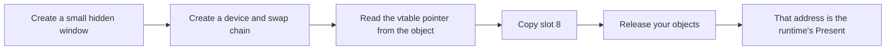

## The OpenGL method does not transfer

Lesson 5.3 hooked `glDrawElements` by name. That worked because OpenGL is a C
API: `opengl32.dll` exports a function with that name, so `GetProcAddress` can
hand you its address, and Lesson 8.4's import-table technique applies directly.

Open `d3d11.dll` in the export inspector from Lesson 7.3 and look for
`Present`. It is not there. Neither is `DrawIndexed`, `Draw`, or any other
method you might want to watch. The exports are a short list — mostly
`D3D11CreateDevice` and friends — and none of them is the function that runs
once per frame.

This is not obfuscation. Direct3D is built on **COM**, the Component Object
Model — Microsoft's convention for handing out objects whose methods are reached
through a table of function pointers rather than by name. COM does not expose
methods as exports. It exposes objects.

## A COM interface is a vtable, which you have already met

In Lesson 3.3 you recovered C++ classes by recognizing that an object begins
with a pointer to a table of function addresses. A COM interface pointer is
exactly that arrangement, promised by the ABI rather than inferred from
evidence:

```text
swap_chain          ->  0x0000_01F4_8A20_0000   the object
read [swap_chain]   ->  0x0000_7FFA_1C30_5000   its vtable
vtable + 8 * 8      ->  0x0000_7FFA_1C30_5040   the slot for method 8
read that slot      ->  0x0000_7FFA_1C28_9A10   the function that runs
```

Two lookups, the same shape as the virtual call you traced in Chapter 3. The
difference is that here the layout is a contract. Microsoft cannot reorder the
methods of a published interface without breaking every compiled program that
uses it, which is what makes a vtable index a usable, stable fact.

Each slot is one pointer wide: eight bytes in a 64-bit process, four in a
32-bit one. Get that wrong and every index lands halfway between two entries.

## Derive the index; do not memorize it

You will find lists of "magic" Direct3D vtable indices online. Take the number
as a hint and derive it yourself, because the derivation takes a minute and
tells you immediately when a list is talking about a different interface.

The rule is that a vtable begins with the methods of the interfaces it
inherits, in inheritance order, each in declaration order. `IDXGISwapChain`
inherits like this:

```text
IUnknown                3 methods   QueryInterface, AddRef, Release      -> 0,1,2
IDXGIObject             4 methods   SetPrivateData, SetPrivateDataInterface,
                                    GetPrivateData, GetParent            -> 3,4,5,6
IDXGIDeviceSubObject    1 method    GetDevice                            -> 7
IDXGISwapChain          Present is declared first                        -> 8
```

3 + 4 + 1 = 8. `Present` is index 8, and now you know *why*, which means you
can work out `ResizeBuffers` the same way instead of searching for it.

The same count applied to `ID3D11DeviceContext` gives `IUnknown` (3) plus
`ID3D11DeviceChild` (4) = 7, then the context's own methods in declaration
order: `VSSetConstantBuffers`, `PSSetShaderResources`, `PSSetShader`,
`PSSetSamplers`, `VSSetShader`, and then `DrawIndexed` at index 12.

For the older API, `IDirect3DDevice9` inherits only `IUnknown`, so its own
methods begin at index 3 and are simply counted down the header:
`Present` at 17, `Reset` at 16, `EndScene` at 42, `DrawIndexedPrimitive` at 82.

| Interface | Method | Index | Runs |
|---|---|---:|---|
| `IDirect3DDevice9` | `EndScene` | 42 | once per frame, before presenting |
| `IDirect3DDevice9` | `DrawIndexedPrimitive` | 82 | once per indexed draw |
| `IDXGISwapChain` | `Present` | 8 | once per frame |
| `ID3D11DeviceContext` | `DrawIndexed` | 12 | once per indexed draw |

Confirm any of these against the SDK header for the version you are targeting
before relying on it. A number copied from a forum post is an unverified claim
about someone else's SDK, which is precisely the kind of borrowed fact
Lesson 1.1 warns about.

## Getting the vtable without touching the game

Here is the part that surprises people. To learn where the game's `Present`
lives, you do not need to find the game's swap chain at all.

All objects created from one interface implementation share a single vtable.
So you can create your own swap chain, in your own process, read the pointers
out of its table, and those are the same function addresses the game's swap
chain uses:



This is worth comparing with two techniques you already know. Pattern scanning
(Lesson 7.4) searches for bytes and needs re-checking every build. Export
lookup (Lesson 8.4) needs an export that does not exist here. Creating a
throwaway device asks the runtime itself for the answer, needs no signature,
and keeps working across driver and runtime updates — because you are reading
the same table the runtime just handed you.

It is the same reasoning as Lesson 8.2's `LoadLibraryW` address, and it has the
same limit. It works because both sides load the same implementation into the
same session. It is not a general licence to assume one process's addresses
mean anything in another.

## Do this to a program you wrote

As in Lesson 8.4, the target is your own. Write a minimal Direct3D 11 program —
a window, a device, a swap chain, a clear-and-present loop — and hook that.
Every mistake is then yours to observe, and nothing depends on a specific game
build.

The vtable lives in the runtime's read-only data, so writing to it needs the
same page-protection dance as the byte patches in Lesson 2.6:

```rust
// 🛡️ SAFETY: `slot` points into the vtable read from a live swap chain, the
// index was derived from the interface declaration, and the original pointer
// is stored so `Drop` can put it back.
unsafe {
    let mut previous = PAGE_PROTECTION_FLAGS(0);
    VirtualProtect(
        slot.cast(),
        size_of::<*const c_void>(),
        PAGE_READWRITE,
        &mut previous,
    )?;
    let original = *slot;
    *slot = replacement;
    VirtualProtect(slot.cast(), size_of::<*const c_void>(), previous, &mut previous)?;
    original
}
```

Restore the previous protection rather than leaving the page writable. A page
you widened stays widened for the life of the process.

## The replacement must match the ABI exactly

A COM method has a hidden first parameter — the interface pointer, the same
`this` you met in Lesson 3.3 — and uses the `system` convention:

```rust
type PresentFn = unsafe extern "system" fn(
    swap_chain: *mut c_void,   // the hidden `this`
    sync_interval: u32,
    flags: u32,
) -> HRESULT;
```

Forget the first parameter and every argument shifts by one position. The call
still runs, `sync_interval` reads whatever was in the `this` register, and the
failure looks like a rendering glitch rather than a signature mistake.

Return the `HRESULT` you received from the original. Callers check it, and
`Present` genuinely can fail — a lost device returns an error the game is
expecting to handle.

## The lifecycle is where hooks actually break

Install, forward, restore. Each step has a failure that a single successful
test run will not reveal, so
[`vtable_hook_lab.rs`]({{ site.baseurl }}/rust-labs/src/bin/vtable_hook_lab.rs)
models the bookkeeping as plain safe Rust with no graphics API involved:

```powershell
cd rust-labs
cargo run --bin vtable_hook_lab
cargo test --bin vtable_hook_lab
```

**Installing twice saves your own replacement as "the original."** The
replacement then forwards to itself, and the stack overflows on the next frame
— far from the second install, which is what makes it confusing. Refuse the
second install by checking whether the slot already holds your function.

**Restoring blindly discards whoever installed after you.** If another tool
hooked the same slot later, writing your saved pointer back removes their
replacement *and* leaves them forwarding to a function no longer in the table.
Restore only when the slot still holds your own function.

**Holding a lock across the forwarded call deadlocks** — that is, two paths end
up each waiting for something the other holds, and neither ever continues. The
original is free to re-enter the hooked path. Copy the original pointer out, release the lock, then
call — the lab does exactly this and says why in a comment.

**The device can be recreated underneath you.** A resolution change or an
alt-tab causes `ResizeBuffers`, and in Direct3D 9 a lost device causes `Reset`.
Cached textures, render targets, and fonts created against the old device are
invalid afterwards. Treat those calls as the signal to drop and rebuild
anything you allocated.

**`Present` is not guaranteed to be your thread.** Whatever the replacement
touches is shared with the render thread, so it needs the discipline from
Lesson 4.8: copy a small fixed-size sample, return, and analyze elsewhere. A
lock, an allocation, or a file write on this path is a frame-time cost paid
thousands of times per second.

## What this technique does and does not tell you

Hooking `Present` tells you that a frame was submitted. It is the natural place
to draw an overlay, count frames, or take a screenshot, and it is the mechanism
behind capture software, frame-rate counters, debug HUDs, and graphics
debuggers such as RenderDoc and PIX.

It tells you nothing about which objects are in that frame. For that you need
the draw calls and the state bound around them, which is the next lesson. And
as in Lesson 5.3, submission is not completion: `Present` returning does not
mean the GPU has finished, and forcing it to catch up so you can measure
something will change the thing you are measuring.

## Scope

Keep this to a program you wrote or an offline single-player session on a
version you have pinned. The transferable skill is COM interface dispatch and
reversible hook lifecycle management, which is the same machinery used by
capture tools, profilers, accessibility overlays, and the graphics debuggers
above.
