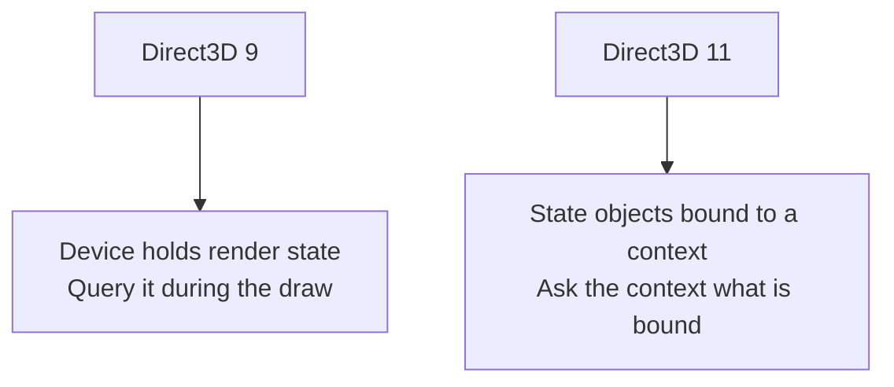

## A draw call is still a request, not an object

Lesson 5.3 made this point for OpenGL and it holds here: a draw call asks the
GPU to consume indices using whatever is currently bound. It does not say
"draw the player." One character can take several draws — body, weapon, shadow
— and one draw can cover many unrelated objects batched together.

What changes between the two APIs is not that idea. It is how much of the
surrounding state you can see from inside the call.

## Read the arguments precisely

The Direct3D 11 indexed draw is compact:

```rust
type DrawIndexedFn = unsafe extern "system" fn(
    context: *mut c_void,        // the hidden `this`
    index_count: u32,
    start_index_location: u32,
    base_vertex_location: i32,
);
```

| Argument | Meaning |
|---|---|
| `index_count` | how many indices to read from the bound index buffer |
| `start_index_location` | where in that buffer to begin |
| `base_vertex_location` | a value added to every index after it is read |

Note that `base_vertex_location` is **signed**. That is not a quirk; it exists
so several meshes can share one vertex buffer, with each mesh addressed by a
positive or negative shift from a common origin. If you log it as `u32` a
perfectly ordinary negative offset appears as a number near four billion, and
you will be tempted to treat a normal draw as corrupt.

The same arithmetic from Lesson 5.3 applies to the counts:

```text
index_count / 3 = triangles submitted, for a triangle list
index_count / 3 ≠ triangles you can see
index_count     ≠ unique vertex count
```

Submitted triangles can still be degenerate, back-face culled, clipped, or
covered by something nearer. Depth testing happens long after this call
returns.

The Direct3D 9 equivalent carries more:

```text
DrawIndexedPrimitive(
    primitive_type,      // triangle list, strip, fan, line list...
    base_vertex_index,
    min_vertex_index,
    num_vertices,
    start_index,
    primitive_count      // primitives, not indices
)
```

Two differences matter when you port a note from one to the other.
`primitive_count` counts **primitives**, where Direct3D 11's `index_count`
counts **indices** — for a triangle list they differ by a factor of three, and
mixing them up is the most common reason a ported filter matches nothing.
`primitive_type` is an argument in Direct3D 9; in Direct3D 11 the topology is
bound state set earlier by `IASetPrimitiveTopology`, so the draw call does not
mention it at all.

## Where the state lives is the real difference



Direct3D 9 keeps render state on the device as a large set of individually
settable values. Inside a `DrawIndexedPrimitive` hook you can ask the device
what is currently set — `GetRenderState`, `GetTexture`, `GetTransform` — and
get an answer immediately.

Direct3D 11 replaces most of that with immutable state objects created up
front and bound as a unit: a blend state, a depth-stencil state, a rasterizer
state. From a `DrawIndexed` hook you retrieve what is bound with the context's
`Get` calls — `OMGetBlendState`, `OMGetDepthStencilState`, `PSGetShader`,
`IAGetVertexBuffers` — and then read the description back off the object.

Two practical consequences follow, and they catch people out:

**Those `Get` calls hand you a reference.** COM `Get*` methods call `AddRef`
on what they return. Every object you retrieve on a path that runs thousands
of times per second must be released, or you leak steadily until something
fails in a way that looks nothing like the cause. This is the reference-count
version of the handle discipline from Lesson 10.4, and it deserves the same
answer: a wrapper whose `Drop` releases, so an early return cannot skip it.

**Querying costs more than logging.** Retrieving several state objects per
draw, on a thread with a frame deadline, is real work. Sample rather than
record everything — one draw in a hundred, or only draws whose index count
falls in a range you care about.

## Label geometry by the state bound around it

You cannot ask a draw call what it is drawing. You can group draws by
properties that tend to correlate with what they are, then test whether the
grouping holds:

| Observable | What it often distinguishes |
|---|---|
| bound pixel shader | material family: skin, foliage, UI, particles |
| bound texture | a specific asset |
| index count | large static geometry versus small dynamic meshes |
| depth-stencil state | world geometry versus UI drawn without depth |
| blend state | opaque geometry versus transparent effects |
| draw order within a frame | rendering passes: depth, opaque, transparent, UI |

Every one of these is a proxy, and Lesson 13.8 explains why proxies deserve
suspicion. A shader shared by characters and crates does not distinguish them.
Test a grouping by changing something you control — move, equip a different
weapon, walk into another room — and check that the group changes the way your
explanation predicts. A label that survives three controlled changes is
evidence; a label that matched once is a coincidence you have named.

## Draw a frame boundary around your samples

`DrawIndexed` fires many times per frame; `Present` fires once. Recording draws
without frame boundaries produces a stream you cannot reason about, because you
cannot tell where one frame's ordering ends.

Number the frames in the `Present` hook from Lesson 5.10, and tag each draw
sample with the current frame number. The draw index within a frame is then
meaningful, which is what makes "the UI is the last eleven draws" a statement
you can check rather than an impression.

```text
frame 412  draw 0..38    depth pre-pass, no pixel shader
frame 412  draw 39..174  opaque world geometry
frame 412  draw 175..190 transparent effects, blending enabled
frame 412  draw 191..201 UI, depth test disabled
```

Bound both the samples per frame and the frames retained, exactly as in Lesson
4.8. An unbounded recorder attached to a render loop will consume memory faster
than you expect and will change the frame times you were trying to measure.

## Direct3D 12 moves the work earlier

Direct3D 12 does not submit draws through a context. Commands are recorded into
command lists ahead of time and handed to a queue with `ExecuteCommandLists`,
often built on several threads at once.

Hooking the submission point therefore tells you that a batch of pre-recorded
work was queued, not what is in it. `Present` still works as a frame boundary
because the swap chain interface is unchanged, but per-draw observation means
dealing with recorded command lists rather than intercepting individual calls.
The vtable reasoning from Lesson 5.10 transfers directly; the assumption that
one hook sees one draw does not.

## Scope

Use your own Direct3D program or an offline single-player session on a pinned
version, and keep the analysis window separate as in Lesson 5.9. The
transferable skill — reading submitted GPU work and correlating it with bound
state — is what graphics debuggers, frame profilers, and capture tools do, and
it is the practical way to understand what a renderer is actually asking the
GPU to do.
