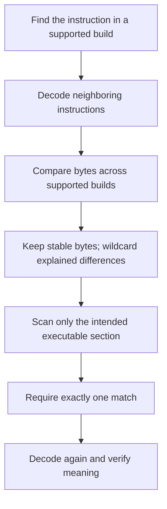

## Why patterns help

ASLR moves a module, and small updates can move a function inside it. A byte pattern searches the current module for a distinctive instruction sequence.


Some bytes encode registers or opcodes and stay stable. Others encode addresses or displacements and may change.

## What a signature actually describes

The CPU sees one continuous byte stream. The disassembler groups that stream into instructions, and each instruction may contain several kinds of information:

| Part | Plain-English meaning | Usually stable? |
|---|---|---|
| Opcode | Which operation to perform, such as subtract or call | Often |
| ModR/M and SIB | Which registers and addressing shape to use | Often |
| Displacement | A field offset or distance from another address | Sometimes |
| Immediate | A number stored directly inside the instruction | Depends on the rule |
| Relative target | How far a call or jump travels | Often changes when code moves |

Suppose two supported builds both subtract a value and then load a nearby field. The instruction *shape* may stay recognizable while the relative call target between those instructions moves. A useful signature keeps the stable shape and places wildcards over the changing target bytes.

Written out, that comparison looks like this. The same two instructions, taken
from two builds of one game:

```text
build A:   29 47 04  E8 3C 91 FF FF
build B:   29 47 04  E8 A8 2D FE FF
           ~~~~~~~~  ~~ ~~~~~~~~~~~
           identical |  these four differ
                     |
                     still the same call opcode
```

The first three bytes are `sub dword ptr [edi+4], eax`: the operation, the
registers, and the field offset, none of which the compiler had any reason to
change. `E8` is a call, and the four bytes after it hold a *relative distance*
to the target, measured from the end of the call instruction. That distance
shifts whenever either the calling code or the called function moves, even by a
single byte, even though it still calls exactly the same function.

So the signature keeps the first four bytes and wildcards the last four:

```text
29 47 04 E8 ?? ?? ?? ??
```

Wildcards are not “bytes we forgot.” Each one here has a stated reason —
“relative call displacement, changes whenever code moves” — and that written
reason is the difference between a wildcard and a shrug. Too few wildcards make
the signature fragile. Too many make it common and ambiguous.

## A signature can overfit one recording

A pattern **overfits** when it memorizes accidental details from one executable
instead of describing the instruction identity you meant to find. An exact
30-byte sequence may work perfectly on the build used to create it and fail
after an unrelated compiler layout change. The opposite mistake is a pattern so
loose that it matches ordinary code everywhere.

| Pattern behavior | Meaning | Correct response |
|---|---|---|
| one match only in the design build | may be overfitted | compare another build you actually intend to support |
| many matches in the design build | under-specified | add stable decoded context |
| one decoded candidate in every declared profile | appropriately scoped | keep each build fingerprint and semantic check |

When supporting two exact builds, design the candidate signature with one
build and test it against the other before calling it version-tolerant. Then
reverse the test: bytes from each build should locate the same *kind of
instruction*, not merely return one arbitrary address.

Do not weaken a pattern until it matches an unknown build and then declare
success. If the course supports only one build, an exact fingerprint plus a
build-specific signature is more honest than pretending the signature is
portable. The goal is evidence that generalizes across the profiles you named,
not the longest or shortest possible byte string.



## Represent exact and wildcard bytes

```rust
#[derive(Clone, Copy, Debug, Eq, PartialEq)]
enum PatternByte {
    Exact(u8),
    Any,
}

fn matches_at(bytes: &[u8], offset: usize, pattern: &[PatternByte]) -> bool {
    // 📏 Ask for the whole candidate window at once. Near the buffer end, an
    // incomplete window is simply “not a match” instead of an indexing panic.
    let Some(window) = bytes.get(offset..offset.saturating_add(pattern.len())) else {
        return false;
    };

    // 🔍 `Any` consumes exactly one byte too; it relaxes equality, not length.
    window.iter().zip(pattern).all(|(found, expected)| {
        matches!(expected, PatternByte::Any)
            || matches!(expected, PatternByte::Exact(value) if value == found)
    })
}
```

The safe matcher makes wildcard meaning and range failure explicit:

```diff
 fn matches_at(bytes: &[u8], offset: usize, pattern: &[PatternByte]) -> bool {
-    for index in 0..pattern.len() {
-        if pattern[index] != bytes[offset + index] {
-            return false;
-        }
-    }
-    true
+    let Some(window) = bytes.get(offset..offset.saturating_add(pattern.len())) else {
+        return false;
+    };
+    window.iter().zip(pattern).all(|(found, expected)| {
+        matches!(expected, PatternByte::Any)
+            || matches!(expected, PatternByte::Exact(value) if value == found)
+    })
 }
```

> **Why this version?** The direct indexes can panic near the end of the buffer,
> while `get` turns an incomplete window into `false`. `PatternByte` prevents a
> magic byte such as `0x00` from secretly meaning “wildcard.” `zip` and `all`
> state the rule directly: each discovered byte must satisfy its corresponding
> pattern item.
{: .block-why }

Read this function from the outside inward:

1. `bytes.get(range)` requests a window without risking an out-of-bounds panic.
2. `saturating_add` prevents the end calculation from wrapping to a small number.
3. `zip` pairs every found byte with one pattern item.
4. `all` returns `true` only when every pair is acceptable.
5. `Any` accepts the found byte; `Exact(value)` accepts only that value.

The function borrows both slices. It does not copy the module again and does not own the pattern. That is why its signature uses `&[u8]` and `&[PatternByte]`.

## Scan safely

```rust
fn find_all(bytes: &[u8], pattern: &[PatternByte]) -> Vec<usize> {
    // ⚠️ An empty pattern would otherwise appear to match between every byte,
    // and subtracting a longer pattern would underflow.
    if pattern.is_empty() || pattern.len() > bytes.len() {
        return Vec::new();
    }

    // ✅ The inclusive end keeps the final legal starting position searchable.
    (0..=bytes.len() - pattern.len())
        .filter(|&offset| matches_at(bytes, offset, pattern))
        .collect()
}
```

Use `<=` so a match beginning at the final possible offset is included.

For `n` input bytes and an `m`-byte pattern, this simple algorithm does at most roughly `n × m` comparisons. That is easy to reason about and fast enough for bounded course modules. More advanced search algorithms matter only after measurement shows this loop is the bottleneck.

The early return handles two important edge cases. An empty pattern would otherwise “match” at every offset, and subtracting a longer pattern length from the input length would underflow.

## Parse a friendly pattern

```rust
fn parse_pattern(text: &str) -> anyhow::Result<Vec<PatternByte>> {
    text.split_whitespace()
        .map(|token| match token {
            "?" | "??" => Ok(PatternByte::Any),
            hex => Ok(PatternByte::Exact(u8::from_str_radix(hex, 16)?)),
        })
        .collect()
}

let pattern = parse_pattern("29 83 ? ? ? ? 8B 4D")?;
```

`collect()` is doing extra work here: the iterator produces `Result<PatternByte>` values and combines them into `Result<Vec<PatternByte>>`. The first invalid hex token stops the parse and returns its error. No half-parsed pattern escapes.

## Scan the correct range

Do not scan an entire process by default. Locate the intended module and executable section, copy that bounded region, and scan the local buffer.


For a PE image, confirm:

- DOS and PE signatures;
- section table bounds;
- executable characteristic;
- virtual address plus size stays in the module.

Libraries such as `goblin` can parse PE files, but live in-memory images still need careful address and section validation.

This separation matters. `ReadProcessMemory` works at the Windows boundary and can fail because a page changed. Once the bytes are in a local `Vec<u8>`, the matching loop uses only checked slices: no remote pointers, no changing protections, and no partial Windows reads during comparisons.

## Require one match

```rust
fn unique_match(matches: &[usize]) -> anyhow::Result<usize> {
    // 🎯 “First result wins” hides ambiguity. All three evidence states are
    // handled explicitly so a weak pattern cannot choose code by accident.
    match matches {
        [only] => Ok(*only),
        [] => anyhow::bail!("pattern was not found"),
        many => anyhow::bail!("pattern is ambiguous: {} matches", many.len()),
    }
}
```

Picking the first of five matches is not version tolerance.

The three outcomes mean different things:

- zero matches means the build, range, or pattern assumption is wrong;
- one match means the signature has located one candidate, which still needs semantic verification;
- several matches mean the signature does not contain enough identity.

Do not “fix” ambiguity by silently lengthening the scan to another unrelated section. Improve the evidence around the intended instruction.

## Verify surrounding meaning

After a match:

- disassemble the surrounding bytes;
- confirm whole expected instructions;
- verify the relative target or field offset;
- check the supported module fingerprint;
- reject an unknown build.


## Test edge cases

```rust
#[test]
fn finds_match_at_last_possible_offset() {
    let bytes = [0x10, 0x20, 0x30];
    let pattern = [PatternByte::Exact(0x20), PatternByte::Exact(0x30)];
    assert_eq!(find_all(&bytes, &pattern), vec![1]);
}
```

Also test empty patterns, all wildcards, a pattern longer than input, no matches, overlapping matches, and multiple matches.

A useful test asks the program to do something and checks an observable result.
It does not merely repeat the code it is supposedly checking:

```rust
// ❌ This only proves that a two-item array has two items.
#[test]
fn pattern_has_the_length_we_just_wrote() {
    let pattern = [0x20, 0x30];
    assert_eq!(pattern.len(), 2);
}
```

By contrast, the boundary test above can catch a real off-by-one bug. That is
the standard to use when AI or autocomplete suggests tests too: ask what
incorrect implementation would make the test fail. If the answer is “none,”
the test is decoration.

Patterns are evidence locators. They do not replace target-version checks or instruction decoding.

## Read the complete program as a pipeline

The executable at the end of the lesson has five phases:

1. `Process::open_by_name` finds the exact target and owns its Windows process handle.
2. `process.module` returns the current base and mapped size of `wesnoth.exe`.
3. `process.regions` asks Windows how that module is divided and keeps readable executable regions.
4. Each accepted region is copied before `.windows(3)` compares local slices.
5. The program prints all evidence and refuses success unless the match count is exactly one.

Notice what it does **not** do: it does not scan every allocation, patch the result, or assume matching bytes prove the instruction’s meaning. Those are separate decisions with separate checks.

## Run it against Wesnoth

The course binary opens the live 32-bit `wesnoth.exe`, finds its current main-module base, visits its readable executable regions, and searches for the exact gold-subtraction instruction bytes `29 42 04`. It prints every match and refuses to call the result usable unless there is exactly one.

```powershell
.\target\i686-pc-windows-msvc\release\pattern_scanner.exe
```

The complete executable is [`pattern_scanner.rs`]({{ site.baseurl }}/windows-labs/src/bin/pattern_scanner.rs). Shared ToolHelp module discovery, memory-region validation, and bounded reads are in [`process.rs`]({{ site.baseurl }}/windows-labs/src/windows_impl/process.rs).

<details class="lab-source" markdown="1">
<summary>Complete lab source: pattern_scanner.rs</summary>

```rust
#[cfg(windows)]
fn main() -> anyhow::Result<()> {
    use gha_windows_labs::Process;

    const PATTERN: [u8; 3] = [0x29, 0x42, 0x04];
    let process = Process::open_by_name("wesnoth.exe", false)?;
    let (base, size) = process.module("wesnoth.exe")?;
    let end = base
        .checked_add(size)
        .ok_or_else(|| anyhow::anyhow!("Wesnoth module range overflowed"))?;
    let mut matches = Vec::new();

    for region in process.regions(base, end)? {
        // 🔒 Code signatures belong in executable image pages, not heaps or
        // unrelated readable allocations that happen to share three bytes.
        if !region.readable || !region.executable {
            continue;
        }
        // 📏 Clip Windows' page-sized region to the exact module interval.
        let start = region.base.max(base);
        let region_end = region.base.saturating_add(region.size).min(end);
        if start >= region_end {
            continue;
        }
        // 🔍 Copy once, then scan safe local slices while the game keeps running.
        let bytes = process.read_bytes(start, region_end - start)?;
        matches.extend(
            bytes
                .windows(PATTERN.len())
                .enumerate()
                .filter_map(|(offset, window)| (window == PATTERN).then_some(start + offset)),
        );
    }

    anyhow::ensure!(
        !matches.is_empty(),
        "gold-subtraction pattern was not found"
    );
    for address in &matches {
        println!("{address:#010x}: 29 42 04  ; sub dword ptr [edx+4],eax");
    }
    anyhow::ensure!(
        matches.len() == 1,
        "pattern is ambiguous: {} matches; inspect each before patching",
        matches.len()
    );
    Ok(())
}

#[cfg(not(windows))]
fn main() {
    eprintln!("This live pattern scanner must run on Windows.");
}
```

</details>

Notice the order: restrict to the correct module, restrict again to readable executable regions, copy each region, scan the safe local copy, then demand one result. A three-byte match identifies a candidate only; patching requires a separately verified address and expected bytes.

## When results are wrong

| Symptom | Most likely question to ask |
|---|---|
| No matches | Is this the exact supported executable and correct architecture? |
| Many matches | Is the signature too short or too full of wildcards? |
| Read failure | Did the region change, or was its protection classified incorrectly? |
| Match points into data | Did the scan include a non-executable section? |
| Correct bytes, wrong behavior | Did you decode enough surrounding instructions and verify the function? |

Error messages should preserve this distinction. “Scanner failed” is not actionable; “pattern matched six locations in executable regions” tells the learner exactly which assumption to revisit.

{% include quiz.html
  id="pattern-many-matches"
  type="multiple-choice"
  title="Handle an ambiguous signature"
  prompt="A code pattern matches six executable locations in the exact supported build. What is the safest next step?"
  options="Patch all six locations||Choose the first match because addresses are sorted||Refine the signature and verify surrounding instructions until one meaning is proven||Turn every byte into a wildcard"
  answer="2"
  explanation="Several matches mean the pattern is not a unique identity. Add stable surrounding bytes, reduce unnecessary wildcards, and disassemble each candidate. A scanner should refuse ambiguity instead of turning uncertainty into six writes."
%}
