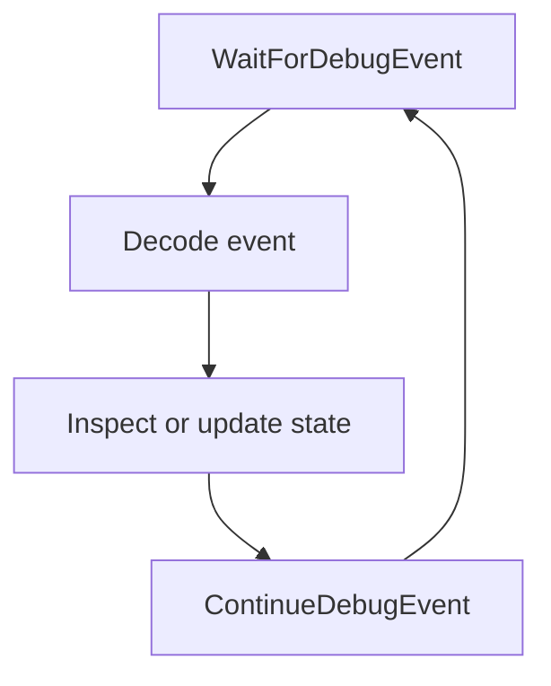

## A debugger is an event loop

Windows reports events such as process creation, DLL loading, exceptions, and process exit.



If the debugger forgets to continue an event, the target remains frozen.

## Model events immediately

Convert Windows structs into owned typed data at the FFI boundary:

```rust
#[derive(Debug)]
enum DebugEvent {
    ProcessCreated { process_id: u32, thread_id: u32 },
    ThreadCreated { thread_id: u32 },
    ModuleLoaded { base: usize },
    Exception {
        thread_id: u32,
        code: u32,
        address: usize,
        first_chance: bool,
    },
    ProcessExited { code: u32 },
    Other,
}
```

Close or transfer ownership of any handles contained in the raw Windows event. Do not leak them during a long session.

## Own breakpoint state

```rust
#[derive(Debug)]
struct SoftwareBreakpoint {
    address: usize,
    original_byte: u8,
    armed: bool,
}

struct Debugger {
    process: Process,
    breakpoints: std::collections::HashMap<usize, SoftwareBreakpoint>,
}
```

Setting a breakpoint:

1. read the original byte;
2. store it;
3. write `0xCC`;
4. flush the instruction cache;
5. mark it armed.


## Handle the `int3` pause

When a software breakpoint installed by this debugger fires:

1. suspend the relevant flow through the debug event;
2. restore the original byte;
3. move the instruction pointer back by one byte;
4. enable the CPU trap flag for one instruction;
5. continue.

The next single-step exception lets the debugger reinsert `0xCC` and clear the trap flag.

This two-step cycle is why a breakpoint has state; it is not just one changed byte.

```rust
enum BreakpointPhase {
    // 🔴 The target currently contains 0xCC at the owned address.
    Armed,
    // 👣 The original byte is temporarily restored for exactly this thread.
    SteppingOriginal { thread_id: u32 },
    // ⚪ No debugger-owned byte is installed at this address.
    Disabled,
}
```

## Distinguish your exceptions

Not every breakpoint exception belongs to your debugger. Windows and the target may use breakpoints internally.

Check:

- exception code;
- address;
- whether the address is in your breakpoint map;
- first-chance status;
- current phase and thread.

Pass unhandled exceptions onward with the correct continue status.

## Debugging changes what you observe

A debugger is a measuring instrument, and every instrument affects its subject
somehow. A software breakpoint temporarily replaces one instruction byte.
Pausing one thread can delay rendering, audio, input, or network work. Single
stepping makes a short path take far longer than normal, and Windows can expose
whether a process is being debugged.

That creates an important distinction:

| Observation | What it proves |
|---|---|
| The behavior happens both attached and detached | It is probably part of the target rather than a pause artifact |
| Only elapsed time changes while attached | The debugger changed scheduling or timing |
| A flag or exception path changes while attached | The target can observe the debugging environment |
| A byte differs at your breakpoint address | Your debugger deliberately changed code to gain control |

On the course target, record one baseline run without a debugger, then
repeat the same input while attached. Log inputs, chosen branches, elapsed
time, and output. The useful question is not “How do I hide the debugger?” but
“Which part of my measurement changed the program, and can I still justify my
conclusion?” This is **instrumentation bias**.

Debugger-aware behavior often depends on a small set of observable families:
flags, handles, exceptions, timing, instructions, memory, and interaction with
the desktop. Sort the changed observation into one of those families before
guessing at a cause. This lesson intentionally does not turn those observations
into concealment or bypass instructions.

## Keep FFI wrappers narrow

Windows calls include:

- `DebugActiveProcess` or process creation with debug flags;
- `WaitForDebugEvent`;
- `ContinueDebugEvent`;
- thread context get/set;
- process memory read/write;
- `FlushInstructionCache`;
- handle cleanup.

Each wrapper should document handle ownership, pointer validity, buffer size, and structure initialization.

## Guarantee continuation

Use a guard so an early parsing error does not accidentally leave an event uncontinued:

```rust
struct ContinueGuard {
    process_id: u32,
    thread_id: u32,
    status: NTSTATUS,
    active: bool,
}

impl ContinueGuard {
    fn continue_now(mut self) -> windows::core::Result<()> {
        // 🛡️ SAFETY: these IDs came from the one pending DEBUG_EVENT, and this
        // guard owns the responsibility to continue it exactly once.
        unsafe {
            ContinueDebugEvent(self.process_id, self.thread_id, self.status)?;
        }
        // ✅ Clear responsibility only after Windows accepted the continue.
        // If the call errors, Drop still attempts to release the pending event.
        self.active = false;
        Ok(())
    }
}

impl Drop for ContinueGuard {
    fn drop(&mut self) {
        if self.active {
            // 🧹 SAFETY: best-effort release of the still-pending event. Using
            // NOT_HANDLED avoids swallowing a target exception we did not own.
            let _ = unsafe {
                ContinueDebugEvent(
                    self.process_id,
                    self.thread_id,
                    DBG_EXCEPTION_NOT_HANDLED,
                )
            };
        }
    }
}
```

Its `Drop` implementation can make a best-effort continue and log failures.

## First milestone

Do not start with stepping, symbols, and a GUI. First:

1. launch a tiny practice target under the debugger;
2. print process and thread events;
3. continue every event;
4. exit cleanly when the target exits.

Then add one breakpoint at a known function in the course target.

## Attach it to Wesnoth

Once the breakpoint cycle works in the tiny target, point the debugger at the 32-bit `wesnoth.exe` 1.14.9 process. Add one software breakpoint at the income instruction from lesson 2.9:

```text
0x009B4D00  add dword ptr [eax+4], edx
```

Start a local match with income and end the turn. When the event fires, copy the thread context and log:

```text
instruction = 0x009B4D00
side record = EAX
gold address = EAX + 0x4
income delta = EDX
gold before = read_u32(EAX + 0x4)
```

Then perform the restore/single-step/re-arm sequence and continue Wesnoth. The turn must finish normally, and the breakpoint should fire again next turn. This turns the debugger project into a real game-hacking tool rather than leaving it attached only to a sample program.

## Cleanup

On detach or exit:

- restore every armed breakpoint;
- flush the instruction cache;
- continue any pending event;
- detach if the target is still running;
- close every process and thread handle.

A debugger that pauses correctly but cannot cleanly detach is not finished.

## Run the completed debugger

Build the workspace for 32-bit Windows, start Wesnoth 1.14.9 in a local match, and run:

```powershell
.\target\i686-pc-windows-msvc\release\wesnoth_debugger.exe
```

End a turn to hit the real income instruction. The tool prints `EAX`, signed and hexadecimal `EDX`, the calculated `EAX + 4` address, and gold before the `add`. Press **End** between events to restore `0x01`, detach, and close all handles.

The complete state machine is [`wesnoth_debugger.rs`]({{ site.baseurl }}/windows-labs/src/bin/wesnoth_debugger.rs). It implements attach, exact opcode verification, `WaitForDebugEvent`, event-handle cleanup, x86 thread contexts, `EIP` rewind, trap-flag stepping, re-arming, error-path continuation, byte restoration, and detach using the `windows` crate.

{% include quiz.html
  id="software-breakpoint-step"
  type="multiple-choice"
  title="Re-arm a software breakpoint"
  prompt="After an `int3` breakpoint fires, why restore the original byte, rewind `EIP`, set the trap flag, and continue for one instruction?"
  options="To let the real instruction run once before putting `0xCC` back||To make the process permanently single-threaded||To convert x86 instructions into source code||To skip the instruction that was replaced"
  answer="0"
  explanation="The CPU pauses after consuming the one-byte `0xCC`, so `EIP` points just past it. Rewinding and restoring lets the displaced instruction execute. The trap flag pauses immediately afterward, giving the debugger a safe moment to reinsert the breakpoint."
%}
