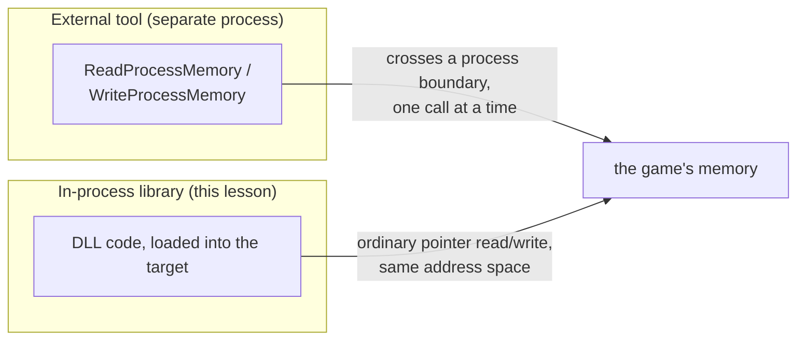
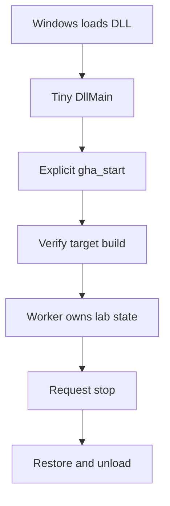
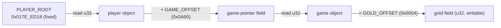
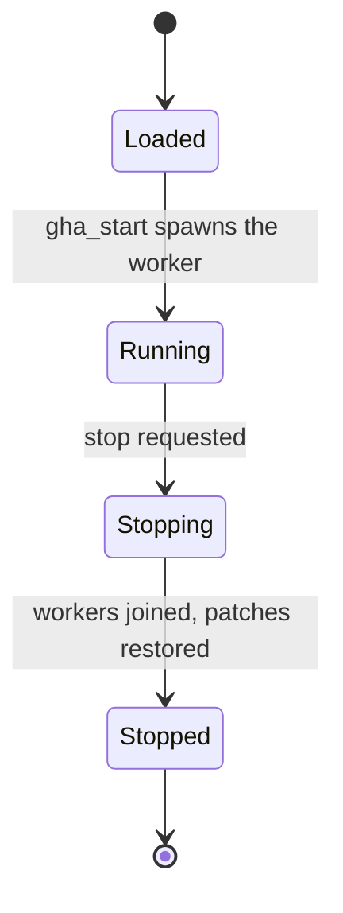

## External versus in-process

An external tool uses Windows to cross a process boundary. An in-process library is loaded into the target and shares its virtual address space.

The two routes reach the same bytes through different doors:



That makes pointer access direct, but not automatically safe. An address discovered in a debugger can still be null, stale, misaligned, or wrong for this game version.

Sharing an address space removes one copying boundary; it does not create shared ownership. The game still owns its objects, decides when they move or disappear, and may update them from other threads. Your DLL is a guest that can observe an address only while the assumptions that justified it remain true.

Before dereferencing, state the contract in four parts:

- which exact build and game state define the layout;
- which object owns the bytes;
- which thread may change or destroy them;
- how long this particular pointer remains valid.

Resolve short-lived pointers near the point of use. Copy the few fields you need into a local snapshot, validate them, then release the borrowed view of game memory.

The safe path has distinct stages instead of one giant startup function:



Each stage earns the capabilities used by the next one, and shutdown releases them in a controlled order.

## Create a DLL project

```powershell
cargo new --lib wesnoth_lab
cd wesnoth_lab
```

Configure Cargo:

```toml
[lib]
crate-type = ["cdylib"]

[dependencies]
windows = { version = "0.62", features = [
    "Win32_Foundation",
    "Win32_System_SystemServices",
] }
```

`cdylib` tells the compiler to build a Windows DLL with a C-compatible boundary.

## Keep `DllMain` tiny

Windows calls `DllMain` while holding the **loader lock**. Many operations are unsafe there: starting complicated work, loading other DLLs, waiting on threads, or calling code that might do those things.

```rust
use std::ffi::c_void;
use windows::Win32::{
    Foundation::{HINSTANCE, HMODULE},
    System::{
        LibraryLoader::DisableThreadLibraryCalls,
        SystemServices::DLL_PROCESS_ATTACH,
    },
};
use windows::core::BOOL;

#[unsafe(no_mangle)]
pub extern "system" fn DllMain(
    instance: HINSTANCE,
    reason: u32,
    _reserved: *mut c_void,
) -> BOOL {
    if reason == DLL_PROCESS_ATTACH {
        // 🛡️ SAFETY: Windows supplied the module that it is currently attaching.
        let _ = unsafe { DisableThreadLibraryCalls(HMODULE(instance.0)) };
    }
    BOOL::from(true)
}
```

Normally the compiler mangles a function's name so it can tell apart two functions with the same short name in different modules. `#[no_mangle]` turns that off and exports the bare name `DllMain` instead. If another object linked into the same DLL also exports a symbol named `DllMain`, or if some other code calls this export assuming a different signature, the linker or loader cannot catch the mismatch the way Rust's type checker normally would. Rust 2024 marks `#[unsafe(no_mangle)]` to make that unchecked, program-wide promise visible at the call site instead of leaving it implicit.

## Export an explicit start function

Let the host or lab loader call a separate function after loading:

```rust
use std::sync::OnceLock;

static STARTED: OnceLock<()> = OnceLock::new();

#[unsafe(no_mangle)]
pub extern "system" fn gha_start(_argument: *mut std::ffi::c_void) -> u32 {
    if STARTED.set(()).is_err() {
        return 1; // already started
    }

    let worker = std::thread::Builder::new()
        .name("gha-tool-worker".into())
        .spawn(|| {
            if let Err(error) = run_lab() {
                eprintln!("lab stopped: {error:#}");
            }
        });

    if worker.is_err() {
        return 2;
    }

    0
}
```

This separates loading from initialization and prevents accidental double-starts.

## Read known in-process data

Wrap a verified field rather than exposing raw pointers everywhere:

```rust
#[derive(Clone, Copy)]
struct PlayerAddress(usize);

impl PlayerAddress {
    /// # Safety
    /// The address must refer to a live, aligned `u32` gold field in the
    /// documented target build for the duration of this call.
    unsafe fn read_gold(self) -> u32 {
        // 🛡️ SAFETY: upheld by the caller after version and pointer-chain checks.
        unsafe { (self.0 as *const u32).read() }
    }
}
```

An even better design resolves the object each time from a module-relative path and checks readable regions before dereferencing.

## Make the Wesnoth gold DLL actually change gold

For **Wesnoth 1.14.9, 32-bit Windows**, use the same chain as the external tool. Only the two offsets and the root address are fixed; the two pointer values in between are whatever Wesnoth allocated this run:



```rust
const PLAYER_ROOT: *const u32 = 0x017E_ED18 as *const u32;
const GAME_OFFSET: usize = 0x0A90;
const GOLD_OFFSET: usize = 0x0004;

/// Resolves the live gold pointer in the documented Wesnoth build.
///
/// # Safety
/// The caller must first verify the exact 32-bit target build and that a
/// local match is active. Each intermediate pointer must be readable.
unsafe fn wesnoth_gold_pointer() -> anyhow::Result<*mut u32> {
    // 🛡️ SAFETY: target/build/state checks are the caller's responsibility.
    let player = unsafe { PLAYER_ROOT.read() } as usize;
    anyhow::ensure!(player != 0, "player pointer is null");

    let game_pointer = player.checked_add(GAME_OFFSET)
        .context("game pointer address overflowed")? as *const u32;
    // 🛡️ SAFETY: the verified player object contains a 32-bit game pointer here.
    let game = unsafe { game_pointer.read() } as usize;
    anyhow::ensure!(game != 0, "game pointer is null");

    let gold = game.checked_add(GOLD_OFFSET)
        .context("gold address overflowed")? as *mut u32;
    Ok(gold)
}

fn set_wesnoth_gold(amount: u32) -> anyhow::Result<()> {
    // 🛡️ SAFETY: `gha_start` enables this only after the build and match checks.
    let gold = unsafe { wesnoth_gold_pointer()? };
    // ✅ SAFETY: the resolver returned the live, aligned four-byte gold field.
    unsafe { gold.write(amount) };
    Ok(())
}
```

Call `set_wesnoth_gold(999)` from the worker started by `gha_start`. Return to the local match and trigger a UI refresh. If no match is active, the function must return an error instead of dereferencing zero.

This is a real internal memory hack: the DLL shares Wesnoth's address space and writes the live gold field directly. The three raw dereferences are isolated and explained instead of being scattered through the thread loop.

## Load it and call the exported start function

The matching injector performs two remote calls. First it runs `LoadLibraryW`
in Wesnoth. Then it maps the same DLL locally without running it, finds the
relative offset of `gha_start`, adds that offset to the DLL base returned by
Wesnoth, and starts a second remote thread at that export.

That second step is important. `LoadLibraryW` returning means Windows finished
the loader-lock portion of loading. Only then does `gha_start` create the
worker. The complete implementation is in
[`injector.rs`]({{ site.baseurl }}/windows-labs/src/bin/injector.rs), and the DLL entry points are
in [`dll.rs`]({{ site.baseurl }}/windows-labs/src/windows_impl/dll.rs).

```powershell
cd windows-labs
cargo build --release --target i686-pc-windows-msvc
.\target\i686-pc-windows-msvc\release\injector.exe `
  wesnoth.exe `
  .\target\i686-pc-windows-msvc\release\gha_windows_labs.dll
```

With a local match already active, the worker resolves the chain and writes
`999`. This is the proof for the lesson: the injected library has executed
inside Wesnoth and changed a live, spendable game value.

## Do not hide the target assumptions

Put version-specific facts together:

```rust
struct TargetProfile {
    module_name: &'static str,
    build_id: &'static str,
    player_path: &'static [usize],
    gold_offset: usize,
}
```

At startup:

1. confirm the module exists;
2. confirm the supported build fingerprint;
3. resolve the pointer path;
4. check each pointer;
5. only then enable the lab feature.

## Unloading is a protocol

Background threads must stop before the DLL unloads. Use an atomic stop flag or a channel, wait for workers to exit from outside `DllMain`, restore patches, and then unload.

The important lesson is architectural: loading, running, stopping, and unloading are separate states. Model them deliberately instead of relying on global booleans and timing luck.

```rust
enum LabState {
    Loaded,
    Running,
    Stopping,
    Stopped,
}
```



The type system cannot make an unknown game address safe, but it can make the rest of the lifecycle much harder to mix up.

Lifecycle states should control capabilities. `Loaded` may allow only bookkeeping, `Running` may own workers and patches, `Stopping` may request cleanup but reject new work, and `Stopped` must own nothing that points into executable code. This is stronger than a single `started: bool`, which cannot distinguish “never started” from “cleanup still in progress.”
