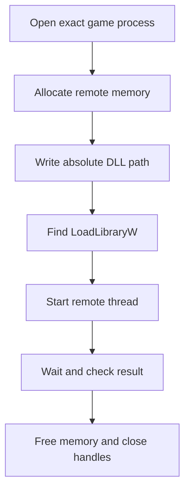

## Keep target identity explicit

This injector accepts only the exact target builds used in the book. Put the allowlist in code so a mistyped command cannot select an unrelated process.

```rust
const ALLOWED_TARGETS: &[&str] = &[
    "wesnoth.exe",       // Wesnoth 1.14.9, 32-bit
    "ac_client.exe",     // AssaultCube 1.2.0.2, 32-bit
    "Quake3-UrT.exe",    // Urban Terror 4.3.4, 32-bit
    "flare.exe",         // Flare 1.12, 32-bit course build
    "wyrmsun.exe",       // Wyrmsun 5.0.1, 32-bit course build
];

fn allowed_target(name: &str) -> bool {
    ALLOWED_TARGETS.iter().any(|allowed| allowed.eq_ignore_ascii_case(name))
}
```

This chapter covers the classic Windows loader sequence. Protected-process work and anti-cheat bypasses are separate subjects and are outside this tool's contract.

## The classic loader sequence



Every box can fail and must clean up what earlier boxes created.

## Use a wide absolute path

Windows `LoadLibraryW` expects a zero-terminated UTF-16 path:

```rust
use std::{os::windows::ffi::OsStrExt, path::Path};

fn wide_path(path: &Path) -> anyhow::Result<Vec<u16>> {
    let absolute = path.canonicalize()?;
    let mut wide: Vec<u16> = absolute.as_os_str()
        .encode_wide()
        .collect();
    wide.push(0);
    Ok(wide)
}
```

A relative path depends on the target’s working directory and is easy to misresolve.

## Own remote memory

Model the allocation so cleanup is not optional:

```rust
struct RemoteAllocation<'a> {
    process: &'a Process,
    address: *mut std::ffi::c_void,
}

impl Drop for RemoteAllocation<'_> {
    fn drop(&mut self) {
        // SAFETY: this allocation belongs to this process and is released once.
        let _ = unsafe {
            VirtualFreeEx(self.process.raw_handle(), self.address, 0, MEM_RELEASE)
        };
    }
}
```

Allocate and write the path with the actual `windows` crate calls:

```rust
let remote_address = unsafe {
    VirtualAllocEx(
        process.raw_handle(),
        None,
        path_bytes.len(),
        MEM_COMMIT | MEM_RESERVE,
        PAGE_READWRITE,
    )
};
anyhow::ensure!(!remote_address.is_null(), "VirtualAllocEx failed");

let remote_path = RemoteAllocation {
    process: &process,
    address: remote_address,
};
process.write_exact(remote_path.address as usize, path_bytes)?;
```

`Process::write_exact` checks the returned byte count from `WriteProcessMemory`. `RemoteAllocation::drop` pairs the successful allocation with `VirtualFreeEx` even when a later `?` returns early.

## Verify every boundary

The high-level loader should look like a checklist:

```rust
let kernel32 = unsafe { GetModuleHandleW(w!("kernel32.dll")) }?;
let load_library = unsafe { GetProcAddress(kernel32, s!("LoadLibraryW")) }
    .context("kernel32 did not export LoadLibraryW")?;
let start: LPTHREAD_START_ROUTINE =
    Some(unsafe { std::mem::transmute(load_library) });

let thread = unsafe {
    CreateRemoteThread(
        process.raw_handle(),
        None,
        0,
        start,
        Some(remote_path.address.cast_const()),
        0,
        None,
    )
}?;
let thread = OwnedHandle::from_raw(thread)?;
let module_handle = wait_for_thread(&thread, "the LoadLibraryW thread")?;
anyhow::ensure!(module_handle != 0, "LoadLibraryW returned null");
```

Two things about that sequence deserve an explanation, because both look wrong
the first time you read them.

**Why is our own `LoadLibraryW` address valid in the game?** `GetProcAddress`
runs in the injector and returns an address in the injector's address space —
which, from the previous chapter, should mean nothing in another process.
It works here because Windows randomizes the base of a system DLL like
`kernel32.dll` once per boot, not once per process. Every process in the
session maps it at the same address, so the number is genuinely the same on
both sides. This is a property of system DLLs specifically. It is not true of
the game's own modules, and it is not a rule to generalize.

**Why can `LoadLibraryW` be used as a thread start routine?** Because the two
signatures happen to line up. A thread entry point receives one pointer-sized
argument and returns a pointer-sized value; `LoadLibraryW` takes one pointer (a
wide string) and returns one (the module handle). So `CreateRemoteThread` can
call it directly, the remote memory holding the path becomes its argument, and
the thread's exit code is the returned module handle — which is exactly what
the `module_handle != 0` check above reads.

The wrapper methods are small `unsafe` boundaries over:

- `OpenProcess`;
- `VirtualAllocEx` / `VirtualFreeEx`;
- `WriteProcessMemory`;
- `CreateRemoteThread`;
- waiting and reading the thread exit code;
- `CloseHandle`.

## Architecture must match

A 32-bit DLL loads into a 32-bit process. A 64-bit DLL loads into a 64-bit process. Check both the loader and target architecture before allocating anything.

For the versions in this book, install the 32-bit compilation target and build the DLL for it:

```powershell
rustup target add i686-pc-windows-msvc
cargo build --release --target i686-pc-windows-msvc
```

Pass the absolute DLL produced under `target\i686-pc-windows-msvc\release\`. A 64-bit injector may still need extra care to inspect a 32-bit target, so the simplest course setup builds the injector as 32-bit too.

## Loader-lock reminder

When the DLL loads, Windows calls its `DllMain` under the loader lock. The course DLL does only one small thing there: `DisableThreadLibraryCalls`. The injector then finds the exported `gha_start` address by its DLL-relative offset and starts a **second** remote thread after `LoadLibraryW` has returned. That guarantees the real worker and hook installation happen outside `DllMain` and outside the loader lock.

## Cleanup order

On every error:

1. stop waiting on or close the remote thread handle;
2. free the remote path allocation;
3. close the process handle.

RAII types make this happen during early returns.

## Run the real game lab

1. Build both injector and DLL for `i686-pc-windows-msvc`.
2. Start one allowed game in the exact version and enter an offline/local match.
3. Run the injector with the process name and absolute DLL path.
4. Wait for `LoadLibraryW` to return a nonzero module handle.
5. Confirm the DLL’s log prints the matched target profile and every verified original byte.
6. Trigger the visible result: Wesnoth gold becomes `999`, AssaultCube recoil disappears, or Urban Terror renders the local wallhack.
7. Toggle the feature off, restore the bytes, and exit the game normally.

If `LoadLibraryW` returns zero, print the target PID, both architectures, the canonical DLL path, and the Windows error. Do not suggest “run as administrator” until those facts are correct.

The completed tool performs a real injection into the course games with exact target checks, owned handles, bounded waits, clear errors, and automatic cleanup.

The complete buildable source is [`injector.rs`]({{ site.baseurl }}/windows-labs/src/bin/injector.rs). It includes the allowlist, architecture check, UTF-16 conversion, allocation, both remote threads, `gha_start` RVA calculation under ASLR, timeout handling, exit-code checks, and cleanup. Its shared process/handle wrappers are in [`process.rs`]({{ site.baseurl }}/windows-labs/src/windows_impl/process.rs) and [`handle.rs`]({{ site.baseurl }}/windows-labs/src/windows_impl/handle.rs).
