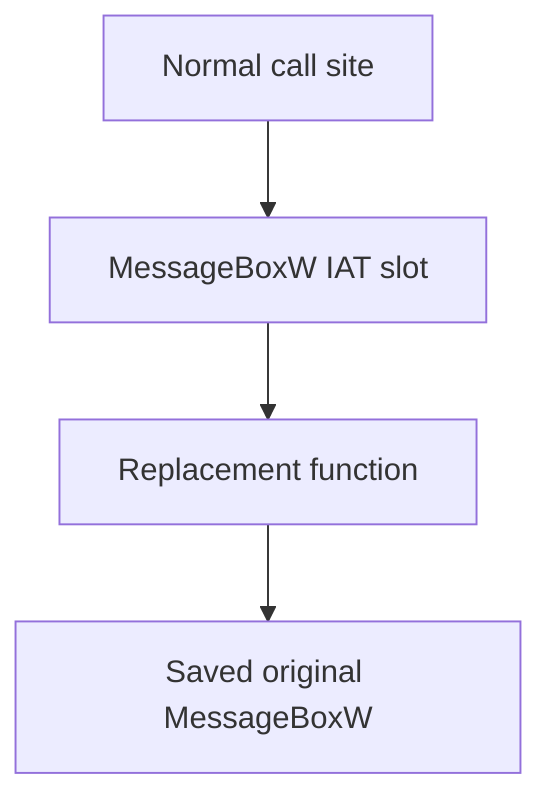

## What the Import Address Table does

Your program can call `MessageBoxW` without knowing where `user32.dll` will load. The PE import data says, “I need this named function.” The Windows loader finds its live address and writes that address into the **Import Address Table**, or **IAT**.

Later, a normal imported call follows the pointer stored in that table:

```text
your call site → MessageBoxW IAT slot → live user32!MessageBoxW
```

If a program deliberately replaces its own slot, the same call site follows the replacement:

```text
your call site → MessageBoxW IAT slot → hooked_message_box
                                      └→ saved original MessageBoxW
```

This lab changes only the IAT of the course executable itself. It does not target another process, hide from security software, or bypass protections.

During the lab, the call still begins at the same instruction; only the pointer in the table chooses a different route:



When the patch owner is dropped, it puts the saved original pointer back into that same IAT slot.

## Keep the function signature exact

The replacement must accept the same arguments and use the same Windows calling convention:

```rust
type RawMessageBoxW = unsafe extern "system" fn(
    HWND,
    PCWSTR,
    PCWSTR,
    MESSAGEBOX_STYLE,
) -> MESSAGEBOX_RESULT;

static ORIGINAL_MESSAGE_BOX: AtomicUsize = AtomicUsize::new(0);

unsafe extern "system" fn hooked_message_box(
    window: HWND,
    _text: PCWSTR,
    caption: PCWSTR,
    style: MESSAGEBOX_STYLE,
) -> MESSAGEBOX_RESULT {
    let address = ORIGINAL_MESSAGE_BOX.load(Ordering::Acquire);
    if address == 0 {
        return MESSAGEBOX_RESULT(0);
    }

    // 🔁 SAFETY: install() saved the original pointer from this exact IAT slot.
    let original: RawMessageBoxW = unsafe { std::mem::transmute(address) };
    // 🛡️ SAFETY: the signature and Windows ABI match MessageBoxW.
    unsafe {
        original(
            window,
            w!("Hook reached the replacement IAT entry."),
            caption,
            style,
        )
    }
}
```

`extern "system"` tells the compiler to use the calling convention Windows expects. If the convention, parameter sizes, or return type are wrong, the stack or registers can be interpreted incorrectly.

## Find the import directory

For a loaded PE32 image:

1. get the current executable base with `GetModuleHandleW(NULL)`;
2. verify `MZ` and `PE\0\0`;
3. require optional-header magic `0x10B`;
4. read the import-directory RVA from data-directory entry 1;
5. walk 20-byte import descriptors until the all-zero terminator;
6. find `user32.dll`;
7. walk its lookup names and IAT slots together;
8. find `MessageBoxW` by name.

Step 7 is the one that surprises people: each imported DLL has **two** parallel
arrays, not one. The compiler writes them as identical lists of equal length,
and the loader overwrites only one of them.

```text
index   lookup table (names)      address table (IAT)
  0     "MessageBoxW"             0x7FF8_1234_5000    <- written by the loader
  1     "MessageBoxA"             0x7FF8_1234_5100
  2     ordinal 0x201             0x7FF8_1234_5200
  3     0  (terminator)           0
```

Before the module is loaded, both arrays hold the same name references. During
loading, Windows resolves each name and writes the resulting live address into
the matching IAT slot, leaving the lookup table alone. That is exactly why you
walk the two together: the lookup table still records *which function this
entry is*, while the IAT records *where that function currently lives*.
Searching the IAT by itself gives you addresses with no names attached;
searching the lookup table by itself gives you names with nothing to patch.

(Some binaries ship with the lookup table absent, in which case the loader has
only the IAT to work from. The parser should handle that case rather than
assuming both arrays are always present.)

The important matching loop is:

```rust
let names = if original_thunk == 0 {
    first_thunk
} else {
    original_thunk
};

for index in 0..2048_usize {
    // 📏 Bound the thunk walk even if a malformed image omits its zero terminator.
    let name_cell = names
        .checked_add(index * 4)
        .context("name thunk overflowed")?;
    let name_value = u32_at(image, name_cell)?;
    if name_value == 0 {
        break;
    }
    if name_value & 0x8000_0000 != 0 {
        // 🔍 The high bit marks an ordinal import; there is no name pointer to read.
        continue; // this one was imported by number, not by name
    }

    let import_name = usize::try_from(name_value)?
        .checked_add(2) // skip the two-byte hint
        .context("import name overflowed")?;
    if c_string_at(image, import_name)? != b"MessageBoxW" {
        continue;
    }

    // 🧭 Names identify the function; FirstThunk identifies the live pointer
    // slot that the loader filled and the hook must replace.
    let slot_rva = first_thunk
        .checked_add(index * 4)
        .context("IAT overflowed")?;
    anyhow::ensure!(slot_rva + 4 <= image_size, "IAT slot outside image");
    let slot = (base + slot_rva) as *mut u32;
    // ✅ The installer now owns this validated four-byte PE32 slot.
}
```

The limits stop a malformed table from becoming an endless walk through memory.

## Change one pointer, then restore it

`VirtualProtect` temporarily makes the four-byte slot writable. The code immediately restores the old page protection:

```rust
unsafe fn write_slot(slot: *mut u32, value: u32) -> anyhow::Result<()> {
    let mut old = PAGE_PROTECTION_FLAGS::default();
    // 🛡️ SAFETY: slot is the validated IAT cell in this executable.
    unsafe { VirtualProtect(slot.cast(), 4, PAGE_READWRITE, &mut old)? };
    // 📏 SAFETY: the page is writable and the slot is exactly four bytes on PE32.
    // 🔁 Volatile keeps this externally visible pointer update as one explicit
    // memory operation; it does not make an invalid slot safe.
    unsafe { slot.write_volatile(value) };

    let mut ignored = PAGE_PROTECTION_FLAGS::default();
    // 🔒 SAFETY: old came from the successful protection change above.
    unsafe { VirtualProtect(slot.cast(), 4, old, &mut ignored)? };
    Ok(())
}
```

The patch owns the original pointer:

```rust
struct IatPatch {
    slot: *mut u32,
    original: u32,
}

impl Drop for IatPatch {
    fn drop(&mut self) {
        // 🧹 SAFETY: this owner restores the same slot exactly once.
        if let Err(error) = unsafe { write_slot(self.slot, self.original) } {
            eprintln!("could not restore MessageBoxW IAT slot: {error:#}");
        }
        // 🔒 Publish “no callable original” only after the slot restoration
        // attempt, so the replacement cannot observe cleanup out of order.
        ORIGINAL_MESSAGE_BOX.store(0, Ordering::Release);
    }
}
```

This is RAII applied to reverse engineering: owning the modification also means owning the cleanup.

## Run the complete three-message proof

```powershell
cargo run --release --target i686-pc-windows-msvc --bin iat_hook_lab
```

You should see three message boxes:

1. the untouched call displays “The normal import runs first.”
2. the hooked call displays “Hook reached the replacement IAT entry.”
3. after `IatPatch` is dropped, the restored call displays “The original import is restored.”

Those three visible states prove interception and restoration. The full buildable source—including bounded PE parsing and every `unsafe` invariant—is [`iat_hook_lab.rs`]({{ site.baseurl }}/windows-labs/src/bin/iat_hook_lab.rs).

## How this connects to game labs

An injected course DLL lives inside the game process, so the same idea can observe an imported graphics or file function used by that exact build. Before changing a game IAT:

- prove the function is actually imported by the main executable;
- use the exact function signature;
- reject an unknown PE format or module version;
- keep the hook tiny and non-blocking;
- restore the original slot before unloading the DLL.

The Urban Terror OpenGL chapter uses an instruction detour because its verified draw path is not expressed as a convenient main-executable IAT slot. Choose a hook based on the real call path, not because one technique sounds fashionable.

References: [Microsoft PE format](https://learn.microsoft.com/en-us/windows/win32/debug/pe-format), [`GetModuleHandleW`](https://learn.microsoft.com/en-us/windows/win32/api/libloaderapi/nf-libloaderapi-getmodulehandlew), and [importing functions using `__declspec(dllimport)`](https://learn.microsoft.com/en-us/cpp/build/importing-function-calls-using-declspec-dllimport).
