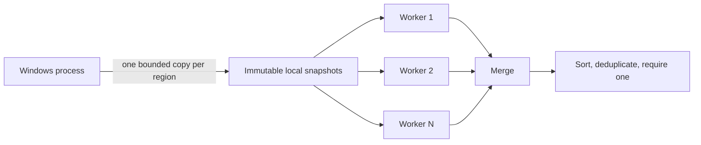

## Parallel code needs a boundary 🔀

The simple pattern scanner is intentionally single-threaded. Its next advanced step is not “put every Windows call on a thread.” The safe boundary is:



Only the capture phase touches the running Wesnoth process. Workers scan ordinary `Vec<u8>` buffers owned by the scanner.

That separation improves more than speed:

- a page cannot disappear halfway through a worker comparison;
- workers do not share a process handle;
- the matching algorithm uses checked local slices;
- captured bytes can be saved and replayed in tests;
- concurrency begins after the unstable operating-system boundary.

## Check both safety and progress

Concurrent code needs two different kinds of promises:

- **safety** asks, “What bad result must never happen?”
- **progress** asks, “What useful ending must eventually happen?”

For this scanner:

| Promise | Concrete game-tool rule |
|---|---|
| safety | no worker reads changing remote memory |
| safety | the global result cap is never exceeded |
| safety | a found address stays inside its copied region |
| progress | every worker eventually sees cancellation or an empty work queue |
| progress | the main thread joins every worker before publishing results |
| progress | one worker panic becomes an error instead of an endless wait |

“Uses atomics” is not a complete concurrency argument. Name which safety fact
each atomic protects and which condition lets each loop finish.

## Copy only the intended code

The capture stage clips every Windows memory run to the live `wesnoth.exe` module and keeps only readable executable pages:

```rust
let start = region.base.max(module_base);
let end = region.base.saturating_add(region.size).min(module_end);
if start >= end {
    continue;
}

let length = end - start;
let bytes = process.read_bytes(start, length)?;
snapshots.push(RegionSnapshot { base: start, bytes });
```

The real tool also caps all copied executable bytes at 128 MiB. Memory safety prevents corruption, but it does not prevent a logically unbounded allocation from exhausting the machine.

If a page changes between `VirtualQueryEx` and `ReadProcessMemory`, that one region is skipped with a diagnostic. A partial buffer never reaches a worker.

## Use an atomic index as a tiny work queue

Each worker asks for the next region number:

```rust
let index = next_region.fetch_add(1, Ordering::AcqRel);
let Some(region) = snapshots.get(index) else {
    break;
};
```

No region is handed out twice. When the index passes the slice, the worker finishes.

Fetching the next index when a worker becomes free is **dynamic scheduling**.
It is better than permanently giving worker 1 the first quarter of regions and
worker 2 the second quarter: a worker that receives several tiny regions can
continue helping while another scans a large one.

Region sizes can still be badly uneven. If measurement later justifies splitting
one large snapshot into fixed-size chunks, adjacent chunks must overlap by
`pattern.len() - 1` bytes or a pattern crossing the boundary can disappear.
The merge step must then remove duplicate addresses from the overlap. Faster
scheduling is not correct if it creates blind spots.

Why not create one thread per region? A module can contain many runs, and thread creation itself costs memory and scheduling time. The tool uses at most `available_parallelism()` workers and never more workers than snapshots.

## Bound results across every worker

A weak pattern can match thousands of locations. A per-thread limit is not enough: eight workers with a 4,096-item limit could still produce 32,768 items.

The scanner reserves each result through one atomic counter:

```rust
fn reserve_match(counter: &AtomicUsize) -> bool {
    counter
        .fetch_update(Ordering::AcqRel, Ordering::Acquire, |current| {
            (current < MAX_MATCHES).then_some(current + 1)
        })
        .is_ok()
}
```

`fetch_update` performs “check below cap and increment” as one atomic operation. When the cap is full, the worker sets a shared cancellation flag. Other workers notice and stop.

The memory ordering communicates two small state transitions:

- `Release` publishes cancellation;
- `Acquire` makes another worker observe that published state.

The bytes themselves need no mutex or atomic because they are immutable.

## Restore deterministic output

Thread completion order changes from run to run. Addresses should not:

```rust
matches.sort_unstable();
matches.dedup();
anyhow::ensure!(matches.len() == 1, "expected one match");
```

Sorting after the merge makes logs, tests, and human review repeatable. Deduplication is defensive; clipped memory regions should not overlap, but downstream correctness should not depend on that hope.

This distinction matters:

- **parallel execution order** may vary;
- **published result order** should be stable.

## Complete buildable tool

<details class="lab-source" markdown="1">
<summary>Complete lab source: parallel_pattern_scanner.rs</summary>

```rust
#[cfg(windows)]
fn main() -> anyhow::Result<()> {
    use std::{
        sync::atomic::{AtomicBool, AtomicUsize, Ordering},
        thread,
    };

    use anyhow::Context;
    use gha_windows_labs::Process;

    const PATTERN: [u8; 3] = [0x29, 0x42, 0x04];
    const MAX_SNAPSHOT_BYTES: usize = 128 * 1024 * 1024;
    const MAX_MATCHES: usize = 4_096;

    struct RegionSnapshot {
        base: usize,
        bytes: Vec<u8>,
    }

    fn reserve_match(counter: &AtomicUsize) -> bool {
        counter
            .fetch_update(Ordering::AcqRel, Ordering::Acquire, |current| {
                (current < MAX_MATCHES).then_some(current + 1)
            })
            .is_ok()
    }

    let process = Process::open_by_name("wesnoth.exe", false)?;
    anyhow::ensure!(
        process.is_32_bit()?,
        "this profile requires 32-bit Wesnoth 1.14.9"
    );
    let (module_base, module_size) = process.module("wesnoth.exe")?;
    let module_end = module_base
        .checked_add(module_size)
        .context("module range overflowed")?;

    let mut total_bytes = 0_usize;
    let mut snapshots = Vec::new();
    for region in process.regions(module_base, module_end)? {
        if !region.readable || !region.executable {
            continue;
        }
        // 📏 VirtualQueryEx can return a run wider than the module; clip it.
        let start = region.base.max(module_base);
        let end = region.base.saturating_add(region.size).min(module_end);
        if start >= end {
            continue;
        }
        let length = end - start;
        total_bytes = total_bytes
            .checked_add(length)
            .context("snapshot byte count overflowed")?;
        anyhow::ensure!(
            total_bytes <= MAX_SNAPSHOT_BYTES,
            "executable snapshot exceeds {MAX_SNAPSHOT_BYTES} bytes"
        );

        match process.read_bytes(start, length) {
            Ok(bytes) => snapshots.push(RegionSnapshot { base: start, bytes }),
            // ⚠️ The process can change a page between query and copy. Skip that
            // observation rather than feeding a partial buffer to worker threads.
            Err(error) => eprintln!("skipped region {start:#010x}+{length:#x}: {error:#}"),
        }
    }
    anyhow::ensure!(
        !snapshots.is_empty(),
        "no readable executable regions were copied"
    );

    let worker_count = thread::available_parallelism()
        .map(|count| count.get())
        .unwrap_or(1)
        .min(snapshots.len());
    let next_region = AtomicUsize::new(0);
    let match_count = AtomicUsize::new(0);
    let cancelled = AtomicBool::new(false);

    // 🔀 Remote memory is copied before parallel work begins. Workers receive
    // immutable local slices, so no process handle or changing page is shared.
    let mut matches = thread::scope(|scope| -> anyhow::Result<Vec<usize>> {
        let mut workers = Vec::new();
        for _ in 0..worker_count {
            let snapshots = &snapshots;
            let next_region = &next_region;
            let match_count = &match_count;
            let cancelled = &cancelled;
            workers.push(scope.spawn(move || -> anyhow::Result<Vec<usize>> {
                let mut local = Vec::new();
                loop {
                    if cancelled.load(Ordering::Acquire) {
                        break;
                    }
                    let index = next_region.fetch_add(1, Ordering::AcqRel);
                    let Some(region) = snapshots.get(index) else {
                        break;
                    };

                    for (offset, window) in region.bytes.windows(PATTERN.len()).enumerate() {
                        if window != PATTERN {
                            continue;
                        }
                        if !reserve_match(match_count) {
                            cancelled.store(true, Ordering::Release);
                            break;
                        }
                        local.push(
                            region
                                .base
                                .checked_add(offset)
                                .context("match address overflowed")?,
                        );
                    }
                }
                Ok(local)
            }));
        }

        let mut combined = Vec::new();
        for worker in workers {
            let local = worker
                .join()
                .map_err(|_| anyhow::anyhow!("a scanner worker panicked"))??;
            combined.extend(local);
        }
        Ok(combined)
    })?;

    anyhow::ensure!(
        !cancelled.load(Ordering::Acquire),
        "match cap reached; pattern is too broad"
    );
    // ✅ Parallel completion order is nondeterministic; sorting makes output and
    // later uniqueness checks repeatable.
    matches.sort_unstable();
    matches.dedup();

    println!(
        "Scanned {total_bytes} copied bytes with {worker_count} worker(s); {} match(es):",
        matches.len()
    );
    for address in &matches {
        println!("  {address:#010x}: sub dword ptr [edx+4], eax");
    }
    anyhow::ensure!(
        matches.len() == 1,
        "expected exactly one verified course-build match"
    );
    Ok(())
}

#[cfg(not(windows))]
fn main() {
    eprintln!("This live parallel scanner must run on Windows.");
}
```

</details>

The source is also available as [`parallel_pattern_scanner.rs`]({{ site.baseurl }}/windows-labs/src/bin/parallel_pattern_scanner.rs).

## Build and run it

Start the exact 32-bit Wesnoth 1.14.9 course build in a local match:

```powershell
cd windows-labs
cargo build --release --target i686-pc-windows-msvc --bin parallel_pattern_scanner
.\target\i686-pc-windows-msvc\release\parallel_pattern_scanner.exe
```

The tool searches for the verified gold-subtraction bytes:

```nasm
29 42 04    ; sub dword ptr [edx+4], eax
```

A supported build should produce one address. Zero means the build, capture, or signature assumption is wrong. More than one means the signature is ambiguous. Parallelism does not change those evidence rules.

## Measure before claiming a speedup

Parallel scanning has fixed costs:

- copying the process is still sequential;
- creating workers costs time;
- a three-byte pattern is cheap to compare;
- merging and sorting remain;
- small modules may fit in cache and finish faster on one thread.

Measure the capture and scan phases separately with `Instant`. If capture dominates, adding workers cannot solve that bottleneck. This is Amdahl’s law in plain English: the part that stays serial limits the total speedup.

For course-sized modules, the architecture lesson is more important than the benchmark number.

## Failure cases to test

Create local byte buffers and verify:

1. a match at the first and last legal offsets;
2. no match;
3. overlapping matches;
4. more matches than the global cap;
5. one empty snapshot list;
6. a base address whose `base + offset` would overflow;
7. worker panic reporting;
8. sorted output across repeated runs.

Do these tests without a game process. Only the small capture layer requires Windows and Wesnoth.

{% include quiz.html
  id="advanced-parallel-scan-boundary"
  type="multiple-choice"
  title="Choose the concurrency boundary"
  prompt="Which parallel scanner design gives workers the most stable input?"
  options="Copy bounded readable code regions once, then scan immutable local buffers||Let every worker repeatedly query and read arbitrary remote pages||Give every byte its own operating-system thread||Patch matches as soon as any worker finds them"
  answer="0"
  explanation="Remote memory changes and Windows reads can fail. Copying once keeps that unstable boundary in one stage; workers then perform deterministic comparisons over immutable slices."
%}

## Checkpoint

You understand the advanced scanner when you can explain:

- why process copying happens before parallel scanning;
- why the match cap is global rather than per worker;
- why cancellation is separate from result storage;
- why sorted results are part of correctness, not cosmetic output;
- why a faster ambiguous pattern is still unusable.
