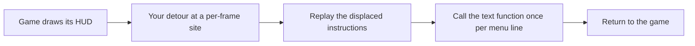

## A third option between a window and an overlay

Lesson 8.7 put the menu in its own window, which is the right default: it
cannot corrupt the game's graphics state, and you can close the game without
losing it.

But you have already met a function that draws text *inside* the game. In
Lesson 3.7 you traced Wesnoth's print function, and in Lesson 5.9 you called
AssaultCube's at `0x0041_9880` to label players. That function already knows
the font, the scale, the screen size, and the right moment in the frame to
draw. Calling it is the cheapest way to put a menu on screen, because the
hard graphics work is done and you are only supplying strings.

The trade is that you are now running inside the game's render path, so
everything Lesson 4.8 says about not stalling that path applies with full
force.

## Hook a per-frame site, then call the text function

The obvious idea is to hook the text function itself. That is the one thing
that cannot work:

```text
your hook runs
  -> you want to draw a menu line
    -> you call the text function
      -> which is hooked
        -> your hook runs
```

Nothing stops the recursion, and the stack overflows in a frame or two.

Hook a site that runs **once per frame** instead, and call the text function
from there as an ordinary function:



Lesson 5.9 already identified such a site in AssaultCube: the final print hook
at `0x0040_BE7E`, resuming at `0x0040_BE83`. Drawing there puts your lines in
the same pass as the game's own HUD, so they inherit its ordering and never
appear underneath the world.

## Reconstruct the contract before you call it

Calling a function you found is Lesson 3.8's problem, not a new one. Before
the first call, answer its four parts:

- which arguments it takes, and in what order — typically a screen position
  and a string;
- where those arguments go, which for a 32-bit game usually means `cdecl` on
  the stack, or `thiscall` with the renderer object in `ecx`;
- what it returns, if anything;
- whether it **copies** the string or merely stores the pointer.

That last question is the one that bites. If the function keeps the pointer and
draws later in the frame, a string you built on the stack is gone by then:

```rust
// ❌ The buffer dies at the end of this function. If the game reads the
//    pointer later in the frame, it reads freed stack space.
let line = format!("radar [on]");
draw_text(10, 10, line.as_ptr());
```

Keep an owned buffer alive for at least as long as the frame, and give the
function a pointer into that:

```rust
// ✅ `lines` outlives the call, and the trailing zero is explicit because a
//    C-style text function reads until it finds one.
struct MenuText {
    lines: Vec<std::ffi::CString>,
}
```

`CString` is the same tool Lesson 3.7 used at the C boundary, and for the same
reason: it guarantees the terminating zero and rejects interior zero bytes
instead of silently truncating your text.

## Colour is usually a marker inside the string

Many engines let a string carry its own formatting. The mechanism is nearly
always the same: a marker byte the renderer watches for, followed by an index
that selects a palette entry. AssaultCube uses the form feed character,
`0x0C`, followed by a digit.

```text
bytes:    0C 33 52 61 64 61 72
          ^^ ^^ ------------
          |  |  the visible text, "Radar"
          |  palette index '3'
          marker
```

Two consequences follow, and both matter.

The marker and index are **consumed**, not drawn, so the string's byte length
is larger than the number of visible characters. That is the same distinction
Lesson 3.7 drew between bytes, code units, scalars, and what a reader sees; a
menu that lines up columns by counting bytes will be crooked.

And the exact marker is a fact about one build. Confirm it by drawing a string
containing a candidate byte and watching what happens, rather than trusting the
number above.

## The menu itself is a small state machine

Everything above is about getting characters on screen. The part that actually
misbehaves is the bookkeeping, so
[`text_menu_lab.rs`]({{ site.baseurl }}/rust-labs/src/bin/text_menu_lab.rs)
models it in portable safe Rust with no graphics API involved:

```powershell
cd rust-labs
cargo run --bin text_menu_lab
cargo test --bin text_menu_lab
```

### A wrapping cursor underflows if you write the obvious thing

Moving the cursor up from the first row should land on the last. The natural
expression is wrong:

```rust
self.cursor = (self.cursor - 1) % self.items.len();   // ❌
```

When `cursor` is `0`, `0 - 1` on an unsigned integer panics in a debug build
and produces `usize::MAX` in a release build, which then indexes far outside
the list. Handle the boundary explicitly and the intent is visible:

```rust
self.cursor = if self.cursor == 0 { last } else { self.cursor - 1 };
```

### `GetAsyncKeyState` reports a level, not a press

Lesson 8.6 made this point about input paths and it decides how a menu feels.
`GetAsyncKeyState` answers "is this key down right now?", which is true on
every frame of one press. A menu that acts on that answer scrolls the whole
list in a fraction of a second.

What a menu needs is the *edge* — the frame where the key changed from up to
down — which means remembering the previous frame:

```rust
let pressed = current.down && !previous.down;
```

The lab test holds the key for ten frames and asserts the cursor moved exactly
one row. That is the behavior to aim for, and it is the same edge-versus-level
distinction Lesson 4.7 used for bot events.

### Build the strings without allocating every frame

The render path runs thousands of times per second. Clear and reuse one buffer
rather than allocating a fresh `Vec` per frame; the lab asserts the buffer's
capacity is unchanged after a second render.

The menu should also own only its own state. Keep the same split Lesson 8.7
used: the menu produces settings and commands, and the worker reads them. A
menu that reaches directly into game memory while the render thread is drawing
has put a second writer on the same data.

## Restore the site, not just the feature

Closing the menu is a display change. Unloading the tool is a lifetime change,
and Lesson 8.8's ordering applies without modification: stop the worker, wait
for it to leave the hooked path, restore the displaced bytes, then release the
DLL. A detour removed while a frame is still executing inside it is the
`Draining` state from Lesson 13.5, and the fix there is the fix here.

## Scope

This is the same offline, version-pinned lab used since Chapter 5, and the same
menu model as Lesson 8.7 rendered somewhere else. The transferable skill —
calling a function you recovered, with a contract you proved, from a hook that
runs at a known point in a frame — is what a debug HUD, a benchmarking overlay,
and an accessibility tool all do.
