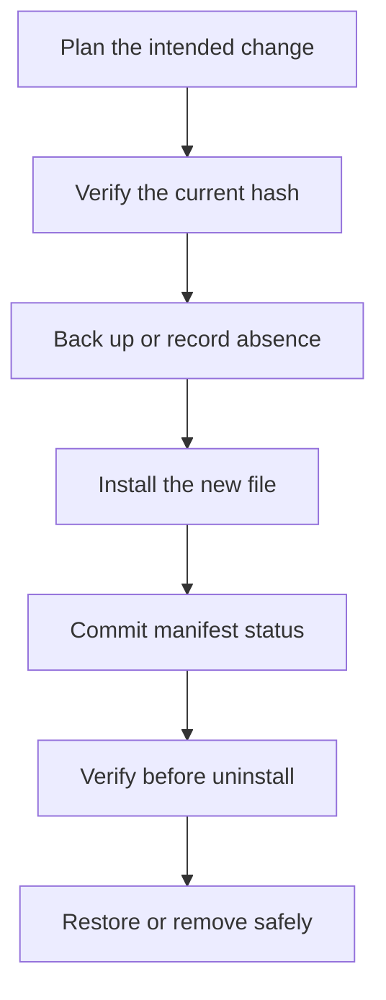

## “Copy these files” is not an uninstall plan

A responsible mod installer knows exactly what it changed. A **manifest** is a machine-readable receipt containing:

- mod identifier and version;
- supported game build;
- relative destination path;
- original file hash, if a file existed;
- installed file hash;
- backup location;
- operation time and status.

Do not store absolute paths inside a portable manifest. Keep a trusted game root separately and resolve enclosed relative paths beneath it.

Treat installation as a reversible state transition with a durable journal, not
as an unrecorded sequence of file copies:



The manifest records which state was reached. After a crash, that record tells
the recovery code whether an original file still needs restoring.

## Model operations before touching disk

```rust
#[derive(Clone, Debug)]
enum PlannedChange {
    Create {
        relative_path: String,
        new_sha256: [u8; 32],
    },
    Replace {
        relative_path: String,
        old_sha256: [u8; 32],
        new_sha256: [u8; 32],
        backup_relative_path: String,
    },
}

#[derive(Clone, Copy, Debug, Eq, PartialEq)]
enum ChangeStatus {
    Planned,
    BackedUp,
    Installed,
    Restored,
}
```

The distinction between `Create` and `Replace` prevents an uninstaller from deleting a file that existed before the mod.

## Verify before replacement

```rust
fn may_replace(current: [u8; 32], expected: [u8; 32]) -> anyhow::Result<()> {
    anyhow::ensure!(
        current == expected,
        "the game file changed after this plan was created"
    );
    Ok(())
}
```

This is an optimistic concurrency check. If the player updates the game or installs another mod between planning and installation, stop instead of overwriting an unexpected file.

## Write status durably

An installer can crash after making a backup but before copying the replacement. Record the transaction in recoverable stages:

```text
Planned -> BackedUp -> Installed
                    -> Restored
```

Write the updated manifest to a temporary file, flush it, validate that it parses, then replace the old manifest. The receipt is part of the modification, not optional documentation.

## Uninstall by comparing hashes

For a created file:

1. hash the current file;
2. delete it only if it still matches the mod's installed hash;
3. otherwise report that someone changed it and leave it alone.

For a replaced file:

1. verify the current file still matches the installed hash;
2. verify the backup matches the recorded original hash;
3. restore through a temporary file;
4. hash the restored output;
5. mark the operation `Restored`.

That policy avoids erasing a user's later work.

## Plan conflicts between mods

Two mods that replace the same path conflict even when both work alone. Build an index from normalized relative path to owning mod:

```rust
use std::collections::BTreeMap;

fn find_conflicts<'a>(
    mods: impl IntoIterator<Item = (&'a str, &'a [PlannedChange])>,
) -> BTreeMap<&'a str, Vec<&'a str>> {
    let mut owners: BTreeMap<&str, Vec<&str>> = BTreeMap::new();
    for (mod_id, changes) in mods {
        for change in changes {
            let path = match change {
                PlannedChange::Create { relative_path, .. }
                | PlannedChange::Replace { relative_path, .. } => relative_path.as_str(),
            };
            owners.entry(path).or_default().push(mod_id);
        }
    }
    owners.retain(|_, mod_ids| mod_ids.len() > 1);
    owners
}
```

A conflict means the installer cannot choose a winner automatically. Show it before installation.

## The recovery test

Use a copy of an open-source game's data folder:

1. install a texture mod;
2. interrupt the installer after backup;
3. run recovery and confirm the original survives;
4. install completely;
5. edit one installed file manually;
6. uninstall and confirm the edited file is preserved with a warning;
7. restore the clean test folder and repeat.

A reversible mod is easier to learn from because every experiment has a defined way home. ✅
