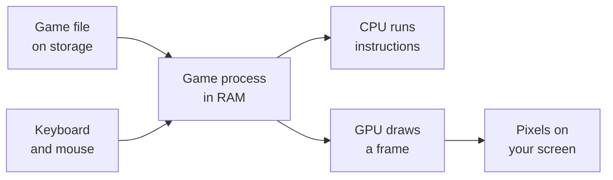

## The five parts we care about

A computer can look complicated, but this course mostly follows data through five places:

| Part | Plain-English job |
|---|---|
| Storage | Keeps files when the power is off |
| RAM | Holds the programs and data being used right now |
| CPU | Follows tiny instructions very quickly |
| GPU | Turns 2D and 3D data into pixels |
| Operating system | Helps programs use the hardware safely |


When you launch a game, the operating system copies its code and data from storage into RAM. The CPU begins running its instructions. The GPU draws frames. Your keyboard and mouse provide input. This repeats many times each second.



> Think of storage as a bookshelf and RAM as your desk. The shelf holds much more, but the CPU can work with items on the desk much faster.
{: .block-tip }

## The CPU speaks in small steps

A CPU does not understand “move the knight” as one idea. It understands smaller instructions such as:

- move a value;
- add two values;
- compare two values;
- jump to a different instruction;
- read from or write to memory.

Registers are tiny storage spots built directly into the CPU. They are like the values currently in the CPU’s hands. In this x86-64 example, `eax` is a register:

```nasm
mov eax, 5
add eax, 4
```

After these instructions run, `eax` contains `9`.


## Rust gives those steps names

Writing every instruction by hand would be exhausting. Rust lets us describe the same idea at a friendlier level:

```rust
fn add_one(number: i32) -> i32 {
    number + 1
}

fn main() {
    let starting_score = 8;
    let final_score = add_one(starting_score);

    println!("Score: {final_score}");
}
```

Read it from top to bottom:

1. `fn` creates a function—a named group of instructions.
2. `number: i32` means the input is a 32-bit signed integer.
3. `-> i32` means the function returns the same kind of integer.
4. `let` creates a value with a name.
5. `println!` prints text.

Rust’s compiler turns this into machine instructions for the CPU. A reverse engineer often travels in the other direction: start with machine instructions and work out the idea they represent.

## Branches are choices

Games constantly make decisions: Is the player alive? Did a shot hit? Is this unit visible? In Rust, a choice can look like this:

```rust
fn change_score(score: i32, should_add: bool) -> i32 {
    if should_add {
        score + 1
    } else {
        score - 1
    }
}
```

At the machine level, the CPU usually implements that `if` with a comparison and a conditional jump. You will see those instructions again in the assembly lessons.

## Binary and hexadecimal

People usually count in base 10. Computers store bits, and each bit is either `0` or `1`, so binary is base 2. Reverse-engineering tools often display hexadecimal, or base 16, because one hex digit neatly represents four bits.

| Decimal | Binary | Hexadecimal |
|---:|---:|---:|
| 5 | `0101` | `0x5` |
| 10 | `1010` | `0xA` |
| 16 | `1 0000` | `0x10` |
| 255 | `1111 1111` | `0xFF` |

Rust accepts all three forms:

```rust
let decimal = 255_u32;
let binary = 0b1111_1111_u32;
let hexadecimal = 0xFF_u32;

assert_eq!(decimal, binary);
assert_eq!(binary, hexadecimal);
```

The underscores are only visual separators. They make long numbers easier to read.

## Processes and memory

An operating system gives each running program a **process**. A process has its own virtual address space: a numbered map where code and data live. An address such as `0x7FF6_1234_1000` is simply a location on that map.

Games are normal processes. Their health, gold, positions, and menus eventually become instructions or data in memory. Game hacking is the study of finding the right piece, understanding it, and changing it in a controlled lab.

## Checkpoint

You are ready to continue if these sentences make sense:

- A game is copied into RAM and run as a process.
- The CPU follows small instructions.
- Rust is translated into those instructions.
- Hexadecimal is a compact way to write binary values.
- A memory address is a location, not the value stored there.
