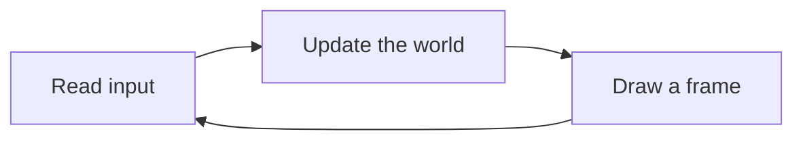
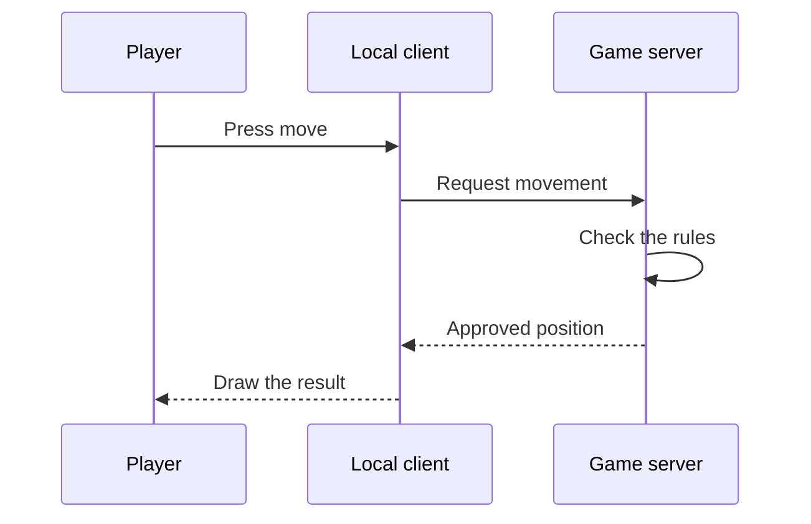

## A game is a loop

Most games repeat the same basic loop:



“Update the world” includes many smaller jobs: move players, check collisions, update timers, run enemy logic, and decide whether the match has ended.

## Data describes the world

Imagine a tiny strategy game. A unit needs a name, health, position, and team. Rust groups related values in a `struct`:

```rust
#[derive(Debug)]
struct Position {
    x: f32,
    y: f32,
}

#[derive(Debug)]
struct Unit {
    name: String,
    health: u32,
    position: Position,
    team: Team,
}

#[derive(Debug)]
enum Team {
    Blue,
    Red,
}
```

This is more than neat organization. It tells the compiler exactly what a valid unit looks like. `Team` can only be `Blue` or `Red`; there is no mystery value `7` to remember.

We can now make a unit:

```rust
let scout = Unit {
    name: String::from("Scout"),
    health: 80,
    position: Position { x: 12.5, y: 7.0 },
    team: Team::Blue, // 🧠 An enum variant prevents mystery team numbers.
};
```

In memory, those fields become bytes. A debugger does not know the friendly names `health` or `position`; it shows addresses, bytes, and instructions. Reversing is the work of rebuilding those names and relationships.

## Code changes the data

A game function might damage a unit:

```rust
fn apply_damage(unit: &mut Unit, amount: u32) {
    // 🛡️ Saturating subtraction stops at zero instead of wrapping around.
    unit.health = unit.health.saturating_sub(amount);
}
```

The `&mut` means “borrow this unit and allow changes.” `saturating_sub` stops at zero instead of wrapping around to a huge number.

That tiny function teaches an important split:

- **Data** is the unit’s current health.
- **Code** is the rule that changes health.

A memory scanner helps us find data. A debugger helps us find the code that reads or changes it.

## Ownership in one picture

Rust has an ownership rule: every value has one owner, and the value is cleaned up when that owner leaves scope. Other code can temporarily borrow the value.

```rust
fn display_name(unit: &Unit) {
    println!("{}", unit.name);
}

let unit = Unit { /* fields omitted */ };
display_name(&unit); // borrow it
// ✅ `unit` is still ours here; the temporary borrow has ended.
```

For everyday Rust, ownership prevents many memory bugs. During reverse engineering, Windows APIs may give us a raw address that Rust cannot prove is valid. We keep that uncertainty inside a very small `unsafe` block and expose a safer function to the rest of the program.

> `unsafe` does not mean “anything goes.” It means “the compiler cannot verify these few operations, so the programmer must verify them.”
{: .block-warning }

## Single-player and multiplayer

In a single-player game, your computer usually owns the world state. In a multiplayer game, a server often owns the official state:



Changing a local number may change what you see without changing the server’s truth. That is why our labs use offline or local targets: the goal is to learn how software works, not to interfere with other players.

## What you are looking for

When you inspect a game, ask:

1. What piece of data represents this thing?
2. Which code reads it?
3. Which code changes it?
4. Who owns the real value: this process or a server?

Those four questions will guide almost every later lesson.

{% include quiz.html
  id="world-state-owner"
  type="multiple-choice"
  title="Find the source of truth"
  prompt="In an ordinary multiplayer game, which machine usually owns the official shared world state?"
  options="Each player's rendering thread||The authoritative game server||Whichever player pressed a key last||The last packet visible in a capture"
  answer="1"
  explanation="Your client predicts and draws a local view, but the authoritative server normally decides the shared result. That is why changing a local copy may change the picture on one screen without changing the official game state."
%}
