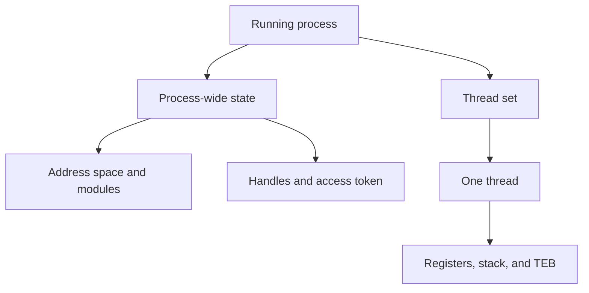

## A program file is not a running process

`wesnoth.exe` on disk is a **program file**. When Windows starts it, Windows creates a **process**: a protected container with an address space, handles, threads, security information, and loaded modules.

That distinction matters. The PE chapter reads the file on disk. A debugger or memory tool studies the running process after Windows has mapped that file and its DLLs into virtual memory.

```text
program on disk              process in memory
--------------------------   --------------------------------------
wesnoth.exe bytes          → image mapped at a live module base
import names               → live function pointers in the IAT
section RVAs               → virtual addresses after base + RVA
entry-point RVA            → first user-code address Windows calls
```

The process is not simply a copy of the file. Windows may place sections at different virtual addresses, fill zero-initialized data, apply relocations, resolve imports, and create private memory that never existed in the EXE.

A process groups process-wide resources and a set of independently scheduled
threads. Each thread adds its own execution state inside that shared container:



Threads share the process address space and handles, but each thread needs its
own registers, stack, and thread bookkeeping so Windows can pause and resume it.

The PE entry point is also not automatically the game's `main` function. Windows
transfers control to startup code chosen by the executable and its runtime. That code
can initialize security state, global constructors, thread-local storage, and library
support before it calls the developer's main function. Reverse the startup chain as
a sequence of responsibilities rather than labeling the first code address “main.”

## The pieces Windows builds

A normal game process contains several kinds of state:

- the **virtual address space**, which gives the process its own numbered memory locations;
- one or more **threads**, which are the paths of CPU execution;
- **modules**, including the main EXE and loaded DLLs;
- **heaps and stacks**, used for dynamic objects and function calls;
- a **handle table**, containing Windows-managed references to files, events, sockets, and other objects;
- an **access token**, describing the process security context;
- user-mode bookkeeping structures, including the PEB and one TEB per thread.

The operating system owns the rules. The process can read much of its own user-mode state, but that does not make every internal field a stable public API.

## A process is machine state plus managed resources

The useful mental model is an inventory of everything required to stop this running
program and later continue it:

```text
address space + thread register contexts + scheduling state
+ open handles + security context + operating-system bookkeeping
```

The EXE supplies code and initial data, but the process is this larger live state.
That explains why copying `wesnoth.exe` does not copy a running match and why a
crash dump can reveal much more than the original file.

Keep **mechanism** separate from **policy**. A context switch is a mechanism for
stopping one thread and restoring another. Scheduling policy decides which ready
thread receives a CPU next. A handle is a mechanism for naming a Windows object;
access checks are policy decisions based on the requested rights and security
context. Mixing the two makes an implementation detail sound like a guarantee.

## PEB means Process Environment Block

The **PEB** is a user-mode structure Windows uses to keep process-wide information. It includes or leads to information such as:

- the process image base;
- loader bookkeeping for DLLs;
- process parameters such as the command line and environment;
- heap-related state;
- flags used by parts of Windows and the loader.

Model the PEB as one root in a graph of process metadata. Its fields lead to other
structures such as process parameters and loader records; those records contain
more links and values. Walking the graph requires the correct architecture and
structure layout at every step. It is internal implementation data, so a field
offset copied from an old 32-bit article is not automatically valid for a current
64-bit process.

The **loader lists** connected to the PEB describe modules known to the Windows loader. They are why low-level debuggers can teach you a lot about how DLL loading works. They are also live linked lists: another thread may load or unload a module while you are walking them.

## TEB means Thread Environment Block

Each thread has its own **TEB**. It contains thread-specific user-mode state, including a route to the PEB, stack boundaries, thread-local storage information, and error-related fields.

On 32-bit x86 Windows code, the `fs` segment register helps locate thread state. On x86-64 Windows code, `gs` fills that role. That is why you may see instructions such as these in low-level Windows disassembly:

```nasm
; 32-bit Windows: obtain the current process's PEB pointer.
mov eax, dword ptr fs:[0x30]

; 64-bit Windows: obtain the current process's PEB pointer.
mov rax, qword ptr gs:[0x60]
```

This is not ordinary game data. `fs:` and `gs:` tell the CPU to use a segment-relative address associated with the current thread. The constants differ because the 32-bit and 64-bit structures differ.

## Why the course tool uses ToolHelp

Walking internal loader pointers is useful when you are learning in a debugger. For a beginner-facing tool, Windows already provides a documented, read-only alternative: a **ToolHelp snapshot**.

`CreateToolhelp32Snapshot` asks Windows for a moment-in-time copy of a process, thread, or module list. `Module32FirstW` fills the first `MODULEENTRY32W`, and `Module32NextW` advances through the copy.

The shared wrapper keeps that unsafe boundary in one reviewed function:

```rust
pub fn module(&self, wanted_name: &str) -> anyhow::Result<(usize, usize)> {
    let flags = TH32CS_SNAPMODULE | TH32CS_SNAPMODULE32;
    // 🛡️ SAFETY: the PID is a value and OwnedHandle closes the returned snapshot.
    let snapshot = unsafe { CreateToolhelp32Snapshot(flags, self.id) }?;
    let snapshot = OwnedHandle::from_raw(snapshot)?;
    let mut entry = MODULEENTRY32W {
        dwSize: size_of::<MODULEENTRY32W>() as u32,
        ..Default::default()
    };

    // 📏 SAFETY: entry has the size Windows requires and remains writable.
    unsafe { Module32FirstW(snapshot.raw(), &mut entry) }?;
    loop {
        if wide_text(&entry.szModule).eq_ignore_ascii_case(wanted_name) {
            return Ok((entry.modBaseAddr as usize, entry.modBaseSize as usize));
        }
        // 🔁 Module32NextW either replaces entry or reports the end of the list.
        match unsafe { Module32NextW(snapshot.raw(), &mut entry) } {
            Ok(()) => {}
            Err(error) if no_more_files(&error) => break,
            Err(error) => return Err(error.into()),
        }
    }
    anyhow::bail!("module {wanted_name:?} was not found")
}
```

`dwSize` is important: it tells Windows which version and size of the output structure the caller prepared. Forgetting it is like handing someone a form without saying which form it is.

## Snapshot does not mean frozen process

The list is stable, but the process is still running. A DLL could unload after the snapshot was created. That produces an important rule:

> Enumeration tells you what existed during the snapshot. A later read must still be allowed to fail.

`Result` makes that race visible. The tool should report a normal error instead of assuming a previously seen address must remain valid.

## Lab: connect the file map to the live process

Start one offline course game, then run both existing tools:

```powershell
cd windows-labs
cargo build --release --target i686-pc-windows-msvc `
  --bin pe_inspector --bin module_inspector

.\target\i686-pc-windows-msvc\release\pe_inspector.exe `
  "C:\Games\Wesnoth 1.14.9\wesnoth.exe"

.\target\i686-pc-windows-msvc\release\module_inspector.exe `
  wesnoth.exe wesnoth.exe 3CCD91
```

Record the preferred image base from the file and the live module base from the process. If they differ, ASLR or relocation changed the room number; the RVA still names the position inside the room.

Repeat with `ac_client.exe` and `Quake3-UrT.exe`. Do not copy one game's module name, pointer width, or address into another game.

## What not to change

Do not edit PEB flags, unlink modules from loader lists, or disguise process parameters. Those changes can break loader assumptions or conceal activity from diagnostic tools. This lesson uses the structures to explain Windows, then uses documented APIs for the actual program.

The buildable implementations are [`module_inspector.rs`]({{ site.baseurl }}/windows-labs/src/bin/module_inspector.rs) and the ToolHelp wrapper in [`process.rs`]({{ site.baseurl }}/windows-labs/src/windows_impl/process.rs).

References: [Microsoft ToolHelp snapshots](https://learn.microsoft.com/en-us/windows/win32/toolhelp/snapshots-of-the-system), [`Module32FirstW`](https://learn.microsoft.com/en-us/windows/win32/api/tlhelp32/nf-tlhelp32-module32firstw), and [Microsoft PE format](https://learn.microsoft.com/en-us/windows/win32/debug/pe-format).
