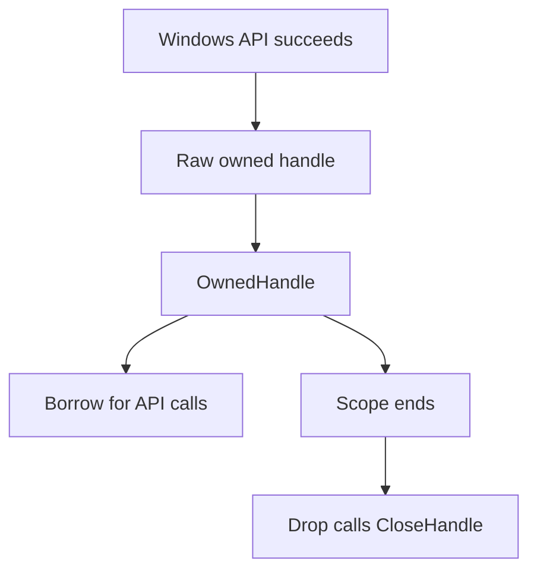

## A handle is not a pointer

Windows keeps kernel-managed objects for processes, threads, files, events, snapshots, and many other resources. A user-mode program normally refers to one of those objects through a **handle**.

The numeric handle value is an index-like token meaningful to Windows in the current process. It is not the object's memory address, and reading memory at that number does not reveal the object.

```text
program value HANDLE(0x12C)
          ↓
current process's handle table
          ↓
Windows event, file, process, thread, or snapshot object
```

A handle entry also carries granted access rights. Two handles referring to the same process can permit different operations.

## Handles have lifetimes

Many APIs return a new handle that the caller owns. When the program is finished with it, the owner calls `CloseHandle`. Forgetting causes a **handle leak**. Repeated leaks can exhaust resources or keep files and processes alive longer than expected.

Closing the same handle twice is also wrong. Windows may have already reused that number for a different object, turning a cleanup mistake into a difficult intermittent bug.

That sequence is worth spelling out, because it explains why this class of bug
surfaces so far away from its cause:

```text
1. you open a process and receive handle 0x12C
2. you close 0x12C                          -> correct
3. elsewhere, the program opens a log file
   Windows reuses the free slot and returns 0x12C again
4. your cleanup code closes 0x12C a second time
5. the log file is now closed, and nothing says why
```

Step 4 does not report an error. It closes something perfectly real — just not
the object you meant. The failure appears later, in unrelated code, at a moment
that depends on the exact order in which the program happened to allocate
handles. That timing dependence is precisely why double-close bugs are so hard
to reproduce and so easy to blame on the wrong component.

The ownership rule should be simple:

> One owner closes one owned handle exactly once. Borrowers may use it temporarily but never close it.

The word **owned** matters because not every handle-shaped value follows the same cleanup rule. Some APIs return pseudo-handles or borrowed handles that must not be passed to `CloseHandle`; other APIs use specialized cleanup functions. The wrapper constructor should document which API created the value and which function releases it.

Model those categories with different types instead of one universal `HANDLE` wrapper. A type that always closes is safe only for resources whose contract says the caller owns a closable handle.

## RAII ties cleanup to scope

RAII means **Resource Acquisition Is Initialization**. A value owns the resource, and its `Drop` implementation releases the resource when the value leaves scope.

The ownership path is deliberately one-way:



Borrowing permits temporary use; only the owner reaches the cleanup path.

The course wrapper is intentionally small:

```rust
#[derive(Debug)]
pub struct OwnedHandle(HANDLE);

impl OwnedHandle {
    pub fn from_raw(handle: HANDLE) -> windows::core::Result<Self> {
        if handle.is_invalid() {
            return Err(windows::core::Error::from_thread());
        }
        Ok(Self(handle))
    }

    pub fn raw(&self) -> HANDLE {
        self.0
    }
}

impl Drop for OwnedHandle {
    fn drop(&mut self) {
        // SAFETY: this value owns the handle and never closes it elsewhere.
        let _ = unsafe { CloseHandle(self.0) };
    }
}
```

`OwnedHandle` does not implement `Copy` or `Clone`. Moving it transfers ownership, so the old variable cannot be used afterward. Borrowing `&OwnedHandle` lets another function call Windows without taking responsibility for cleanup.

RAII connects resource lifetime to lexical scope, including early returns and `?` errors. It does not decide whether the original ownership contract was correct. Wrapping a borrowed handle as owned merely turns the eventual double-close into an automatic bug.

## Why `Drop` ignores the close result

`Drop::drop` cannot return `Result`. Cleanup often happens while another error is already unwinding the stack. The course therefore performs a best-effort `CloseHandle` and keeps the original error.

A close failure is normally evidence that the ownership invariant was already broken, such as an invalid or previously closed handle. The fix is to correct ownership, not to retry closing an unknown numeric value.

## Prove cleanup with a count

The lab records the current process's handle count, creates 128 unnamed event objects, wraps every returned handle, then drops the vector.

<details class="lab-source" markdown="1">
<summary>Complete lab source: handle_raii.rs</summary>

```rust
#[cfg(windows)]
fn main() -> anyhow::Result<()> {
    use gha_windows_labs::OwnedHandle;
    use windows::Win32::System::Threading::{
        CreateEventW,
        GetCurrentProcess,
        GetProcessHandleCount,
    };

    fn handle_count() -> windows::core::Result<u32> {
        let mut count = 0_u32;
        // SAFETY: GetCurrentProcess returns this process's pseudo-handle and
        // count remains a valid output pointer during the call.
        unsafe {
            GetProcessHandleCount(GetCurrentProcess(), &mut count)?;
        }
        Ok(count)
    }

    let before = handle_count()?;
    let events: Vec<OwnedHandle> = (0..128)
        .map(|_| {
            // SAFETY: no security structure or name pointer is supplied.
            let raw = unsafe { CreateEventW(None, false, false, None) }?;
            OwnedHandle::from_raw(raw)
        })
        .collect::<windows::core::Result<_>>()?;
    let while_owned = handle_count()?;

    drop(events);
    let after_drop = handle_count()?;

    println!("Before:      {before} handles");
    println!("While owned: {while_owned} handles");
    println!("After drop:  {after_drop} handles");
    anyhow::ensure!(
        while_owned >= before.saturating_add(128),
        "the event handles were not visible in the process count",
    );
    anyhow::ensure!(
        after_drop < while_owned,
        "dropping OwnedHandle did not reduce the handle count",
    );
    println!("Each OwnedHandle called CloseHandle once.");
    Ok(())
}

#[cfg(not(windows))]
fn main() {
    eprintln!("This RAII handle lab must run on Windows.");
}
```

</details>

The iterator returns `Result<OwnedHandle>` for every event. `collect::<Result<Vec<_>, _>>()` stops on the first failure. Any handles already collected live in the partially built vector, so they are dropped while the error returns.

That is the important improvement over manual cleanup:

```diff
 fn create_events(count: usize) -> windows::core::Result<Vec<OwnedHandle>> {
-    let mut raw_handles = Vec::new();
-    for _ in 0..count {
-        raw_handles.push(CreateEventW(None, false, false, None)?);
-        // Every error return here would need a manual CloseHandle loop.
-    }
-    Ok(raw_handles)
+    (0..count)
+        .map(|_| {
+            let raw = unsafe { CreateEventW(None, false, false, None) }?;
+            OwnedHandle::from_raw(raw)
+        })
+        .collect() // Earlier owners are dropped if a later creation fails.
 }
```

### Why this version?

Every error path receives the same cleanup behavior. Adding a new `?` does not silently create a leak.

## Run the proof

```powershell
cd windows-labs
cargo run --release --target i686-pc-windows-msvc --bin handle_raii
```

The middle count should rise by at least 128. The final count should fall again. Small background differences are possible because process instrumentation may briefly create its own handles, so the program checks the meaningful direction instead of demanding identical before/after numbers.

## Not every handle should be closed

Some APIs return a **pseudo-handle**, such as `GetCurrentProcess`. It is a special constant interpreted as the current process and should not be wrapped as a newly owned handle.

Other APIs return borrowed handles whose documentation says another component owns them. Ownership comes from the API contract, not from the fact that a program can store the number.

Before wrapping a handle, answer:

1. Does success return a new owned handle?
2. Which function releases it?
3. Which values mean failure?
4. May the handle be shared across threads?
5. Does an event or callback transfer ownership?

The complete wrapper is [`handle.rs`]({{ site.baseurl }}/windows-labs/src/windows_impl/handle.rs), and the proof program is [`handle_raii.rs`]({{ site.baseurl }}/windows-labs/src/bin/handle_raii.rs).

References: [`CloseHandle`](https://learn.microsoft.com/en-us/windows/win32/api/handleapi/nf-handleapi-closehandle), [`GetProcessHandleCount`](https://learn.microsoft.com/en-us/windows/win32/api/processthreadsapi/nf-processthreadsapi-getprocesshandlecount), and [kernel objects](https://learn.microsoft.com/en-us/windows/win32/sysinfo/kernel-objects).
