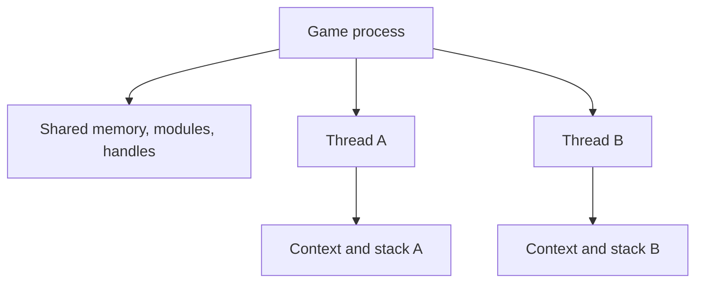

## A process owns resources; threads execute code

A process supplies the address space, handles, modules, and security boundary. A **thread** is a path of execution inside that process.

Every process begins with at least one thread. Games commonly add threads for rendering, audio, networking, asset loading, input, and background work. Those names describe roles chosen by the program; Windows fundamentally schedules thread IDs, priorities, and CPU state.

Threads in the same process share code and most data, but each thread has its own:

- thread ID, or TID;
- instruction pointer and general CPU registers;
- stack and stack pointer;
- thread-local storage;
- scheduling state and priority information;
- TEB, introduced in the PEB/TEB lesson.

Two threads can access the same object at nearly the same time. That is why games use mutexes, events, atomics, queues, and other synchronization tools.

The process supplies shared resources, while each execution path keeps its own paused CPU state and call history:



This shared-versus-private split explains both communication between threads and the races that communication can create.

## Scheduling is not the same as parallel execution

Windows **schedules** runnable threads by giving them turns on CPU cores. On one
core, threads can interleave: one runs, pauses, and another runs. On several cores,
some threads can also run truly in parallel. The program must be correct under both
possibilities.

Suppose the update thread changes a player record in two steps while an overlay
thread reads between them:

```text
update: write x position
overlay: read x, y, and health
update: write y position
```

The overlay may observe a combination that was never a complete game state. This
is an **interleaving** problem. “It worked ten times” does not prove it is safe,
because the scheduler may choose a different order on the next run.

Synchronization creates an agreement about ordering or exclusive access. A mutex
can protect a group of fields as one critical section. An atomic operation can make
one small value indivisible. A queue can transfer ownership of work from one thread
to another. These tools solve different problems; adding an atomic flag does not
automatically make the object around it coherent.

Two common non-deadlock failures deserve names:

- An **atomicity violation** happens when several operations must behave as one
  unit, but another thread can observe or change state in the middle. “Check pointer,
  then use pointer” is unsafe if another thread can free it between those steps.
- An **order violation** happens when one action assumes another action already
  occurred, but no synchronization enforces that order. A render worker reading a
  snapshot before initialization finishes is one example.

The fix must enforce the required relationship, not merely make the timing less
likely. A lock can protect one compound state change. An event, condition variable,
or channel can establish that initialization completed before consumption begins.

## Ask both safety and progress questions

Concurrent code needs two kinds of reasoning:

- **Safety:** can something bad happen, such as a torn state, double update, or
  use-after-free?
- **Progress:** can the intended work eventually happen, or can threads wait
  forever?

A mutex may improve safety but create a **deadlock** if two threads acquire locks
in opposite orders. A thread may be safe yet suffer **starvation** if other work
continually wins access. A spin loop may make progress in a test and waste an
entire core in the real game.

For an observer tool, prefer immutable snapshots and message passing when
possible. One component reads a bounded snapshot, validates it, and hands owned
data to rendering or logging. That reduces the amount of shared mutable state whose
interleavings you must reason about.

## Ready, running, and waiting explain thread activity

A thread that is not executing is not necessarily broken. In a simplified state
model, a thread can be:

- **running:** currently executing on a core;
- **ready:** able to run, waiting for the scheduler to choose it;
- **waiting:** blocked until I/O, a timer, lock, event, or another condition changes.

Windows transitions threads between these states. A network thread may spend most
of its life waiting and still be perfectly healthy. A CPU profiler mainly samples
running work; wait analysis explains why a thread is not running. Use the tool that
matches the question.

## A thread context stores paused register values

A **thread context** is a structure containing register state for a particular architecture. On 32-bit x86, useful fields include:

- `Eip`: the next instruction address;
- `Esp`: the top of the current stack;
- `Ebp`: a frame pointer when the compiler uses one;
- `Eax`, `Ebx`, `Ecx`, `Edx`, `Esi`, and `Edi`: general-purpose registers;
- `EFlags`: condition and control bits, including the trap flag used for single-stepping.

On x86-64, those names become `Rip`, `Rsp`, `Rbp`, `Rax`, and so on, with additional registers.

The context is meaningful only at a controlled instant. Reading or writing a running thread's registers while it continues executing would race with the CPU. A debugger receives an event while Windows has stopped the relevant threads, or a tool explicitly suspends a thread and must later resume it.

This course's debugger uses the debugger event model. It does not randomly freeze a game thread and hope cleanup succeeds.

## A stack records nested work

When function A calls function B, the program must remember where B should return. Arguments, saved registers, local variables, and return information may be stored in a **stack frame**.

```text
newest frame       spend_gold()
                   end_turn()
                   process_player_action()
oldest shown       game_loop()
```

A stack trace walks from the current frame toward older callers. Optimized code can inline functions, omit frame pointers, move values into registers, or reuse stack slots, so the neat classroom picture is a guide rather than a promise.

That complexity is why Microsoft recommends `StackWalk64` instead of inventing a stack walker from raw pointers. Matching symbols and unwind information make the result much more reliable.

## Start with a read-only thread inventory

Before opening a thread or asking for its context, identify which threads belong to the target process. `TH32CS_SNAPTHREAD` creates a system-wide snapshot, even when a PID is supplied. The program must filter `th32OwnerProcessID` itself.

<details class="lab-source" markdown="1">
<summary>Complete lab source: thread_inventory.rs</summary>

```rust
#[cfg(windows)]
fn main() -> anyhow::Result<()> {
    use std::mem::size_of;
    use gha_windows_labs::{OwnedHandle, Process};
    use windows::Win32::{
        Foundation::ERROR_NO_MORE_FILES,
        System::Diagnostics::ToolHelp::{
            CreateToolhelp32Snapshot,
            TH32CS_SNAPTHREAD,
            THREADENTRY32,
            Thread32First,
            Thread32Next,
        },
    };

    fn no_more_files(error: &windows::core::Error) -> bool {
        error.code() == ERROR_NO_MORE_FILES.to_hresult()
    }

    let process_name = std::env::args().nth(1)
        .unwrap_or_else(|| "wesnoth.exe".to_owned());
    let process = Process::find(&process_name)?;

    // 🔍 The thread snapshot is system-wide; filter by owner PID below.
    // 🧹 SAFETY: OwnedHandle owns the returned snapshot.
    let snapshot = unsafe {
        CreateToolhelp32Snapshot(TH32CS_SNAPTHREAD, 0)
    }?;
    let snapshot = OwnedHandle::from_raw(snapshot)?;
    let mut entry = THREADENTRY32 {
        dwSize: size_of::<THREADENTRY32>() as u32,
        ..Default::default()
    };

    // 📏 SAFETY: entry has the required size and is writable.
    unsafe { Thread32First(snapshot.raw(), &mut entry) }?;
    let mut threads = Vec::new();
    loop {
        if entry.th32OwnerProcessID == process.id {
            threads.push((entry.th32ThreadID, entry.tpBasePri));
        }
        // 🔁 SAFETY: entry remains a valid output structure.
        match unsafe { Thread32Next(snapshot.raw(), &mut entry) } {
            Ok(()) => {}
            Err(error) if no_more_files(&error) => break,
            Err(error) => return Err(error.into()),
        }
    }

    threads.sort_unstable_by_key(|(thread_id, _)| *thread_id);
    println!(
        "{} (PID {}) has {} thread(s)",
        process.name,
        process.id,
        threads.len(),
    );
    for (thread_id, base_priority) in threads {
        println!("  TID {thread_id:<8} base priority {base_priority}");
    }
    println!("No thread was opened, suspended, queued, or changed.");
    Ok(())
}

#[cfg(not(windows))]
fn main() {
    eprintln!("This read-only thread inventory must run on Windows.");
}
```

</details>

`dwSize` tells Windows how large a `THREADENTRY32` the caller prepared. The final `ERROR_NO_MORE_FILES` is not a failure; it is the documented end of enumeration.

## Run and compare stable facts

```powershell
cd windows-labs
cargo build --release --target i686-pc-windows-msvc `
  --bin thread_inventory

.\target\i686-pc-windows-msvc\release\thread_inventory.exe wesnoth.exe
.\target\i686-pc-windows-msvc\release\thread_inventory.exe ac_client.exe
.\target\i686-pc-windows-msvc\release\thread_inventory.exe Quake3-UrT.exe
```

The count may change between runs because games create and retire worker threads. A TID is temporary and can eventually be reused. Do not store it as a version-specific constant.

Base priority is scheduling input, not “importance.” The currently busy rendering thread might have the same base priority as an idle worker. Use ETW CPU samples or debugger evidence to understand actual activity.

Likewise, a TID does not identify a permanent role. To infer what a thread is doing,
combine several observations: its start address or module, stack samples over time,
CPU and wait activity, thread description when available, and the game behavior
that coincides with that activity. One paused stack is a clue, not a lifetime job
title.

## How the Wesnoth debugger uses a context safely

When Windows reports the course breakpoint, the event thread is stopped. The debugger:

1. opens that exact event thread with context rights;
2. reads its x86 `CONTEXT`;
3. moves `Eip` back over the one-byte `int3`;
4. sets the trap flag in `EFlags`;
5. continues the event so one original instruction runs;
6. receives the single-step event;
7. clears the trap flag and rearms the breakpoint.

```rust
context.Eip = u32::try_from(INCOME_INSTRUCTION)?;
context.EFlags |= 1 << 8; // x86 trap flag
set_context(&thread, &context)?;
```

The state machine prevents one thread's single-step event from being mistaken for another thread's event.

## Why this lesson does not hijack threads

Changing another thread's instruction pointer, queuing executable work to it, or suspending service threads is not required to understand game execution. Those operations can deadlock a process, strand locks, corrupt state, or disable diagnostic evidence.

The course inventories threads read-only and changes a context only inside the explicit breakpoint lifecycle of the version-matched Wesnoth debugger, where every event is continued exactly once.

The inventory is [`thread_inventory.rs`]({{ site.baseurl }}/windows-labs/src/bin/thread_inventory.rs). The controlled context example is [`wesnoth_debugger.rs`]({{ site.baseurl }}/windows-labs/src/bin/wesnoth_debugger.rs).

References: [ToolHelp thread functions](https://learn.microsoft.com/en-us/windows/win32/api/_toolhelp/), [`GetThreadContext`](https://learn.microsoft.com/en-us/windows/win32/api/processthreadsapi/nf-processthreadsapi-getthreadcontext), and [`StackWalk64`](https://learn.microsoft.com/en-us/windows/win32/api/dbghelp/nf-dbghelp-stackwalk64).
