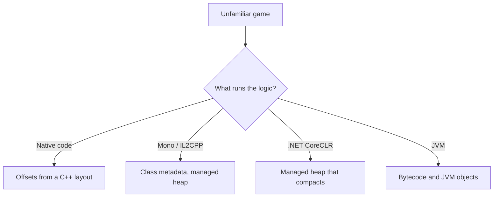

Every method in this book so far assumes something it has never said out loud:
that the game's logic is native machine code, that its objects are laid out by
a C++ compiler, and that a field sits at a fixed distance from an object base
for the life of a build.

For the course games — Wesnoth, AssaultCube, Urban Terror — all of that is
true. For a large share of games released in the last decade it is not. Pointing
a memory scanner at a Unity game and hunting for a stable offset can waste an
afternoon before you discover the number you want was never stored the way you
assumed.

So this lesson comes before the method, not after it. The first question about
an unfamiliar game is not "where is health?" It is "what kind of program is
this?"

## The runtime decides what your evidence means



The branches are not different difficulty levels. They are different questions.
On the left, an object base plus an offset is a durable fact about a build. On
the right, the same phrase may describe something the runtime is entitled to
move, or something whose field order was decided at load time rather than at
compile time.

## Read the folder before you attach anything

The fastest evidence is on disk and costs nothing:

| What you see beside the executable | Very likely |
|---|---|
| `<Game>_Data/Managed/Assembly-CSharp.dll` | Unity, Mono backend |
| `GameAssembly.dll` and `il2cpp_data/Metadata/global-metadata.dat` | Unity, IL2CPP backend |
| `<Game>/Binaries/Win64/<Game>-Win64-Shipping.exe`, `Engine/` | Unreal Engine |
| A large `.pck` beside a small executable | Godot |
| `coreclr.dll` or a `.runtimeconfig.json` | .NET |
| `jvm.dll`, `.jar` files | Java |
| Only an EXE and ordinary DLLs | native C or C++ |

Confirm it against the loaded modules with the inventory tool from Lesson
11.1, because a folder can lie and a launcher can start something other than
the executable you inspected. Two independent signals agreeing is the standard
this book has used since Chapter 1, and it applies here too.

## Native: everything so far applies

Game logic compiled to machine code, objects laid out by the C++ compiler,
fields at fixed offsets for one build. This is the world Chapters 2, 3, and 7
describe, and nothing in them needs adjusting.

## Unity with the Mono backend: the code is readable

`Assembly-CSharp.dll` is not a native DLL. It holds .NET intermediate
language, which keeps class names, method names, and field names in its
metadata. A decompiler shows something close to the original C#, including the
field you are looking for and the method that changes it.

This changes the shape of the work completely. You are no longer inferring that
offset `0x138` behaves like health across controlled tests. You are reading a
field called `health` and the method called `TakeDamage` that writes it. The
recovery skills from Chapter 3 still matter, but they become confirmation
rather than discovery.

One nuance worth getting right, because it is widely misstated: Unity's Mono
uses the Boehm collector, which is **non-moving**. An object stays at its
address for its lifetime. That is why fixed addresses and pointer chains work
about as well here as in a native game, and why Unity games feel familiar to
anyone who learned on native ones.

## Unity with IL2CPP: native code, but the names survive

IL2CPP converts the same C# ahead of time into C++ and compiles it, so the
logic ships as native code inside `GameAssembly.dll`. There is no
`Assembly-CSharp.dll` to decompile, and at first glance you are back to reading
disassembly.

But the conversion has to preserve enough information for reflection and
serialization to work at runtime, and it stores that information in
`global-metadata.dat`. Class names, method names, and field names are all
still there — just in a data file rather than in the code. Recovering a layout
becomes a matter of reading metadata and correlating it with the compiled
functions, which is far closer to having symbols than to reversing a stripped
binary.

## .NET and the JVM: addresses that move

A .NET game running on CoreCLR is the case where the earlier assumption really
does break. CoreCLR's garbage collector is generational and **compacting**: it
relocates surviving objects to remove gaps. An object's address is therefore
valid only until the next collection that moves it.

Note how precisely that differs from the Unity Mono case above. Both are
"managed" and "garbage collected," and only one of them moves objects. The word
"managed" is not what determines whether an address is durable — the specific
collector is. This is the sort of distinction worth checking rather than
inheriting from a forum post.

Where objects move, an address is not an identity. What you need instead is
whatever the runtime offers as a stable reference: a handle, a field on a
long-lived static, or a re-lookup by name each time. The same reasoning appeared
in Lesson 1.4 with slot-and-generation handles, and it is the same lesson: when
storage can be reused or relocated, record something that proves which object
you mean.

The JVM has the same property for the same reason.

## Unreal: native, with its own directory

Unreal games are native C++, so the Chapter 3 methods apply directly. What is
different is that the engine maintains its own object system — a global object
array and a name table — which most of the game's state hangs off. Finding that
array once gives you a route to nearly everything, which makes it a much better
first target than any individual value.

## Write the answer down before you start

Add one line to the lab notes described in Lesson 10.2:

```text
target:   ExampleGame.exe
runtime:  Unity 2021 LTS, IL2CPP backend
evidence: GameAssembly.dll loaded; il2cpp_data/Metadata/global-metadata.dat present
implies:  names in metadata, not IL; native code; addresses stable
```

That last line is the one that saves the afternoon. It states, before any
scanning begins, whether an address you write down today is expected to mean
anything tomorrow — and if the answer turns out to be wrong, you have written
down exactly which assumption to revisit.
