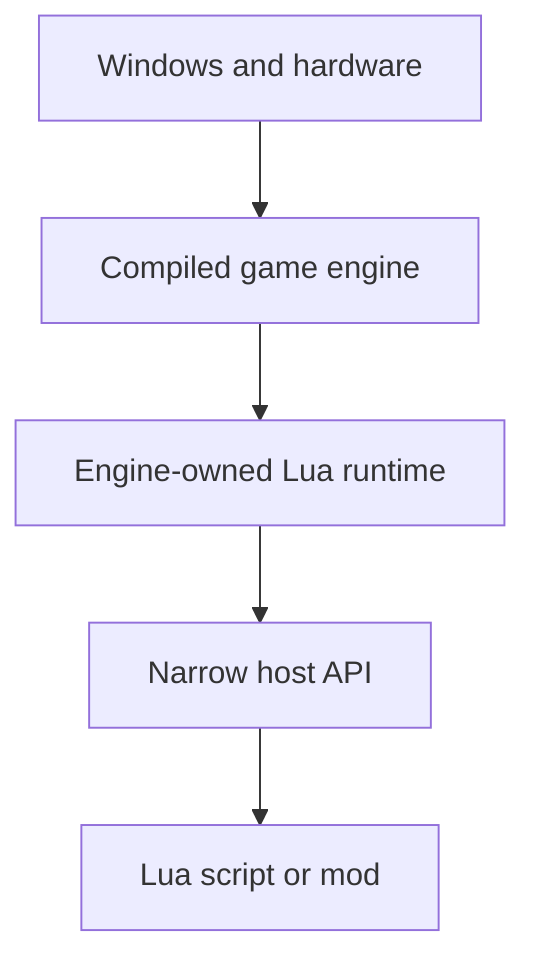
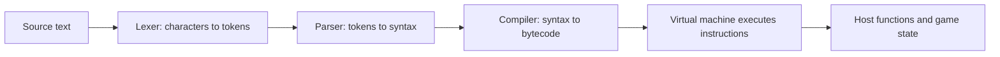

## Compiled engine, flexible script

The native host is normally compiled ahead of time into machine code. Changing its source means building a new executable or library.

Lua is a small programming language commonly **embedded** inside a larger program. The game owns a Lua interpreter and asks it to run text scripts. A designer can change a quest, unit rule, or user-interface behavior without rebuilding the whole engine.

Use the host-boundary model:



The engine owns the runtime and decides which values and functions cross the API
boundary. A script cannot automatically do everything the engine can do; it sees
only the capabilities that the host deliberately exposes.

## What “run this script” actually means

Lua source is not executed as English-like text one line at a time. A typical
Lua 5.4 runtime performs a small pipeline:



The **lexer** recognizes tokens such as names, numbers, `function`, and `end`.
The **parser** checks how those tokens form expressions and statements. The
compiler produces instructions for Lua's virtual machine, and the VM updates a
Lua stack, tables, call frames, and program counter. Some hosts cache bytecode;
others compile source each time it loads. LuaJIT may additionally translate hot
paths into native machine code, so identify the actual runtime before assuming
its internals.

This layered model gives a useful debugging order:

1. a syntax error means parsing never produced a runnable function;
2. a runtime type error means execution reached an operation with unsuitable
   values;
3. a host-API error means the script crossed the engine boundary but violated
   that function's contract;
4. a gameplay error can occur even when all three earlier layers succeeded.

“The script failed” is therefore only a starting observation. Record the layer,
instruction or source location, values, and host call involved.

## Lua is dynamically typed

The host language knows a variable's type at compile time:

```rust
let health: u32 = 100;
```

In Lua, a variable can refer to values of different types at different times:

```lua
local health = 100
health = "unknown"
```

That flexibility is convenient for configuration and gameplay rules. It also moves many mistakes from compile time to runtime. Clear names, validation, tests, and small APIs matter even more.

For these lessons we pin the lab to **Lua 5.4** through `mlua 0.12`. Other games may embed Lua 5.1, LuaJIT, Lua 5.5, or a customized dialect. Check the target's documentation or version string before assuming features exist.

## The values you meet first

```lua
local name = "bot_alpha"       -- string
local health = 100              -- integer number
local distance = 12.5           -- floating-point number
local alive = true              -- boolean
local target = nil              -- no value
local position = { x = 4, y = 9, z = 2 } -- table
local decide = function() end   -- function
```

Lua also has threads/coroutines and userdata supplied by a host. A table is the main container: it can behave like a list, dictionary, record, namespace, or object.

Every Lua value carries a runtime type tag. A table variable normally refers to
a garbage-collected object rather than containing the complete table inline.
Assignments copy the reference, so two names can point to the same table:

```lua
local first = { health = 100 }
local second = first
second.health = 75
assert(first.health == 75) -- both names reach the same table
```

That is aliasing. It is convenient, but it means ownership is a host-and-runtime
policy rather than a simple “one variable owns one table” rule. The garbage
collector reclaims an object only after it can no longer be reached from Lua
roots such as globals, active call frames, registry entries, or host-held
references.

**Userdata** is the bridge to native objects. Full userdata is memory managed by
Lua with a host-defined metatable; light userdata is essentially an unowned raw
pointer value. A sound API avoids exposing a pointer whose native object may die
while Lua still holds it. Stable handles with generation checks, copied
snapshots, or host-managed reference objects make the lifetime rule explicit.

## Calls cross a real stack boundary

The Lua C API uses an indexed value stack. A native function reads arguments
from stack slots, validates them, pushes return values, and reports how many it
returned. Libraries such as `mlua` wrap much of that protocol, but the contract
still exists underneath:

```text
before call: [function][argument 1][argument 2]
native code: validate arguments, perform bounded work
after call:  [return value 1]
```

Stack balance, conversion errors, panics/exceptions, and re-entrant calls all
matter at this boundary. Treat each host function like a small parser: specify
accepted types and ranges, reject invalid inputs without partial side effects,
and return errors in the form the runtime expects.

## Local versus global names

```lua
local selected = nil -- visible only in this scope ✅
state = "running"   -- creates or replaces a global name ⚠️
```

Prefer `local` unless you intentionally publish a value. Accidental globals let separate scripts overwrite each other's state and make spelling mistakes difficult to find.

## The host API is the security boundary

A poor host might expose an all-powerful function:

```lua
-- ❌ A script can ask for any address, size, and write.
memory.write(address, bytes)
```

The book's lab exposes a narrow interface instead:

```lua
local entities = game.snapshot()
game.request({ kind = "select_entity", id = entities[2].id })
```

`game.snapshot()` returns copied sample data. `game.request` accepts only a small list of validated actions. The script never receives a process handle, arbitrary pointer, command shell, or raw Windows API.

This is **capability design**: code can do only what the values and functions in its environment allow.

## Your first observer

The file `lua-labs/scripts/observer.lua` contains:

```lua
-- 👀 Ask the host for one copied, read-only view of the current game state.
local entities = game.snapshot()

for _, entity in ipairs(entities) do
    local state = entity.alive and "alive" or "dead"
    game.log(string.format(
        "%s: %s at (%.1f, %.1f, %.1f)",
        entity.name,
        state,
        entity.position.x,
        entity.position.y,
        entity.position.z
    ))
end
```

Read it as a sequence:

1. ask for one snapshot;
2. visit each entity in its list order;
3. choose a readable state word;
4. format one message;
5. send that text to the host logger.

Nothing here edits a game. It proves the language, table shape, and host boundary before later automation.

## Run the lab

From the repository root:

```powershell
cargo run --manifest-path lua-labs/Cargo.toml -- scripts/observer.lua
```

The host works on Windows, macOS, and Linux because it uses a simulated snapshot. Later you can connect the same API shape to one of the book's read-only Windows observers.

## Keep versions and trust visible

When a game loads Lua mods, document:

- Lua version or dialect;
- search paths and file names;
- which standard libraries are available;
- host-provided functions and their argument rules;
- whether scripts are trusted, signed, or user-authored;
- CPU, memory, and action limits;
- how a script error is reported and disabled.

Lua makes behavior easier to change. A well-designed host also makes the boundaries easier to explain.
