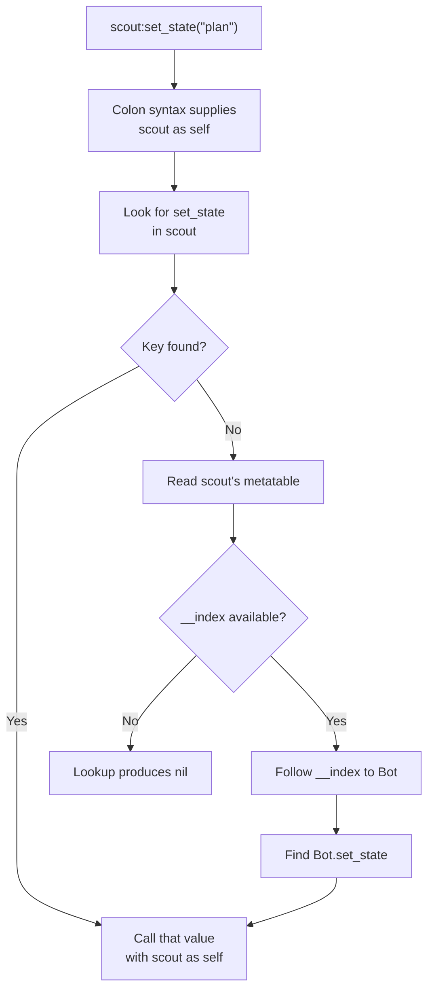

## Lua tables represent arrays, records, and maps

A Lua table maps keys to values. These are all tables:

```lua
local list = { "sword", "shield", "potion" }
local position = { x = 10.0, y = 5.5, z = 2.0 }
local by_id = { [7] = "archer", [12] = "mage" }
```

The first table uses integer keys `1`, `2`, and `3`. Lua sequences conventionally start at **one**, not zero.

A table is not “an array that sometimes has names.” It is one mapping abstraction that accepts several kinds of keys. Sequence operations add conventions on top: positive integer keys beginning at one, usually without holes. The length operator and `ipairs` are easiest to reason about when the script preserves that shape.

Before crossing the host/Lua boundary, name the promised shape:

```text
entity sequence: keys 1..n, every value is an entity table
entity record: named keys id, alive, and position
lookup map: arbitrary entity IDs mapped to records; order is not promised
```

The same Lua table implementation can represent all three, but host validation and iteration rules differ.

```lua
print(list[1]) -- sword ✅
print(list[0]) -- nil
```

When the host turns a `Vec` into a Lua sequence, it must add one to the zero-based index. The implementation in `lua-labs/src/main.rs` does exactly that.

## Iterate according to the shape

Use `ipairs` for a dense integer sequence:

```lua
for index, item in ipairs(list) do
    print(index, item)
end
```

Use `pairs` when keys are not a simple sequence:

```lua
for key, value in pairs(position) do
    print(key, value)
end
```

Do not rely on a meaningful order from `pairs`. If order matters, store an explicit sequence or sort the keys.

## Functions are values

```lua
local function squared_distance(a, b)
    local dx = b.x - a.x
    local dy = b.y - a.y
    return dx * dx + dy * dy
end

local scoring_rule = squared_distance
print(scoring_rule({ x = 0, y = 0 }, { x = 3, y = 4 })) -- 25
```

A function can be stored in a table, passed to another function, and returned. This is why a game can register callbacks such as `on_turn_started`.

## Closures remember surrounding values

```lua
local function make_cooldown(required_ticks)
    local remaining = 0

    return function(triggered)
        if remaining > 0 then
            remaining = remaining - 1
            return false
        end
        if triggered then
            remaining = required_ticks
            return true
        end
        return false
    end
end

local ready_once = make_cooldown(3)
```

The returned function keeps access to `remaining` after `make_cooldown` has returned. That remembered environment is a closure.

## The colon supplies `self`

```lua
local Bot = {}

function Bot:set_state(next_state)
    self.state = next_state
end

local bot = { state = "observe" }
Bot.set_state(bot, "plan") -- dot form: pass bot explicitly
Bot:set_state("plan")      -- colon form: Bot becomes self
```

Colon syntax is convenient, but the last line above changes the `Bot` table itself, not `bot`. To share methods through a prototype, Lua code commonly uses a metatable.

## Metatables change fallback behavior

```lua
local Bot = {}
Bot.__index = Bot

function Bot:new(name)
    local instance = { name = name, state = "observe" }
    return setmetatable(instance, self)
end

function Bot:set_state(next_state)
    self.state = next_state
end

local scout = Bot:new("scout")
scout:set_state("plan")
```

When `scout` has no `set_state` key, its metatable's `__index` points to `Bot`, so Lua looks there. This resembles method lookup, but it is not a compiled C++ vtable. It is a runtime table rule that scripts can inspect and change.

Read the expression `scout:set_state("plan")` in two stages. Colon syntax first supplies `scout` as the hidden first argument. Normal table lookup then searches `scout` for `set_state` and follows the `__index` rule to `Bot` when the key is absent. Keeping argument passing separate from lookup makes metatable behavior much less mysterious.



The left side of the process chooses the first argument. The right side finds
the function value. They cooperate, but they are separate rules.

## Validate host-shaped tables

Dynamic types do not remove the need for contracts:

```lua
local function require_entity(value)
    assert(type(value) == "table", "entity must be a table")
    assert(type(value.id) == "number", "entity.id must be a number")
    assert(type(value.position) == "table", "entity.position must be a table")
    assert(type(value.alive) == "boolean", "entity.alive must be a boolean")
    return value
end
```

Validate at the boundary, then let internal code use the checked shape. The host must still validate every value coming back from Lua; a script can mutate its table after validation.

## Avoid clever metatable surprises

Metamethods such as `__index`, `__newindex`, `__add`, and `__call` can make expressive APIs. They can also hide control flow.

For beginner-friendly game scripts:

- prefer ordinary fields for data;
- use a small prototype pattern only when shared methods help;
- avoid changing global metatables;
- do not run arbitrary behavior during simple field reads;
- validate tables received from scripts at the host boundary.

Plain tables and plain functions are enough for most observers, mod rules, and state machines. Learn the mechanism, then use only as much magic as the reader can still explain.
