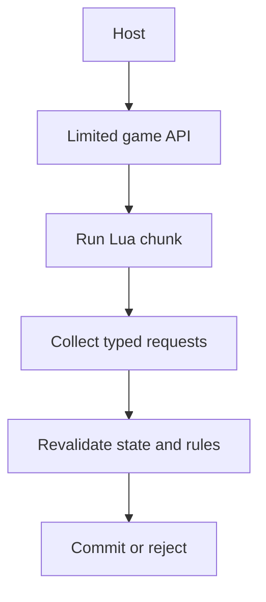

## The host owns the interpreter

`mlua` creates and controls a Lua virtual machine from the host. The project pins:

```toml
[dependencies]
anyhow = "1.0"
mlua = { version = "0.12", features = ["lua54", "vendored", "error-send"] }
```

`lua54` chooses Lua 5.4. `vendored` builds the matching Lua implementation with the crate, so a learner does not need to find a separate Lua DLL. `error-send` lets contextual host error-reporting carry a Lua failure through `anyhow` without discarding its details.

The interpreter is a subsystem with its own state, memory manager, call stack, and error rules. Embedding does not merge Lua and the host into one language. `mlua` builds a checked bridge that converts values and controls when execution crosses between them.

Treat each crossing as an interface:

- host-to-Lua inputs need a documented table shape and units;
- Lua-to-host requests need type and game-rule validation;
- errors need enough context to identify the script and boundary;
- callbacks need time and resource limits appropriate to the host loop.

The safest design passes snapshots and requests, not borrowed pointers into live game objects.

The host remains in charge even while Lua decides what it would like to do:



Lua plans with owned data; the host decides whether each plan is still valid at commit time.

## Load only the libraries you need

```rust
use mlua::{Lua, LuaOptions, StdLib};

let lua = Lua::new_with(
    StdLib::TABLE | StdLib::STRING | StdLib::MATH,
    LuaOptions::default(),
)?;
```

This lab needs table helpers, string formatting, and math. It does not load the Lua `io`, `os`, `debug`, or package libraries.

Removing libraries is not a complete hostile-code sandbox. It is still good capability hygiene: a script cannot call a function that does not exist in its environment.

## Expose one host function

```rust
let log = lua.create_function(|_, message: String| {
    println!("[lua] {message}");
    Ok(())
})?;

lua.globals().set("log", log)?;
```

`create_function` converts Lua arguments into the requested host type. Passing a table where a `String` is required produces a Lua error instead of an unchecked cast.

The first closure argument is the active `Lua` handle. It is named `_` here because logging does not need to create any Lua values.

## Prefer a namespace table

Avoid filling the global environment with dozens of unrelated functions:

```rust
let game = lua.create_table()?;
game.set("log", lua.create_function(|_, message: String| {
    println!("[lua] {message}");
    Ok(())
})?)?;
lua.globals().set("game", game)?;
```

Lua then calls:

```lua
game.log("observer started")
```

The `game` table becomes the documented boundary between engine and script.

## Convert host records into Lua tables

The complete host creates a table for each copied entity:

```rust
fn snapshot_table(lua: &Lua, entities: &[EntitySnapshot]) -> mlua::Result<mlua::Table> {
    let result = lua.create_table()?;

    for (index, entity) in entities.iter().enumerate() {
        let item = lua.create_table()?;
        item.set("id", entity.id)?;
        item.set("name", entity.name)?;
        item.set("alive", entity.alive)?;

        let position = lua.create_table()?;
        position.set("x", entity.position[0])?;
        position.set("y", entity.position[1])?;
        position.set("z", entity.position[2])?;
        item.set("position", position)?;

        result.set(index + 1, item)?; // Lua sequences begin at one. 🔢
    }
    Ok(result)
}
```

Nested tables make the script readable: `entity.position.x` is clearer than `entity[4]`.

## Load a named script with context

```rust
let source = std::fs::read_to_string(&script_path)?;
lua.load(&source)
    .set_name(script_path.to_string_lossy())
    .exec()?;
```

Naming the chunk gives errors a useful file label. The complete lab adds `anyhow::Context` so the host error also says which script failed.

## Separate setup, execution, and results

A clear host follows this order:

1. create the Lua state;
2. apply resource limits;
3. construct the host API;
4. load script text;
5. execute it once or register callbacks;
6. collect bounded requested actions;
7. validate those actions in the host;
8. report errors without crashing the engine.

Do not let a script run during partial API construction. Do not hold a mutable game-state lock across script execution. Give Lua a copied snapshot and collect requests for later processing.

This is a two-phase boundary. During **planning**, Lua reads an immutable snapshot and returns proposed actions. During **commit**, the host checks that the target, snapshot version, entity IDs, and game rules are still valid before acting. A plan based on an old snapshot is rejected instead of being applied to a different moment.

## Run all three useful scripts

```powershell
cargo run --manifest-path lua-labs/Cargo.toml -- scripts/observer.lua
cargo run --manifest-path lua-labs/Cargo.toml -- scripts/nearest_entity.lua
cargo run --manifest-path lua-labs/Cargo.toml -- scripts/state_machine.lua
```

The host prints accepted actions after the script returns. That delay is deliberate: Lua proposes data, and the host remains the authority that decides what happens.

## Why the host still needs validation

`mlua` safely converts values at the language boundary, but it cannot know your game rules. The host must still check:

- entity IDs exist in the current snapshot;
- coordinates are finite and within the map;
- an action is allowed in the current state;
- the script has not exceeded a rate limit;
- the target still matches the verified local build.

Memory safety and game-rule validity are different jobs. A good host performs both.
