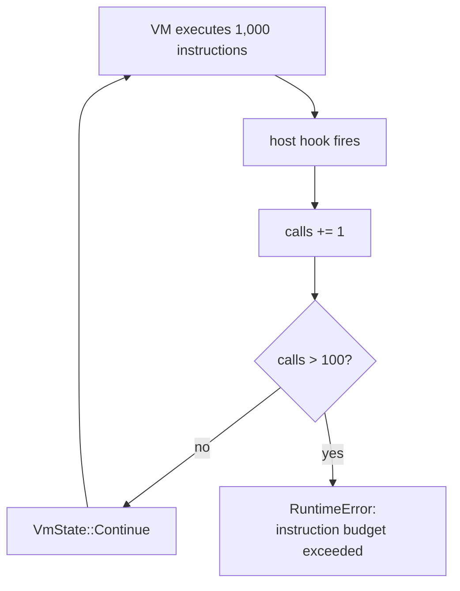
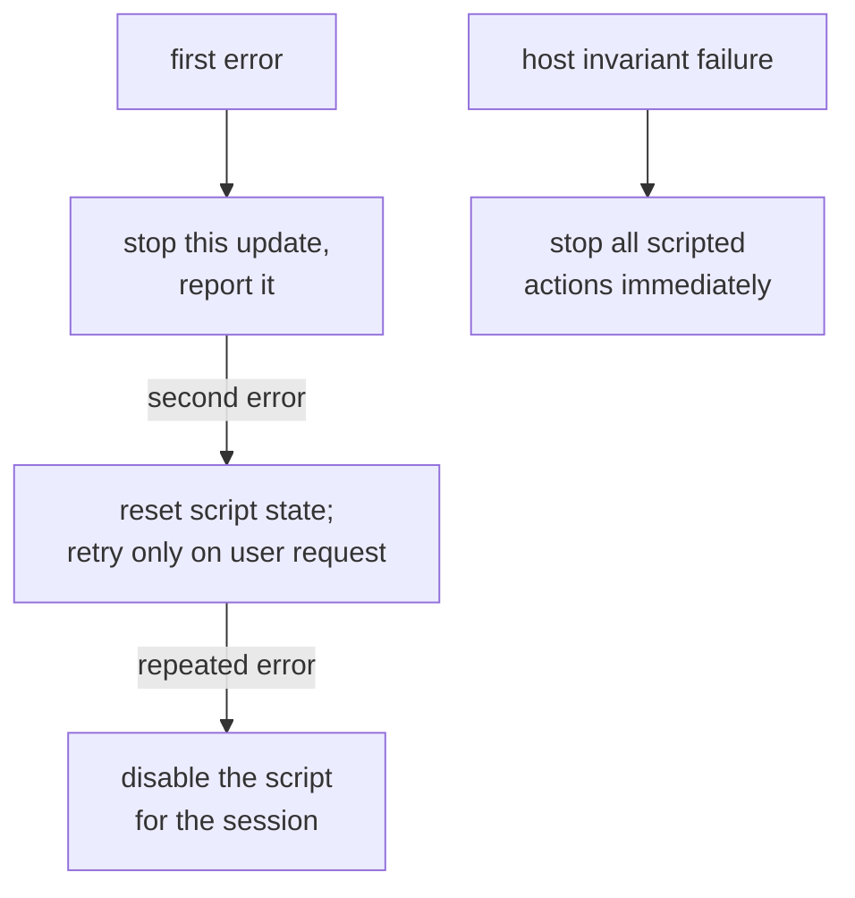

## A script can fail without being malicious

Common mistakes include:

- an infinite loop;
- a table that grows every update;
- calling a missing function;
- assuming an entity always exists;
- dividing by zero and producing a non-finite value;
- repeatedly requesting an action the host rejects.

An embedded interpreter must treat failure as a normal result. One script error should not crash the game, leak resources, or leave input stuck.

## Budgets describe several resources

“The script is small” does not imply that it is cheap to run. Bound the dimensions separately:

- source and bytecode size;
- Lua-managed memory;
- VM instructions per update;
- call-frame depth;
- host-callback calls and returned data;
- wall-clock deadline for work outside instruction counting;
- queued actions and log output.

Choose whether a budget resets per callback, per frame, or per whole script session. A limit with no time window is ambiguous. Record which budget stopped execution so a learner can distinguish an infinite loop from memory growth or excessive host calls.

| Resource | Guard | Reset window |
|---|---|---|
| Source and bytecode | Maximum input bytes | Script load |
| Lua-managed memory | Allocator limit | Script session |
| VM instructions | Hook counter | One update |
| Call frames | Maximum depth | One call chain |
| Host callbacks | Call and returned-byte caps | One update |
| Wall-clock work | Host deadline or cancellation | One update |
| Actions and logs | Queue and output-byte caps | One update |

When a limit is crossed, stop that update, discard its uncommitted actions, and
report the exact budget. Do not quietly continue with half-produced output.

## Limit memory

The lab host applies a four-megabyte Lua allocation limit:

```rust
let lua = mlua::Lua::new_with(
    mlua::StdLib::TABLE | mlua::StdLib::STRING | mlua::StdLib::MATH,
    mlua::LuaOptions::default(),
)?;

lua.set_memory_limit(4 * 1024 * 1024)?;
```

Choose a limit after measuring realistic scripts. Too low prevents normal work; unlimited growth lets one bug consume the process.

The limit covers Lua-managed allocations, not every resource a host callback might allocate. Host functions need their own bounds.

## Limit instructions

`mlua` can call a host hook after a chosen number of VM instructions:

```rust
use std::sync::{Arc, Mutex};
use mlua::{HookTriggers, VmState};

let calls = Arc::new(Mutex::new(0_u32));
let counter = Arc::clone(&calls);

lua.set_hook(
    HookTriggers::new().every_nth_instruction(1_000),
    move |_, _| {
        let mut calls = counter.lock()
            .map_err(|_| mlua::Error::RuntimeError("hook counter failed".into()))?;
        *calls += 1;
        if *calls > 100 {
            return Err(mlua::Error::RuntimeError(
                "script exceeded its instruction budget".into()
            ));
        }
        Ok(VmState::Continue)
    },
)?;
```



Since the hook fires every 1,000 instructions and allows at most 100 calls, a script gets roughly 100,000 VM instructions per update before this particular budget stops it.

The hook is not a stopwatch. Different instructions cost different amounts of real time, and host callbacks can do work between hooks. It is one defense against runaway Lua bytecode.

Reset the instruction allowance at a controlled host boundary, not from inside the script. If the hook counter is shared across updates, document that as a session budget; if each update gets a fresh allowance, also cap how often updates can be requested.

## See the budget fail on purpose

`scripts/budget_failure.lua` contains:

```lua
-- ❌ This intentional failure demonstrates the host's instruction budget.
while true do
end
```

Run it:

```powershell
cargo run --manifest-path lua-labs/Cargo.toml -- scripts/budget_failure.lua
```

Expected result: the host returns a contextual error naming the script and the exceeded budget. If the terminal hangs forever, the limit is not working.

## Protect every host callback

A function exposed to Lua should validate:

- argument types and string lengths;
- sequence lengths;
- numeric finiteness and range;
- referenced IDs;
- permissions for the current script;
- rate and action budgets.

Never hold a poisoned mutex or important engine lock while running arbitrary script code. Copy inputs first, execute, then validate collected outputs.

## Make errors useful but not secret-leaking

Development builds should report:

- script path or stable identifier;
- line and traceback when available;
- host API function involved;
- which validation rule failed;
- whether the script was disabled or may retry.

Do not dump process memory, account tokens, full private chat logs, or arbitrary host paths into a public error report.

## Use a failure policy

One practical policy is:



Do not catch an error and continue from half-mutated host state. Lua requests should be queued and committed only after the script returns successfully.

## Test more than the happy path

Create scripts that:

- request an unknown action;
- omit a required field;
- pass a string where an ID is expected;
- allocate an ever-growing table;
- loop forever;
- throw an error inside a helper function;
- return normally with zero actions;
- submit the maximum allowed valid action list.

For each test, assert the result, action count, error category, and whether the script remains enabled.

## Sandboxing is a design, not one switch

No single setting makes arbitrary scripts safe. The useful layers are:

- a limited standard library;
- no arbitrary native module loading;
- a narrow host API;
- copied snapshots;
- structured action requests;
- memory, instruction, time, and rate limits;
- least-privilege Windows handles behind the host boundary;
- clear cancellation and recovery.

Lua is most valuable when it makes small policies easy to change while the host keeps powerful capabilities narrow and testable. 🔒
