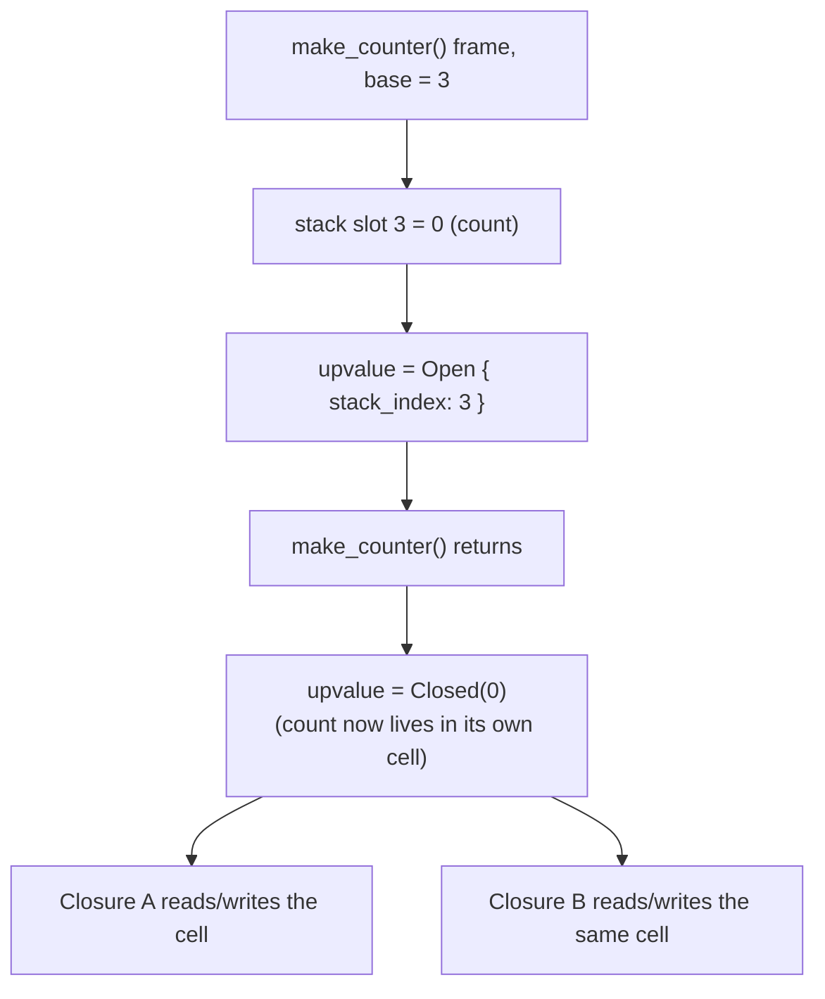
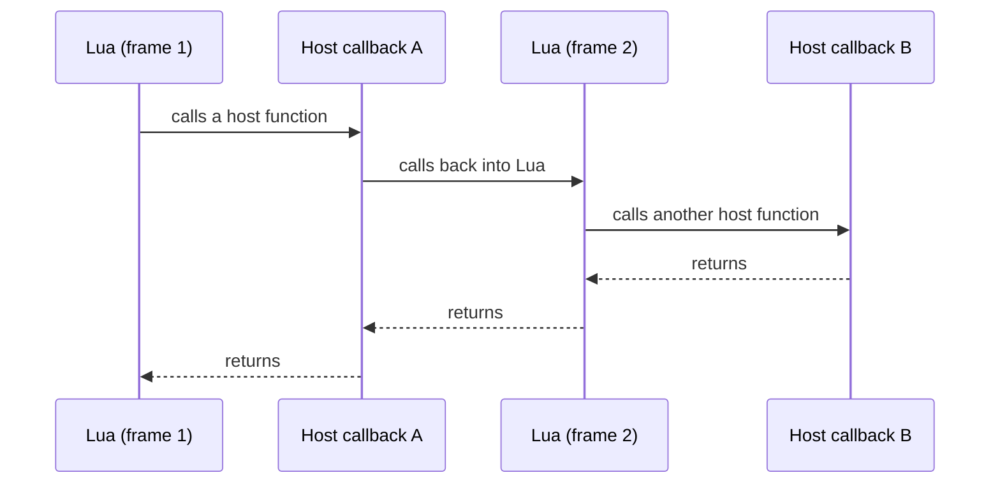

## A VM call needs bookkeeping

When one Lua function calls another, the interpreter must remember where the caller continues, where its local values live, which function is running, and where results should go. That record is a **call frame**.

This is the virtual machine’s version of the call-stack idea from the assembly chapter. The CPU still has a real native stack underneath, but Lua call frames describe Lua execution.

## One value stack can hold many frames

A VM can keep values in one vector and let each frame own a range:

```rust
struct CallFrame {
    function: FunctionId,
    base: usize,
    return_instruction: usize,
    expected_results: ResultCount,
}

enum ResultCount {
    Exact(usize),
    All,
}
```



`base` says where this function’s local area begins. Bytecode operands can refer to `base + local_index` rather than carrying raw pointers into the vector.

Lua allows multiple return values, so a caller may request an exact number or accept all produced results. Missing results become `nil`; unwanted extras can be discarded.

## A closure is code plus captured surroundings

Consider:

```lua
local function make_counter()
    local count = 0
    return function()
        count = count + 1
        return count
    end
end
```

The returned function keeps using `count` after `make_counter` has returned. `count` is an **upvalue**: a captured variable from an enclosing scope.

While the outer frame is active, an upvalue may refer to its live stack slot. Before that frame disappears, the interpreter must move or “close” the value into storage owned by the closure. Otherwise the closure would keep an invalid stack location.

## Open and closed upvalues

An implementation can model the two states explicitly:

```rust
enum UpvalueLocation {
    Open { stack_index: usize },
    Closed(Value),
}
```

Several closures may capture the same local, so they must share one upvalue cell. If each closure copies the number independently, updates will disagree and the Lua behavior will be wrong.

Follow `make_counter` through with slot numbers and it stops being abstract.
Say its frame gets `base = 3`, so its single local `count` lives in stack slot
3:

```text
call make_counter()
  stack slot 3 = 0            <- count, inside the live frame
  inner function created
  upvalue = Open { stack_index: 3 }

make_counter returns
  slot 3 is about to belong to whatever runs next,
  so the interpreter closes the upvalue first:
  upvalue = Closed(0)         <- the 0 now lives in a cell the closure owns

counter()   reads the cell -> 0, writes 1, returns 1
counter()   reads the cell -> 1, writes 2, returns 2
```

“Open” and “closed” are just those two rows: while the frame lives the upvalue
is a slot number, and afterwards it is a value in a cell. The identity never
changes — it is the same `count` throughout — only where it is stored.

That distinction predicts a specific bug. Hand the same `count` to two
closures, then close it by copying the value into each one rather than sharing
one cell. Call the first closure twice and the second once, and you get 1, 2,
and then 1 again, because the second closure incremented its own private copy.
Sharing the cell is what makes the third call return 3, which is the behaviour
Lua actually promises.

The captured value changes location without changing its identity:



Both closures keep referring to one shared cell after the original stack frame is gone.

This is a useful ownership lesson: the local starts inside one frame, escapes, becomes shared state, and outlives its original scope.

## Host callbacks look like VM functions at the boundary

When `mlua` registers `game.log`, it builds a callable Lua value backed by a host closure. The boundary must:

1. check the Lua argument count and types;
2. convert them to host values;
3. call the host function;
4. convert success values back to Lua;
5. turn host errors into Lua errors with context;
6. avoid letting a panic cross the language boundary.

The callback should be short and bounded. A Lua instruction budget cannot interrupt arbitrary blocking work performed inside native host code.

## Re-entrancy adds nested host and VM call frames

A host callback may call Lua again, which may call another host function. This is **re-entrancy**. The host needs a clear policy for locks and mutable game state.



Avoid holding a mutable engine lock while executing unknown script code. Give Lua a copied snapshot, collect typed requests, return to the host, and then validate and apply them. That architecture from earlier lessons also prevents complicated nested borrows.

## Debug a function call in layers

When a script call behaves incorrectly, record:

- bytecode instruction and VM instruction pointer;
- active function and call-frame base;
- argument slots and their value tags;
- requested result count;
- open upvalues and the stack slots they reference;
- host callback name and converted arguments;
- final Lua error chain.

Do not print secrets or entire game snapshots by default. A debugger can be useful without becoming a data leak.

## Build understanding in stages

The original `mini_vm` lab intentionally stops before functions. Extend a copy in this order:

1. add named local slots;
2. add `Call` and `Return` instructions;
3. introduce a `CallFrame` stack;
4. support an exact result count;
5. add function constants;
6. capture one read-only upvalue;
7. close it when the outer frame returns;
8. share one mutable upvalue between two closures;
9. add recursion and enforce a maximum frame depth.

Each stage should have a failing test before it gets more features. A small verified interpreter teaches more than a large VM whose stack rules are guesses.

The detailed implementation path in [Build a Lua Interpreter in Rust](https://wubingzheng.github.io/build-lua-in-rust/en/) is useful further reading for functions and closure escape. Keep your own code original, compare observable behavior with the official Lua manual, and treat the reference implementation as a guide to questions—not a source to paste from.
