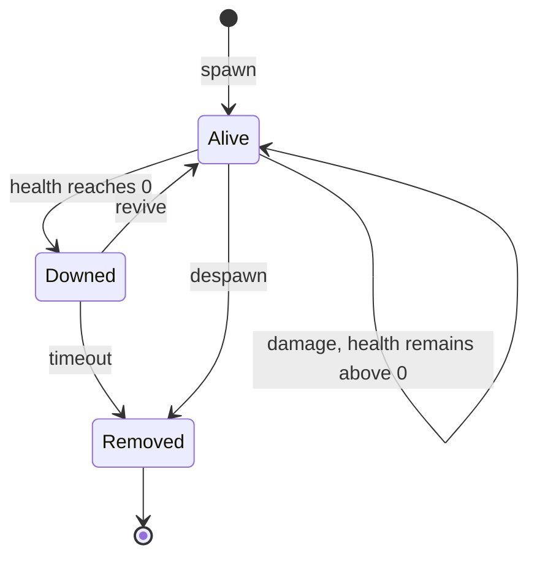

## Prerequisites

You should already be able to:

- distinguish a value from the address that currently stores it;
- record a game build and repeat one controlled action;
- read a small state machine and a timestamped event log;
- separate observation from a state-changing operation.

## What bypass analysis means in this chapter

A **bypass** is a path that reaches an outcome without satisfying the control
that was supposed to guard it. In a game, the mismatch is often between a
convenient proxy and the real rule:

| Proxy that gets checked | Property that actually matters |
|---|---|
| Menu button is enabled | Engine policy permits the state change |
| One field's checksum matches | The complete object relation is current and valid |
| One environment signal is absent | The requested command satisfies game rules |
| An old object still has a plausible address | The identity and generation still match |

The analysis pattern is always the same: state the promised rule, trace the
branch that claims to enforce it, follow every path to the effect, and look for
a path where the proxy and the real property disagree. Later lessons apply that
pattern to integrity checks, anti-debug behavior, encoded values, hooks, and
object layouts.

## Begin with the property that must remain true

Advanced analysis becomes manageable when you stop asking only, “Which byte
changed?” and ask, “Which property of the system does this byte help preserve?”

An **invariant** is a statement that must be true whenever the system reaches a
valid state. Examples include:

- ammunition never becomes negative;
- an entity ID refers to at most one live entity in a snapshot;
- a patch is applied only to the exact build and bytes it was made for;
- a rendering hook is either fully installed or fully removed;
- a read-only observer never changes the game state.

The invariant is the measuring stick. An address, instruction, field name, or
log message is evidence about that property—not the property itself.

## Separate state, invariants, controls, signals, evidence, and findings

These terms are related, but they are not interchangeable:

| Term | Precise meaning | Example in a toy game |
|---|---|---|
| **State** | Values needed to describe the system at one moment | `health = 48`, `mode = Playing` |
| **Transition** | An event and rule that move state to another valid state | Damage changes health from 48 to 43 |
| **Invariant** | A property required of every valid state or transition | `0 <= health <= max_health` |
| **Observation** | A measurement that does not prove its own cause | A write breakpoint reports one store instruction |
| **Hypothesis** | A falsifiable explanation for observations | “This store commits post-armor damage” |
| **Finding** | A supported claim with impact, evidence, and limits | The store violates the health bound on build X |

A **control** attempts to preserve an invariant. A **detector** reports evidence
that the invariant may have failed. A detector can be noisy while the control
still works, or quiet while the control is incomplete.

## Draw the state before inspecting implementation details

Suppose an entity can be alive, downed, or removed. Write that model before
searching memory:



Now a useful question appears: does the observed `health` field change before
or after the `Alive -> Downed` transition? A single memory sample cannot answer
that. A timestamped trace can.

## Record evidence as structured data

Free-form notes are easy to misread. Use a small schema:

```rust
#[derive(Debug, Clone, PartialEq, Eq)]
struct Observation {
    sequence: u64,
    tick: u64,
    source: &'static str,
    entity_id: u32,
    event: Event,
}

#[derive(Debug, Clone, PartialEq, Eq)]
enum Event {
    HealthRead { value: i32 },
    HealthWrite { before: i32, after: i32 },
    ModeChanged { before: Mode, after: Mode },
}
```

`sequence` establishes log order. `tick` connects the event to the game clock.
`source` says which observer produced it. The event carries typed fields rather
than one sentence that must be parsed later.

Do not mistake sequence for causality. If event A appears before event B, A may
have caused B, both may share a cause, or the observers may have different
buffering delays. Repeat the experiment and change one input at a time.

## State what evidence would disprove a hypothesis

“This probably controls health” is difficult to disprove. A useful hypothesis
predicts an observable result:

> If the instruction commits final health, then changing armor while holding
> raw damage constant will change the stored delta, and exactly one write will
> occur before the transition to `Downed`.

Write the competing explanation too:

> The instruction only updates a display cache; authoritative health changes
> earlier at a different address.

Then design observations that separate the two explanations. Watching the
value, the transition, and the next UI refresh is stronger than staring at one
disassembly window.

## Combine several kinds of evidence

| Strength | Evidence | What it supports |
|---:|---|---|
| 1 | One matching value | A possible representation |
| 2 | Controlled value change | A behavioral association |
| 3 | Repeated reads or writes at a stable instruction | A recurring code/data relationship |
| 4 | Perturbation with predicted results | A causal hypothesis |
| 5 | Clean restarts and multiple builds | Stability and version limits |
| 6 | Automated regression fixture | A claim that can be rechecked |

More evidence does not make a conclusion permanent. It makes the claim and
limits clearer.

## Report the result so it can be retested

A compact technical finding contains:

1. **claim** — the exact behavior observed;
2. **scope** — build, architecture, mode, and configuration;
3. **invariant** — the property expected to hold;
4. **preconditions** — state needed to reproduce it;
5. **procedure** — bounded steps and changed variables;
6. **evidence** — trace, bytes, call stack, or fixture output;
7. **impact** — which behavior becomes wrong or unreliable;
8. **repair** — where the invariant should be enforced;
9. **retest** — the test that distinguishes fixed from unfixed behavior;
10. **limits** — what the evidence does not prove.

## Glossary terms introduced here

- **Invariant:** a property required of every valid state or transition.
- **Observation:** a measured fact whose cause still needs reasoning.
- **Hypothesis:** an explanation that predicts evidence and can be disproved.
- **Control:** logic intended to preserve an invariant.
- **Detector:** logic that reports a possible invariant failure.
- **Finding:** a scoped, evidence-backed technical conclusion.

## Checkpoint

You should now be able to turn “find the health code” into a state model, a
precise invariant, two competing hypotheses, a structured trace, and a retest
that another person can reproduce.
