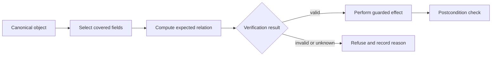

## Prerequisites

You should understand byte ranges, hashes, snapshots, state transitions, and
the difference between a copied value and the canonical value used by the
game.

## An integrity check is a claim about a boundary

An integrity check answers a narrow question such as, “Do these bytes equal the
expected bytes?” It does not automatically prove that the whole process, file,
object, or later operation is unchanged.

Before evaluating a check, write down five boundaries:

| Boundary | Question to answer |
|---|---|
| Bytes | Exactly which bytes are included? |
| Time | When are they measured, and how long is the result reused? |
| Identity | Which build, object, file, or module does the result describe? |
| Consumer | Which operation trusts the result? |
| Failure | What state is reached when verification cannot complete? |

The target invariant for this lesson is:

> A sensitive toy operation proceeds only when verification covers the same
> object, the required fields, and the state used by that operation.

## Follow the decision, not only the checksum function

The important path begins with canonical state and ends at the effect:



If a result is cached, copied to another object, or checked far away from the
effect, label those edges. Each edge creates a question about identity and
freshness.

## A toy integrity record

This deliberately small record uses a checksum as an accidental-corruption
signal. It is not cryptographic authentication:

```rust
#[derive(Debug, Clone)]
struct PlayerRecord {
    player_id: u32,
    health: u16,
    max_health: u16,
    generation: u32,
    checksum: u32,
}

fn covered_checksum(record: &PlayerRecord) -> u32 {
    record.player_id
        .wrapping_mul(31)
        .wrapping_add(u32::from(record.health))
        .wrapping_add(u32::from(record.max_health).rotate_left(7))
        .wrapping_add(record.generation.rotate_left(13))
}

fn verify(record: &PlayerRecord) -> bool {
    record.health <= record.max_health
        && record.checksum == covered_checksum(record)
}
```

The checksum includes every field used to identify the record and interpret
health. The range invariant is checked separately because a matching checksum
does not make an impossible value meaningful.

## Distinguish four failure classes

### Incomplete coverage

A check covers `health` but ignores `max_health` or `player_id`. The bytes can
be internally consistent while describing the wrong entity or an impossible
range.

### Wrong source of truth

The code verifies a display cache, then applies an operation to the canonical
simulation object. The check and effect refer to different state.

### Stale decision

The program verifies generation 17, the object changes to generation 18, and a
later operation trusts the old `true`. This is a time-of-check/time-of-use
problem.

### Ambiguous failure

A read error, unsupported build, and genuine mismatch all become `false` or,
worse, silently become “valid.” Use explicit results:

```rust
#[derive(Debug, Clone, Copy, PartialEq, Eq)]
enum IntegrityFailure {
    WrongBuild,
    Unreadable,
    IdentityChanged,
    OutOfRange,
    ChecksumMismatch,
}
```

These variants are useful telemetry and make tests state exactly which promise
failed.

## Keep verification beside the effect

A guarded update can consume the same mutable object it verifies:

```rust
fn apply_heal(record: &mut PlayerRecord, amount: u16) -> Result<(), IntegrityFailure> {
    if record.health > record.max_health {
        return Err(IntegrityFailure::OutOfRange);
    }
    if record.checksum != covered_checksum(record) {
        return Err(IntegrityFailure::ChecksumMismatch);
    }

    // The checked object is also the object changed below.
    record.health = record.health.saturating_add(amount).min(record.max_health);
    record.generation = record.generation.wrapping_add(1);
    record.checksum = covered_checksum(record);
    Ok(())
}
```

This local function is easy to reason about because the check and effect share
one exclusive borrow. Across process or thread boundaries, use versioned
snapshots, expected-byte comparisons, or a command sent to the owner of the
state; a remote read followed by a remote write is not atomic.

## Test the relation, not one handpicked example

Useful regression properties include:

- changing any covered field without updating the checksum is rejected;
- changing an uncovered display-only field does not affect verification;
- `health > max_health` is rejected even with a recomputed checksum;
- a stale `generation` is refused at the consuming boundary;
- read failure produces `Unreadable`, never “valid”;
- every refusal emits a bounded reason code and no state change.

For the small record above, iterate over each covered field and flip one bit.
That mutation test proves the test suite notices missing coverage.

## Glossary terms introduced here

- **Integrity:** confidence that state still satisfies its required relation.
- **Coverage:** the exact data and conditions examined by a check.
- **Canonical state:** the state the game actually uses to decide an effect.
- **Freshness:** whether evidence still describes the state being consumed.
- **TOCTOU:** a gap in which state changes between checking and using it.
- **Postcondition:** a property that must hold after an operation completes.

## Checkpoint

You should now be able to trace an integrity result from selected bytes to its
consumer, identify incomplete coverage or stale identity, and place a repair
where the verified state and the guarded effect meet.
