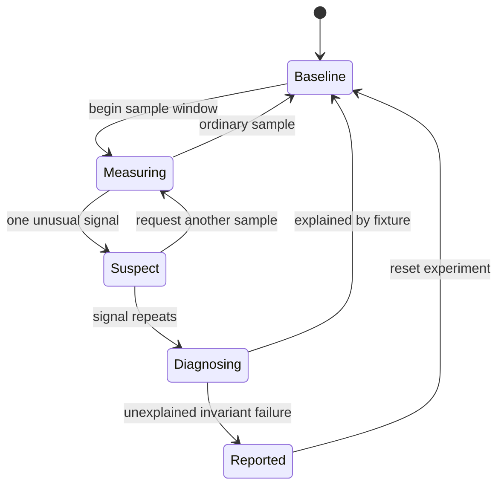

## Prerequisites

You should understand debugger events, timers, threads, state machines, and the
difference between a game rule and evidence about the environment.

## Treat the behavior as a protocol

An anti-debug routine is often described as a bag of checks. That view hides
the important part: what state does each observation cause, and which game
behavior changes afterward?

Model it as a protocol with inputs, memory, and outputs. For a deliberately
small local fixture:



This diagram exposes questions a single `if debugger_present` cannot answer:

- Does one sample cause a permanent decision?
- Is there a second observation before behavior changes?
- Can a slow frame, breakpoint, virtual machine, or overloaded computer produce
  the same signal?
- Is the response visible in telemetry?
- Does the game still enforce its real state invariants?

The target invariant is:

> Environmental observations may annotate or pause the experiment, but game
> state validity is enforced independently at the state-changing boundary.

## Separate signal, interpretation, and response

```rust
#[derive(Debug, Clone, Copy, PartialEq, Eq)]
enum Signal {
    ObserverFlag(bool),
    SampleDelayMicros(u64),
    UnexpectedBreakpointEvent,
}

#[derive(Debug, Clone, Copy, PartialEq, Eq)]
enum Assessment {
    Ordinary,
    NeedsAnotherSample,
    NeedsDiagnosis,
}
```

A **signal** is measured data. An **assessment** interprets one or more signals.
A **response** is an action such as recording a diagnostic event or refusing a
specific invalid command. Combining all three into one hidden boolean makes it
hard to discover false positives and impossible to explain the decision.

## What a Windows program can actually measure

The state machine above is deliberately abstract, which risks leaving the
impression that an "observer signal" is one vague thing. It is not. A Windows
program has several genuinely different sources of evidence, and they differ in
what they prove — which is the whole reason the lesson insists on separating
signal from assessment.

**Things the loader wrote down.** When Windows starts a process for a debugger,
it records that fact inside the process itself. The Process Environment Block
carries a `BeingDebugged` byte at offset `0x02`, and `IsDebuggerPresent` is
little more than a read of it. The same structure's `NtGlobalFlag` field gains
heap-checking bits, and the process heap ends up with different `Flags` and
`ForceFlags` values than it otherwise would. Nothing here measured anything.
The loader simply noted what it was asked to do, and the program is reading the
note.

**Bookkeeping the kernel keeps.** A debugged process has a debug object
associated with it, and `NtQueryInformationProcess` will report on that
association when asked for `ProcessDebugPort` or `ProcessDebugObjectHandle`.
Again a record, held somewhere else.

**Its own code.** Lesson 2.3 showed that a software breakpoint replaces a byte
with `0xCC`. A checksum over its own instructions notices that change.

**Its own thread state.** A hardware breakpoint changes no bytes, so a checksum
misses it entirely. It lives in the CPU's debug registers — `DR0` through `DR3`
holding addresses, `DR7` holding the enable and condition bits — and those
registers are part of a thread's saved context. A thread can therefore call
`GetThreadContext` on itself and read them.

That pair is worth sitting with. Neither kind of breakpoint is invisible, and
neither is universally visible; they leave traces in *different places*. A
program checking only its bytes never sees a hardware breakpoint, and one
checking only its debug registers never sees a software breakpoint.

**Who handles an exception first.** A program can raise an exception on purpose
and see whether its own handler runs. If something else took it, something else
is attached.

**The surrounding machine.** Parent process, window titles, the module list.

Sort these by what they would establish and the picture changes. The first two
are records the operating system keeps, and a determined observer can change
what those records say. The middle two are the program noticing traces of your
tools inside its own address space and thread state. The last one is about the
machine, not about this process, and can be true with nothing attached at all.

None of them establishes that a game rule was broken. That is exactly why this
lesson keeps environment observation separate from validating game state, and
why the invariant at the top belongs at the effect boundary rather than
anywhere in this list.

## Timing detects pauses, not intent

Suppose code measures how long a tiny operation takes. A large gap might come
from a breakpoint, but also from preemption, power management, virtualization,
page faults, logging, or a busy machine.

Numbers make the difficulty concrete. Time the same trivial operation ten
thousand times on an idle machine and you might record:

```text
median             1.2 us
99th percentile    8.0 us
maximum          412.0 us     <- one scheduler preemption, nothing unusual
```

Now try to pick a threshold. Set it at 10 microseconds and ordinary background
activity trips it several times a minute. Set it above 412 and you have written
a rule that almost nothing will ever trigger, including the condition you meant
to catch. The distribution of “ordinary but unlucky” overlaps the distribution
of “actually paused,” so no single number separates them cleanly.

What does separate them is repetition. One sample above the 99th percentile is
ordinary luck; twenty in a row from the same code path is a changed
environment. That is exactly why the state machine above asks for another
sample rather than deciding on the first one.

Use distributions rather than one magic threshold:

| Measurement | Useful interpretation |
|---|---|
| Median | Typical sample duration |
| 95th or 99th percentile | Ordinary tail latency |
| Maximum | One extreme event; inspect rather than generalize |
| Repeated outliers | Evidence that the environment changed |
| Game invariant failure | Evidence that game state became invalid |

Establish a baseline on the same fixture, retain raw bounded samples, and
report the threshold and sample count. A threshold without its distribution is
not a reproducible result.

## Make the toy detector observable

```rust
#[derive(Debug, Clone, PartialEq, Eq)]
struct DiagnosticEvent {
    sample: u64,
    signal: Signal,
    assessment: Assessment,
    reason: &'static str,
}

fn assess_delay(delay_us: u64, ordinary_p99_us: u64) -> Assessment {
    if delay_us <= ordinary_p99_us {
        Assessment::Ordinary
    } else {
        Assessment::NeedsAnotherSample
    }
}
```

The event tells a test what was measured and why it was classified. The next
sample can confirm or reject the first interpretation. No branch silently
changes unrelated game behavior.

## Diagnose the behavior from both directions

When reversing an unfamiliar routine, trace:

1. **backward from the branch** to find the signals and stored history;
2. **forward from the branch** to find every response and shared sink;
3. **across clean runs** to estimate ordinary variation;
4. **across one controlled observation** to see which transitions differ;
5. **through failures** to determine whether the response is fail-open,
   fail-closed, or merely diagnostic.

Name the response precisely. “The game detects a debugger” is weaker than
“after two samples above the recorded p99, the fixture enters `Diagnosing` and
emits reason `timing_outlier`; no simulation state changes.”

## Test false positives and false negatives

Build a matrix from conditions you can deliberately create in the fixture:

| Condition | Expected assessment | Expected game effect |
|---|---|---|
| Normal run | Ordinary | Command still validated normally |
| Deliberate short sleep | Needs another sample | No state change by the detector |
| Repeated long sleeps | Needs diagnosis | Diagnostic event only |
| Explicit observer flag | Needs diagnosis | Diagnostic event only |
| Invalid health command with no signals | Ordinary environment; command rejected | Health unchanged |

The last row is essential. A quiet environment must not turn an invalid game
operation into a valid one.

## Glossary terms introduced here

- **Signal:** one observable measurement.
- **Assessment:** an interpretation based on one or more signals.
- **Response:** behavior chosen after an assessment.
- **Baseline:** recorded ordinary behavior used for comparison.
- **False positive:** an ordinary condition classified as suspicious.
- **False negative:** the target condition occurs without the expected signal.
- **Fail-open / fail-closed:** whether uncertainty permits or refuses an effect.

## Checkpoint

You should now be able to reconstruct anti-debug behavior as states and
transitions, measure timing as a distribution, locate the response sinks, and
prove that environmental signals do not replace validation of game state.
