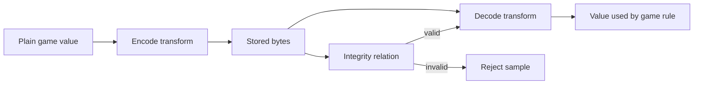

## Prerequisites

You should be comfortable with hexadecimal integers, XOR, bit rotation,
wrapping arithmetic, breakpoints, and tracing a value through several
instructions.

## Start from behavior, not from a guessed formula

An encoded field often looks like noise in a memory viewer, because the bits
being stored are not the number the game displays. That on its own tells you
almost nothing about what is being done to it.

Five words get used as though they were interchangeable here, and they are not:

| Word | What it is actually for | Needs a secret? |
|---|---|---|
| compression | making the bytes smaller | no |
| serialization | arranging values for storage or sending | no |
| obfuscation | making the bytes awkward to read | no |
| authentication | proving nobody altered the bytes | yes |
| encryption | hiding the bytes from anyone without the key | yes |

Only the last two involve a secret. Mistaking obfuscation for encryption sends
you hunting for a key that was never there; mistaking encryption for
obfuscation wastes days trying to spot a pattern in output designed to have
none.

The rule your decoder has to satisfy:

> Decoding an encoded value returns exactly the original value, and any
> integrity check travelling with it is verified *before* the decoded value is
> used for anything.

The second half is the part people skip. A value that decodes cleanly is not
the same as a value nobody tampered with — decoding will happily produce a
plausible-looking number from bytes somebody edited.

Trace both directions:



The write path often reveals the forward transform. The read path reveals its
inverse and the order of operations. A formula is convincing only when it
predicts new samples.

## Obfuscation and encryption answer different questions

| Property | Reversible obfuscation | Authenticated encryption |
|---|---|---|
| Main purpose | Change representation | Keep data secret and detect modification |
| Secret required | Often no durable secret | Yes |
| Repeated values | May reveal obvious patterns | Nonces should make ciphertexts differ |
| Modification detection | Optional ad-hoc tag | Authentication tag is part of the design |
| Analysis result | Recover the transform | Identify algorithm, key/nonce lifecycle, and boundaries |

A reversible XOR-and-rotate transform is useful for learning data flow, but it
is not a security boundary.

## Follow one complete toy transform

A minimal reversible transform is:

```rust
const ROTATION: u32 = 7;

pub const fn encode(value: u32, key: u32) -> u32 {
    (value ^ key).rotate_left(ROTATION)
}

pub const fn decode(encoded: u32, key: u32) -> u32 {
    encoded.rotate_right(ROTATION) ^ key
}
```

Read `encode` left to right. XOR combines the value and key; rotation moves the
bit positions. To invert it, reverse both the order and each operation:

1. rotate right by the same count;
2. XOR with the same key because `x ^ k ^ k == x`.

This “reverse order, invert each step” rule also helps when disassembly shows a
longer composition.

## Use differential observations

Record several controlled pairs:

| Trial | Plain value | Encoded value | What to compare |
|---:|---:|---:|---|
| A | 100 | `E(100)` | Baseline |
| B | 101 | `E(101)` | Which output bits change for +1? |
| C | 100 | `E₂(100)` | Did a session key or generation change? |
| D | 0 | `E(0)` | Does it expose a key-like constant? |

Do not derive a general rule from one pair. Predict a fifth pair before
accepting the model.

Useful clues in a read path include:

- XOR, rotate, byte-swap, add, subtract, and multiply by odd constants;
- a nearby key or generation field;
- duplicate calculations before a comparison;
- a branch that rejects the value;
- conversion to float or clamping immediately after decoding.

## Preserve operation width and wrapping behavior

Machine arithmetic is performed at a width. `u32::wrapping_add` is not the same
as arbitrary-precision arithmetic, and an 8-bit rotate is not a 32-bit rotate.
Record operand widths, truncations, sign extensions, and endianness.

For multiplication modulo `2^32`, only an odd multiplier has a multiplicative
inverse. That mathematical fact lets a reversible transform undo the multiply;
an even multiplier loses information.

## A tag verifies a defined relation, not every field

A small record can store a toy tag beside the encoded value and verify it before
decoding. That can detect accidental changes in the example, but the relation
is still reproducible by anyone who knows the algorithm and key. Name the
claim accurately: it is a toy integrity relation, not cryptographic
authentication.

## Verify the recovered model

The verification should prove:

```text
decode(encode(value, key), key) == value
```

over edge values such as `0`, `1`, `u32::MAX`, values around a carry boundary,
and multiple keys. Mutation tests should flip each encoded bit and confirm that
the toy tag check refuses changed samples.

## Glossary terms introduced here

- **Obfuscation:** a reversible representation intended to make a value less
  obvious, not to provide strong secrecy.
- **Plain value:** the value before a transform.
- **Encoded value:** the stored result of a transform.
- **Round trip:** encode followed by decode, ending at the original value.
- **Differential observation:** comparing outputs after one controlled input
  change.
- **Wrapping arithmetic:** fixed-width arithmetic reduced modulo `2^N`.

## Checkpoint

You should now be able to trace encoded state through read and write paths,
recover the inverse operation order, preserve machine widths, and validate the
model with predictions rather than visual guesses.
