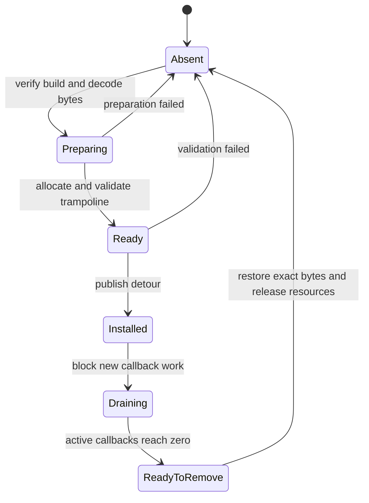

## Prerequisites

You should understand x86-64 instruction boundaries, calling conventions,
executable memory protections, trampolines, threads, and reversible resource
ownership.

## A hook changes a live control-flow graph

A detour replaces an edge in the game’s control-flow graph. The difficult part
is not emitting a jump; it is preserving every contract around that edge while
other threads may execute it.

The target invariant is:

> The hook is either fully absent or fully usable; every call observes a valid
> instruction stream, ABI state, lifetime, and return path.

Model installation and removal explicitly:



There should be no `HalfPatched` state visible to executing threads.

## Preserve five contracts

| Contract | What must remain true | Typical failure |
|---|---|---|
| Instruction | Whole instructions are displaced and relocated correctly | Return lands inside an instruction |
| ABI | Required registers, stack alignment, unwind expectations, and return values survive | Caller receives corrupted state |
| Identity | Expected module build and original bytes match | Patch targets a different function version |
| Concurrency | No thread executes a partly written or already freed path | Intermittent crash during install/remove |
| Lifetime | Callback state and trampoline outlive every user | Removal frees memory while a callback runs |

A successful single-threaded test proves almost none of these under load.

## Decode before deciding patch length

x86-64 instructions have variable length. Decode complete instructions until
their total size can hold the chosen branch encoding. Record each displaced
instruction and classify address-relative operands:

- RIP-relative memory operands;
- relative calls and jumps;
- conditional branches;
- instructions whose behavior depends on the original address.

Copying such bytes to a trampoline without relocation changes their target.
The trampoline builder must either rewrite the operand correctly or reject the
site. “Unsupported instruction” is a valid, reliable outcome.

## Make installation a transaction

Prepare everything before publishing the detour:

```rust
#[derive(Debug, Clone, Copy, PartialEq, Eq)]
enum HookPhase {
    Absent,
    Preparing,
    Installed,
    Draining,
}

struct PreparedHook {
    target: usize,
    expected: Vec<u8>,
    original: Vec<u8>,
    patch: Vec<u8>,
    trampoline: ExecutableBlock,
}
```

The preparation stage can verify:

1. exact target build and module identity;
2. current bytes equal `expected`;
3. all displaced instructions decode completely;
4. relative operands can be relocated;
5. trampoline and return address are reachable;
6. callback ABI matches the target function;
7. a dry-run decode of the final patch succeeds.

Only then should one owner publish the change. If a later step fails, restore
the saved bytes and report which postcondition failed.

### Publication must have a real thread-safety mechanism

A multi-byte detour is not magically atomic. Another thread must not fetch the
first half of the new jump while the second half still contains old bytes. Pick
one publication mechanism and name it in the design:

| Mechanism | What makes the patch indivisible to observers | Important limit |
|---|---|---|
| cooperative safe point | game-owned worker threads park at a known boundary before publication | only works when you control or can instrument those workers |
| thread rendezvous | peer threads are paused, their instruction pointers are checked or moved away from the patch span, and they resume only after verification | naïve suspension can deadlock when a stopped thread owns a lock the installer needs |
| framework-managed transaction | a mature detour library relocates affected instruction pointers and publishes through its documented transaction API | the library's guarantees still need to match the target architecture and process |

With peer threads unable to execute the patch span, the publisher changes the
page protection, writes the complete detour, calls Windows
`FlushInstructionCache` for the modified range, restores the original page
protection, rereads the bytes, and only then releases the rendezvous. The same
sequence applies in reverse during removal. `VirtualProtect` only changes page
permissions; it does **not** make a five-byte jump atomic or synchronize other
cores.

Do not claim that an ordinary byte copy is atomic. A single aligned store is a
valid shortcut only when the architecture and exact patch encoding explicitly
guarantee atomicity for that width. If those facts are not proven, use a real
rendezvous or a transaction-capable hook library.
{: .block-warning }

## Re-entry is part of the contract

A callback can indirectly call the hooked function again. That is **re-entry**.
Choose and document a policy:

| Policy | Behavior | Suitable use |
|---|---|---|
| Allow | Nested calls execute callback again | Callback is pure and recursion is expected |
| Bypass nested | Nested call uses original path | Logging or observation that may call related code |
| Reject | Nested entry returns a defined error | Fixture where recursion is invalid |

A thread-local depth counter can implement “bypass nested” in a local fixture.
It is not a substitute for process-wide lifetime tracking during removal.

## Keep callback work bounded

The hooked thread may be the render thread or simulation thread. A callback
should capture a small owned event and return. Do not perform blocking I/O,
wait for another thread that may need the current thread, hold a global lock
through the original function, or let a panic cross the callback boundary.

A bounded queue makes overload visible. Count dropped events rather than
silently allocating without limit.

## Drain before removing

Removal needs two counters or states:

- whether new callback work is accepted;
- how many callbacks are currently active.

Set the state to `Draining`, stop publishing new work, wait for the active count
to reach zero using a bounded policy, restore the exact original bytes, verify
them, then release trampoline and callback state. If draining times out, keep
the still-valid resources and report the incomplete shutdown; freeing them is
not recovery.

## Test more than the happy path

Use a local fixture function and cover:

- expected bytes match and installation succeeds;
- one expected byte differs and nothing is written;
- a displaced RIP-relative instruction is relocated or cleanly rejected;
- nested callback entry follows the documented policy;
- 16 or more threads call the fixture while events are captured;
- the event queue fills and reports drops;
- removal begins while callbacks are active;
- install/remove repeated hundreds of times leaves original bytes intact;
- a callback failure returns a defined result without unwinding across the ABI.

## Glossary terms introduced here

- **Detour:** a deliberate replacement of one control-flow edge.
- **Trampoline:** relocated displaced instructions followed by a return edge.
- **Relocation:** adjusting address-dependent instructions for a new location.
- **Re-entry:** the hooked path is entered again before an earlier call returns.
- **Draining:** refusing new work while existing users finish.
- **Publish:** make prepared state visible to other threads.

## Checkpoint

You should now be able to review a hook in terms of instruction, ABI, identity,
concurrency, and lifetime contracts, and design installation and removal as
observable transactions with rollback and stress tests.
