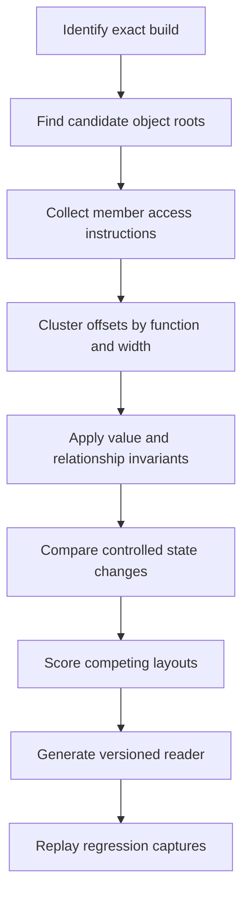

## Prerequisites

You should understand C++ object layouts, vtables, member offsets, container
headers, pointer chains, x86-64 addressing modes, and build fingerprints.

## An offset is a versioned hypothesis

If one build reads health from `[rcx+0x138]`, the durable fact is not merely
`0x138`. The stronger statement is:

> In this exact build, a method receiving the candidate player object in `rcx`
> repeatedly reads a four-byte value at offset `0x138`; the value follows
> controlled health changes and satisfies the observed health invariants.

The target invariant is:

> A layout is accepted only for the build and object identity supported by its
> evidence, and every field read is bounded and semantically validated.

## Recover a layout from independent evidence



Do not let one memory scan decide the structure. Combine static access
patterns, runtime value transitions, object identity, and relationships among
fields.

## Build an offset evidence table

Suppose several methods access one candidate object:

| Offset | Width | Access pattern | Runtime observation | Candidate meaning |
|---:|---:|---|---|---|
| `0x08` | 8 | indirect call through loaded pointer | points into read-only module data whose entries point into executable code | vtable pointer |
| `0x30` | 12 | three adjacent float loads | changes with movement | position vector |
| `0x48` | 4 | float compare against zero | changes with view rotation | yaw or pitch candidate |
| `0x138` | 4 | subtract, clamp, store | follows damage and healing | health candidate |
| `0x13C` | 4 | upper bound for previous field | stable per entity class | max-health candidate |

The relationship `0 <= health <= max_health` is stronger than “both numbers
look reasonable.” Adjacent fields and shared access paths create structural
evidence.

## Distinguish identity from shape

Two objects can have similar bytes but different roles. Validate identity with
several signals:

- vtable pointer falls inside the module's expected read-only data section, and
  several entries reached through it fall inside executable code;
- entity ID matches the manager entry used to reach the object;
- generation changes when the slot is reused;
- position is finite and within broad world bounds;
- health relationships hold;
- repeated methods use the same object pointer.

A **shape check** says bytes resemble a player. An **identity check** says this
is the player object reached through the expected ownership path in this
snapshot.

## Represent uncertainty in the recovered type

```rust
#[derive(Debug, Clone, Copy)]
struct LayoutV42 {
    position: usize,
    health: usize,
    max_health: usize,
    entity_id: usize,
    generation: usize,
}

#[derive(Debug, Clone, Copy, PartialEq, Eq)]
enum Confidence {
    Candidate,
    Repeated,
    CrossValidated,
}
```

Keep evidence and confidence beside the numeric offsets in generated metadata.
Do not turn a candidate into a field merely because a name is convenient.

## Migrate after an update by matching behavior

When a new build moves fields:

1. fingerprint the new executable and symbols that remain available;
2. locate the same behavioral function through call relationships or a
   carefully versioned pattern;
3. collect member accesses again instead of adding a constant to every offset;
4. replay the same controlled game transitions;
5. rebuild the evidence table;
6. compare field relationships, not just individual values;
7. create a new layout record and keep the old record immutable;
8. run captured-snapshot regression tests for both builds.

Step 3 deserves emphasis, because the tempting shortcut is to diff two known
offsets and add that difference to all the others. Layouts do not move like
that. A field inserted in the middle shifts everything after it and nothing
before it, and alignment can absorb part of the shift:

```text
field         build 41    build 42    moved by
position      0x30        0x30        0
yaw           0x48        0x48        0
team          --          0x50        (newly added)
health        0x138       0x140       +8
max_health    0x13C       0x144       +8
entity_id     0x150       0x158       +8
```

Nothing here moved by one constant. Three fields did not move at all, one
appeared, and the rest shifted by the size of the insertion. A tool that added
`+8` everywhere would read `position` eight bytes into the wrong place and
report numbers that still look like perfectly plausible coordinates.

Compiler optimization can split, inline, reorder, or eliminate accesses. A
missing old pattern does not prove the underlying concept disappeared.

## Reject partial reads and impossible layouts

A reader should validate the whole requested field range before interpreting
bytes. Use checked addition for `base + offset`, enforce maximum object size,
and reject unreadable page crossings. Decode into local values; do not create a
reference whose lifetime pretends remote bytes belong to the current process.

Validation should reject:

- non-finite vectors;
- `health > max_health` when the game model forbids it;
- a vtable pointer outside expected read-only module data, or initial entries
  that do not point into an expected executable code section;
- duplicate live entity IDs in one snapshot;
- generation changes during a multi-field read;
- an unsupported build rather than falling back to the nearest known layout.

## Score evidence without hiding it

A score helps rank candidates but does not replace the underlying facts:

| Evidence | Example weight |
|---|---:|
| Controlled health transition matched | +4 |
| Damage function stores at offset | +3 |
| Range relation with max health holds | +2 |
| Offset merely contains a plausible number | +1 |
| Generation changed during read | reject |
| Build identity unknown | reject |

Record the contributing observations so a high score can be audited.

## Glossary terms introduced here

- **Layout:** the byte positions and interpretation of fields in an object.
- **Shape check:** validation that bytes have a plausible structure.
- **Identity check:** validation that the object is the intended instance.
- **Generation:** a counter distinguishing reuse of the same storage slot.
- **Cross-validation:** supporting a claim with independent forms of evidence.
- **Build fingerprint:** stable data used to identify one exact binary version.

## Checkpoint

You should now be able to reconstruct an object from access patterns and field
relationships, carry uncertainty explicitly, and migrate to a new build by
repeating evidence rather than guessing how far old offsets moved.
