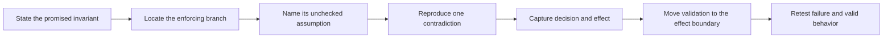

## Prerequisites

You should understand invariants, canonical state, checksums, decision
telemetry, environment signals, and regression tests. Each example is a small
state model that keeps the important relationship visible in one screenful.

## Use one rigorous analysis recipe every time

Each experiment follows the same sequence:



## Recipe 1: a client-visible flag guards an engine effect

### Minimal control and promised invariant

The UI has an “award bonus” button. A weak implementation treats the button’s
`ui_button_unlocked` flag as permission to change the score:

```rust
pub fn weak_award(&mut self, amount: u32) -> DecisionEvent {
    if !self.ui_button_unlocked {
        return DecisionEvent {
            operation: "award_bonus",
            allowed: false,
            reason: DecisionReason::UiFlagMissing,
        };
    }

    self.bonus = self.bonus.saturating_add(amount);
    DecisionEvent {
        operation: "award_bonus",
        allowed: true,
        reason: DecisionReason::Allowed,
    }
}
```

The promised invariant is: bonus changes only when the engine policy permits
an award and the result stays within the configured maximum.

### Why it fails

Presentation state answers “should the button look available?” It does not
answer “may the simulation perform this effect?” Multiple inputs, scripts, and
restored UI state can reach the same engine operation. The weak control places
authority in a copy used for presentation.

### Minimal reproduction

The example changes only the presentation flag before calling the weak path:

```rust
let mut game = BonusGame::new(false, 100);
game.set_ui_button_for_example(true);

let event = game.weak_award(25);
assert!(event.allowed);
assert_eq!(game.bonus(), 25); // contradiction: engine policy was false
```

The contradiction is the evidence: `allowed = true` and `bonus = 25` while
the engine-owned policy is false.

### Repair and telemetry

The repaired method ignores presentation state at the effect boundary. It
checks the engine policy, uses checked addition, enforces the maximum, and
emits one of `EnginePolicyDenied`, `ValueOutOfRange`, or `Allowed`.

The regression test keeps the UI flag true and proves the repaired method
denies the operation without changing bonus. A second test proves a valid
engine policy still permits a bounded award.

## Recipe 2: a checksum covers only the convenient field

### Minimal control and promised invariant

`StatsRecord` contains player ID, health, maximum health, generation, and a
checksum. The weak checksum covers only health:

```rust
const fn weak_checksum(health: u16) -> u32 {
    u32::from(health).wrapping_mul(31)
}
```

The promised invariant is: the identity and generation match the same record,
the health range is valid, and every field used by that relation is covered.

### Why it fails

The checksum answers only, “Did the health field change?” Changing
`maximum_health` can make the relation impossible while the stored weak
checksum still matches.

### Minimal reproduction

```rust
let mut stats = StatsRecord::new(7, 80, 100, 3);
stats.change_maximum_without_retagging_for_example(60);

assert!(stats.weakly_valid());       // weak relation misses the change
assert!(!stats.completely_valid());  // full relation also checks 80 <= 60
```

This is a **coverage bypass** inside the small record: the mutation falls outside
the measured bytes but changes the meaning of the protected state.

### Repair and telemetry

The repaired relation covers player ID, health, maximum health, and generation,
then separately checks `health <= maximum_health`. Emit a specific failure such
as `ChecksumMismatch` or `OutOfRange`; do not compress every failure into one
boolean in production code.

The regression suite mutates every covered field individually and asserts that
the complete relation fails. It also keeps a valid record to prove verification
is not permanently closed.

This checksum detects example-data corruption; it is not authentication. If the
system needs to defend against a party who can recompute an unkeyed checksum,
the design needs an authenticated owner and key lifecycle, not a more obscure
formula.

## Recipe 3: one environment signal substitutes for command validation

### Minimal control and promised invariant

The weak game refuses `set_health` only when one observer flag is present. When
the signal is absent, it accepts any number:

```rust
pub const fn weak_set_health(
    &mut self,
    value: u16,
    signal: EnvironmentSignal,
) -> DecisionEvent {
    if matches!(signal, EnvironmentSignal::ObserverFlagged) {
        return DecisionEvent {
            operation: "set_health",
            allowed: false,
            reason: DecisionReason::ObserverSignalRecorded,
        };
    }

    self.health = value;
    DecisionEvent {
        operation: "set_health",
        allowed: true,
        reason: DecisionReason::Allowed,
    }
}
```

The promised invariant is `health <= maximum_health` after every accepted
command.

### Why it fails

The flag describes the environment, not the command. Even a perfectly measured
observer signal cannot prove that an unrelated health value is in range. The
weak rule therefore has a large ordinary path where invalid data is accepted.

### Minimal reproduction

```rust
let mut game = HealthGame::new(80, 100);
let event = game.weak_set_health(500, EnvironmentSignal::Ordinary);

assert!(event.allowed);
assert_eq!(game.health(), 500); // contradiction: maximum is 100
```

No signal is hidden or modified. The example simply demonstrates that absence
of one signal says nothing about the validity of the requested state.

### Repair and telemetry

The repaired method creates two independent events:

1. an environment-observation event records whether the flag was present;
2. a command-decision event validates `value <= maximum_health`.

An observer flag can still help diagnose a run, but it neither grants nor
removes the health invariant. Tests cover all four combinations of ordinary or
flagged environment with valid or invalid values.

## Compare the three failures

| Recipe | Weak proxy | Real invariant | Correct boundary | Detection evidence |
|---|---|---|---|---|
| UI flag | Presentation state | Engine policy and bounded bonus | Award effect | Allowed event while policy is false |
| Partial checksum | One field | Whole identity/range relation | Record verification and consumer | Weak valid, complete invalid |
| Environment flag | One observer signal | Health range | Health command | Allowed event followed by out-of-range state |

All three mistakes confuse a proxy with the property that actually matters.
The repair is not “add more proxy checks.” It is to enforce the invariant where
the effect becomes real, then use proxy signals as supporting telemetry.

## Write a complete regression pair

Every repair needs two sides:

```text
negative test:
  reproduce old preconditions
  expect decision = denied with exact reason
  expect canonical state unchanged

positive test:
  provide valid preconditions
  expect decision = allowed
  expect exactly the intended state change
```

Also assert that a denial event is emitted. A silent refusal can preserve state
while leaving diagnosis and coverage testing blind.

## Glossary terms introduced here

- **Proxy:** an observable value used as indirect evidence for another
  property.
- **Coverage bypass:** a meaningful change outside the data examined by a
  control.
- **Effect boundary:** the shared point where a requested state change becomes
  canonical.
- **Negative regression test:** proves the previously failing case is refused.
- **Positive regression test:** proves valid behavior still works after repair.
- **Contradiction:** evidence that a control decision and resulting state cannot
  both satisfy the promised invariant.

## Checkpoint

You should now be able to reproduce each gap, explain the unchecked
assumption, capture the contradiction, move the invariant to the shared effect
boundary, and preserve both the failure case and valid behavior as tests.
