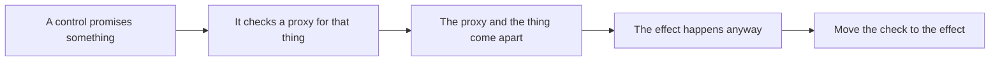

## Prerequisites

Lesson 13.8 covered three bypass patterns: a client flag trusted as
permission, a checksum that covered only part of what it protected, and an
environment signal standing in for validation. This lesson adds eight more.

Every example lives in
[`bypass_patterns_lab.rs`]({{ site.baseurl }}/rust-labs/src/bin/bypass_patterns_lab.rs),
which uses no Windows APIs, no processes, no filesystem, and no network. The
"attacker" is a test function calling an intentionally bad policy. That keeps
the computer-science shape of each failure visible while keeping the code
useless as a recipe aimed at someone else's machine.

```powershell
cd rust-labs
cargo run --bin bypass_patterns_lab
cargo test --bin bypass_patterns_lab
```

## The shape every one of these shares



The interesting question is never "what was the trick?" It is always "what did
the control measure, and how did that stop matching what it promised?" Each
section below names the promise first, because a control with no stated promise
cannot be bypassed — only surprised.

## Pattern 4: arithmetic that wraps inside the bound check

**Promise:** a read never leaves the mapped region.

The check looks exhaustive:

```rust
offset + length <= region_size
```

On a 64-bit machine that sum is computed modulo 2^64. Choose an offset near the
top of the range and the addition wraps past zero into a small number:

```text
offset        = 0xFFFF_FFFF_FFFF_FFFC   (usize::MAX - 3)
length        = 16
offset + length wraps to 12
12 <= 4096  ->  the check says yes
```

Nothing overflowed *visibly*. In a release build there is no panic, no warning,
and the comparison is perfectly true. The read then starts at an address near
the top of the address space.

**The repair** is not a bigger integer. It is refusing to answer a question that
has no answer:

```rust
match offset.checked_add(length) {
    Some(end) => end <= region_size,
    None => false,
}
```

Better still, hand the question to the slice, which cannot be argued out of its
own length — `region.get(offset..end)` returns `None` for every range it does
not own. Prefer asking a value that knows the answer over recomputing the
answer yourself.

## Pattern 5: a prefix compared before the path is resolved

**Promise:** a mod can only open files under `assets/`.

```rust
request.starts_with("assets/")
```

The check reads the text the caller supplied, not the location that text names:

```text
"assets/../saves/profile.dat"   starts with "assets/"  ->  allowed
resolves to                     "saves/profile.dat"    ->  outside the root
```

This is the same mistake as the archive extraction in Lesson 9.5, and it is
worth seeing twice, because the two look nothing alike in code and are
identical in structure. Both compare a string against a rule that only the
resolved path can satisfy.

**The repair** is to resolve first and compare second. The lab's `resolve`
walks the segments, pops on `..`, and returns `None` the moment the path climbs
above its own root — because "this path escapes" is an answer the caller needs,
not an error to paper over.

## Pattern 6: an error treated as permission

**Promise:** an asset loads only when its hash matches the manifest.

```rust
verify(asset, actual_hash, manifest).unwrap_or(true)
```

`verify` returns `Result<bool, VerifyError>`, so there are three outcomes, not
two: matched, did not match, and could not tell. `unwrap_or(true)` folds the
third into the first.

Look at what that does to an attacker's job. Forging a file that hashes to the
expected value is hard. Making the manifest unreadable — deleting it, locking
it, truncating it — is trivial, and now produces the same result.

**The repair** is to fail closed and to keep the third outcome distinct:

```rust
Ok(true)  => Decision::allow(),
Ok(false) => Decision::deny(Reason::HashMismatch),
Err(_)    => Decision::deny(Reason::VerificationUnavailable),
```

Those two denials need different responses from a human. One means the file
changed. The other means your verification is broken, which is a bigger
problem, and collapsing them into one boolean throws that distinction away.

## Pattern 7: a second route to the same effect

**Promise:** no byte changes while writes are disabled.

`apply_patch` checks the policy and then writes. Months later somebody adds a
batch helper, because calling `apply_patch` in a loop felt wasteful:

```rust
pub fn weak_apply_batch(&mut self, patches: &[(usize, u8)]) {
    for &(address, value) in patches {
        self.write(address, value);   // the private writer, directly
    }
}
```

The guard was never removed or weakened. It was simply routed around. Worse,
the batch path records no decisions at all, so the audit log shows nothing
happened while the bytes changed.

**The repair** is structural rather than additional. Do not add a second copy of
the check to the batch helper; make the batch helper call the guarded entry
point. One way in means one place to be correct:

```rust
patches.iter().map(|&(a, v)| self.apply_patch(a, v)).collect()
```

When you review a control, count the routes to the effect before reading the
check. A guard on three of four paths is not a guard.

## Pattern 8: a valid command accepted twice

**Promise:** each award is applied once.

The integrity tag verifies. The amount is within bounds. The command is
genuinely well-formed — and submitting it four times pays out four times:

```text
weak_award(generation 1, amount 50) x4   ->  balance 200
```

A tag proves the bytes were not edited. It says nothing about whether they were
already used. Freshness and integrity are separate properties, and a check for
one is silently assumed to cover the other far too often.

**The repair** binds each command to a position in a sequence and refuses any
position at or behind the last one applied:

```rust
if command.generation <= self.last_generation {
    return Decision::deny(Reason::StaleGeneration);
}
```

Note what this costs: the receiver now has to remember something. Every
anti-replay design pays that price somewhere — a counter, a window of recent
identifiers, a timestamp with a bounded skew. A design that claims to stop
replay while remaining completely stateless has not stopped replay.

## Pattern 9: a decision cached past the state it described

**Promise:** turning writes off stops the tool from writing.

```rust
let allowed = *self.cached_allowed.get_or_insert(self.writes_allowed);
```

The first call stores the answer; every later call reuses it. Turn writes off
afterwards and the tool keeps writing, because it is still answering a question
asked at start-up.

This is a cousin of the check/use gap from Lesson 11.4, with one instructive
difference: nothing raced. There is no unlucky timing to reproduce and no
second thread involved. The answer simply outlived the input it was computed
from. Single-threaded code can have this bug, which is why "we are
single-threaded" is not a reason to skip the review.

**The repair** is to re-read the setting where the write happens. A cache is
only safe when something invalidates it, and nothing here does.

## Pattern 10: a per-tick tolerance that accumulates

**Promise:** a player cannot move faster than the movement rule allows.

Every movement check needs slack for jitter and rounding, so the rule allows a
few centimetres over the maximum per tick. Each tick is judged alone, and each
tick is genuinely fine:

```text
max step        400 cm
tolerance         5 cm
step taken      405 cm    ->  allowed, every single time

over 600 ticks: 600 x 5 = 3,000 cm of free distance
```

Thirty metres, and no individual check was ever wrong. This is the pattern that
most resembles real anti-cheat tuning, because the tolerance is not a mistake —
remove it and honest players trip the rule constantly.

**The repair** keeps the per-tick tolerance and adds a budget across a window:

```rust
let excess = (step_cm - MAX_STEP_CM).max(0);
if self.spent_cm + excess > WINDOW_BUDGET_CM {
    return Decision::deny(Reason::BudgetExhausted);
}
```

Now jitter that averages out costs nothing, because a step under the maximum
spends zero budget. A steady lean in one direction runs out after twelve ticks.
The lab test asserts both halves of that claim, which is the point: a tolerance
rule needs a test proving it still accepts ordinary play, or the next person
will quietly widen it until it does.

## Pattern 11: a batch that fails halfway and keeps what it did

**Promise:** a rejected mod list changes nothing.

```rust
for &change in changes {
    if !item_is_valid(change) { return Decision::deny(Reason::ItemInvalid); }
    slots[change.slot] = change.value;
}
```

The refusal is honest. The state is still wrong:

```text
changes: [ {slot 0, value 7},  {slot 9, value 3} ]
result:  Denied(ItemInvalid),  slots = [7, 0, 0, 0]
```

Slot 0 was written before slot 9 was rejected. A caller that reads "denied" and
assumes nothing happened is now working from a state nobody intended, and the
half-applied change is exactly the sort of thing that survives a restart.

**The repair** is two phases: validate every item, then apply every item.
Nothing is written until the whole request is known to be acceptable, so a
denial genuinely means no change. When the effect cannot be made atomic, the
alternative is an explicit rollback path — never a comment saying callers
should re-check.

## Compare all eight

| Pattern | What was checked | What actually mattered | Where the repair belongs |
|---|---|---|---|
| Wrapping bound | a sum that wrapped | whether the range exists | the slice that owns the bytes |
| Path prefix | the requested text | the resolved location | after resolution |
| Fail-open | two outcomes | three outcomes | the error branch |
| Second route | one entry point | every route to the effect | the single choke point |
| Replay | integrity | integrity and freshness | a sequence the receiver remembers |
| Cached decision | state at start-up | state at the effect | the write itself |
| Tolerance drift | one tick | accumulated excess | a budget over a window |
| Partial batch | each item in turn | the request as a unit | validate-then-apply |

Read the middle two columns together. In every row the control measured
something true, and something true was not the same as the thing promised.
That gap is the whole subject.

## Turn a bypass claim into a research question

When you meet an evasion claim in the wild, the useful response is not to run
it. It is to work out which row of that table it belongs to:

| Question | Where the answer comes from |
|---|---|
| What did the control promise? | documentation, or the check's own comment |
| What does it actually measure? | the code at the branch |
| How can the two come apart? | the pattern table above |
| What evidence proves the gap? | a decision that contradicts the promise |
| Where does the invariant belong? | the shared point where the effect becomes real |
| What test keeps it fixed? | one negative case and one positive case |

The last row is the one people skip. A repair with only a negative test tends
to be over-tightened until ordinary behavior breaks; a repair with only a
positive test tends to drift back. Both, or it will not hold.

## Glossary terms introduced here

- **Fail-open:** treating an inconclusive check as permission.
- **Choke point:** the single place every route to an effect must pass through.
- **Freshness:** evidence that a message has not been used before, which
  integrity alone does not provide.
- **Tolerance budget:** an allowance spent across a window rather than granted
  per event.
- **Two-phase apply:** validating an entire request before performing any part
  of it.
