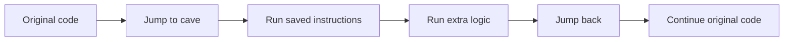

## The problem with replacing code

Replacing an instruction with `nop` is useful for one quick test, but it can only remove behavior. What if we want to observe values, add a check, or run several instructions?

A **code cave** is a spare executable area used for extra code. A **detour** redirects execution there and then returns.



## The five pieces

A responsible detour has:

1. **hook site** — the instructions being replaced;
2. **saved bytes** — an exact copy of those original instructions;
3. **cave** — memory where the new code can execute;
4. **extra logic** — the observation or change;
5. **return address** — the first untouched instruction after the hook.

If any one is wrong, the game may crash or behave strangely.

## Instructions are not all the same size

On x86, one instruction may be 1 byte and another may be 7 bytes. A typical near jump needs 5 bytes. You must replace **whole instructions** until you have enough room.

```text
bad:  copy exactly 5 bytes, cutting an instruction in half
good: copy whole instructions whose combined size is at least 5 bytes
```

The return address is the hook address plus the total number of whole bytes replaced.

## A skeleton

Conceptually, a cave can look like:

```nasm
; registers/flags are saved only if our added code changes them

; replay complete instructions removed from the hook site
mov eax, [rcx+30]

; extra lab logic
; ...

jmp return_address
```

There is no universal “save every register” rule. First learn what the original code expects. Save only what your inserted logic would otherwise clobber, and keep the calling convention in mind.

## Why Rust does not remove assembly

Rust is our main language, but a detour begins and ends at machine-code boundaries. Rust can:

- allocate and own buffers;
- calculate and verify addresses;
- decode instructions with a library;
- build a patch plan;
- restore original bytes automatically;
- expose a small safe API.

The final jump bytes and an in-process hook may still require `unsafe` code or assembly. We isolate that part:

```rust
struct Patch {
    address: usize,
    original: Vec<u8>,
    replacement: Vec<u8>,
}

impl Patch {
    fn is_compatible_with(&self, found: &[u8]) -> bool {
        found == self.original
    }
}
```

Before writing, compare the bytes in memory with `original`. If they differ, stop. The target may be a different version or another tool may already have changed it.

## Restore is part of the design

A patch is not complete until it has a cleanup path. Plan restoration before applying the detour:

- store the exact original bytes;
- restore them when the feature is disabled;
- restore them when the tool exits normally;
- make repeated enable/disable operations safe.

This habit will shape the Rust wrappers we build later.
