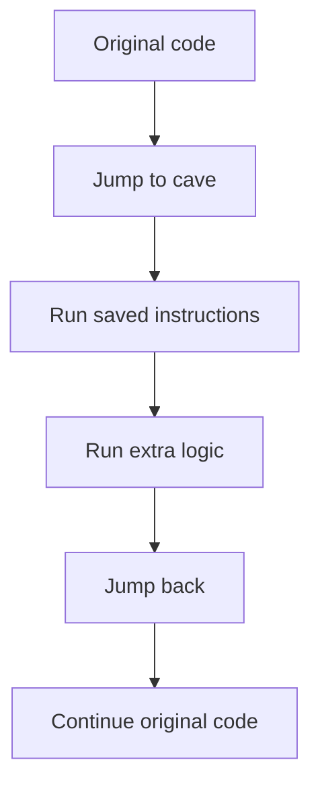

## The problem with replacing code

Replacing an instruction with `nop` is useful for one quick test, but it can only remove behavior. What if we want to observe values, add a check, or run several instructions?

A **code cave** is a spare executable area used for extra code. A **detour** redirects execution there and then returns.



## The five pieces

A responsible detour has:

1. **hook site** — the instructions being replaced;
2. **saved bytes** — an exact copy of those original instructions;
3. **cave** — memory where the new code can execute;
4. **extra logic** — the observation or change;
5. **return address** — the first untouched instruction after the hook.

If any one is wrong, the game may crash or behave strangely.

## Instructions are not all the same size

On x86, one instruction may be 1 byte and another may be 7 bytes. A typical near jump needs 5 bytes. You must replace **whole instructions** until you have enough room.

```text
bad:  copy exactly 5 bytes, cutting an instruction in half
good: copy whole instructions whose combined size is at least 5 bytes
```

The return address is the hook address plus the total number of whole bytes replaced.

## Implement the real Wesnoth code cave in Rust

Now we will hijack a real piece of code in **Wesnoth 1.14.9, 32-bit
Windows**, the same authorized target used by the original guide. The Terrain
Description menu reaches this instruction span:

```text
hook address:    0x00CC_AF8A
original bytes:  8B 01 8D 74 26 00
resume address:  0x00CC_AF90
visible change:  set the current side's gold to 888
```

The first two original bytes mean `mov eax,[ecx]`. The remaining four form a
do-nothing `lea` used for alignment. Together they occupy six bytes—enough for
our five-byte near jump and one `nop`.

This is the actual cave from the build-checked Windows project:

```rust
use std::ptr;
use anyhow::{Context, Result};
use gha_windows_labs::{LocalPatch, near_jump};

const PLAYER_ROOT: usize = 0x017E_ED18;
const GAME_OFFSET: usize = 0x0A90;
const GOLD_OFFSET: usize = 0x0004;

const HOOK: usize = 0x00CC_AF8A;
const RESUME: usize = 0x00CC_AF90;
const ORIGINAL: [u8; 6] = [0x8B, 0x01, 0x8D, 0x74, 0x26, 0x00];

/// Follow Wesnoth's real pointer path and change the live gold field.
///
/// # Safety
/// Run only inside the documented 32-bit Wesnoth build with a local match open.
unsafe fn set_gold(amount: u32) -> Result<()> {
    // SAFETY: the supported-game profile identifies this pointer root.
    let player = unsafe { ptr::read_volatile(PLAYER_ROOT as *const u32) } as usize;
    anyhow::ensure!(player != 0, "start a local match first");

    let side_pointer_address = player
        .checked_add(GAME_OFFSET)
        .context("side-pointer address overflowed")?;
    // SAFETY: the verified player record stores a 32-bit side pointer here.
    let side = unsafe {
        ptr::read_volatile(side_pointer_address as *const u32)
    } as usize;
    anyhow::ensure!(side != 0, "current side pointer is null");

    let gold_address = side
        .checked_add(GOLD_OFFSET)
        .context("gold address overflowed")?;
    // SAFETY: the current side record stores its four-byte gold value at +4.
    unsafe { ptr::write_volatile(gold_address as *mut u32, amount) };
    Ok(())
}

extern "C" fn cave_body() {
    // A naked assembly function cannot return Result. A missing match simply
    // leaves gold unchanged; startup already verified the game executable.
    let _ = unsafe { set_gold(888) };
}

#[cfg(target_arch = "x86")]
#[unsafe(naked)]
unsafe extern "C" fn terrain_cave() {
    core::arch::naked_asm!(
        // Save the flags and eight general-purpose 32-bit registers.
        "pushfd",
        "pushad",

        // Rust performs the pointer checks and gold write.
        "call {body}",

        // Put the interrupted thread back exactly as we found it.
        "popad",
        "popfd",

        // Replay the behavior of all instructions replaced at the hook.
        "mov eax, dword ptr [ecx]",
        "lea esi, [esi]",

        // Continue at the first untouched Wesnoth instruction.
        "jmp {resume}",
        body = sym cave_body,
        resume = const RESUME,
    );
}

#[cfg(target_arch = "x86")]
fn install_terrain_hook() -> Result<LocalPatch> {
    let cave_address = terrain_cave as *const () as usize;
    let jump = near_jump(HOOK, cave_address)?;

    let mut detour = [0x90_u8; 6];
    detour[..5].copy_from_slice(&jump); // E9 plus signed rel32

    // LocalPatch refuses a different build, makes the code page writable,
    // writes all six bytes, flushes the instruction cache, restores the page
    // protection, and owns ORIGINAL so Drop can restore it later.
    LocalPatch::apply(HOOK, &ORIGINAL, &detour)
}
```

Here is the important difference between “the address worked once” and a hook
whose assumptions are visible:

```diff
- let side = *(player.add(GAME_OFFSET) as *const u32) as usize;
- *((side + GOLD_OFFSET) as *mut u32) = 888;
+ let side_pointer_address = player.checked_add(GAME_OFFSET)
+     .context("side-pointer address overflowed")?;
+ let side = ptr::read_volatile(side_pointer_address as *const u32) as usize;
+ anyhow::ensure!(side != 0, "current side pointer is null");
+ let gold_address = side.checked_add(GOLD_OFFSET)
+     .context("gold address overflowed")?;
+ ptr::write_volatile(gold_address as *mut u32, 888);
```

> **Why this version?** `checked_add` prevents a bad pointer plus offset from
> wrapping around to a believable low address. The null check turns “no active
> side” into an ordinary error. Volatile access tells the compiler that this
> memory can change outside normal Rust code, but it does **not** make an invalid
> pointer safe. That is why the build check, pointer path, and narrow `unsafe`
> boundary are still required. `LocalPatch` then owns the separate responsibility
> of restoring the original instructions.
{: .block-why }

This is not pseudocode. The complete definitions of [`LocalPatch` and
`near_jump`](/windows-labs/src/windows_impl/local_patch.rs), including
`VirtualProtect`, `FlushInstructionCache`, and automatic restoration, are part
of the project. The exact cave above lives in [`game_hooks.rs`](/windows-labs/src/windows_impl/game_hooks.rs).

Build it as 32-bit because the naked function uses x86 registers and the target
stores four-byte pointers:

```powershell
cd windows-labs
cargo build --release --target i686-pc-windows-msvc
```

Inject the resulting DLL with the course injector:

```powershell
.\target\i686-pc-windows-msvc\release\injector.exe `
  wesnoth.exe `
  .\target\i686-pc-windows-msvc\release\gha_windows_labs.dll
```

Press **F1** to install the cave. Right-click a tile and choose **Terrain
Description**. Gold becomes `888` before the description is shown. Press **F1**
again to restore all six original bytes; repeat the menu action and gold should
stay unchanged. Press **End** to stop the worker and restore any remaining
patch.

## What “hijacking” means here

The CPU was about to fetch the byte `0x8B` at `0x00CCAF8A`. We replace that
six-byte region with:

```text
E9 ?? ?? ?? ?? 90
│  └─ signed distance from the end of this jump to terrain_cave
└──── x86 near-jump opcode
               └─ one-byte padding because the original span was six bytes
```

The CPU therefore goes to our DLL instead. Our cave borrows control, preserves
the interrupted computation, changes gold, performs the behavior we removed,
and gives control back at `0x00CCAF90`. The original function never returns to
the hook address, so there is no loop.

This is a tiny example of **control-flow redirection**, a computer-science idea
used by debuggers, profilers, hot-patching systems, instrumentation tools, and
game hooks.

There is no universal “save every register” rule. `pushfd`/`pushad` is easy to
understand for this small 32-bit teaching cave. In a performance-sensitive
hook, inspect which values are live and preserve exactly what the inserted code
may change. The stack must also be balanced: every `push` needs a matching
`pop`, and the called function's convention must agree with the cave.

## Why Rust does not remove assembly

Rust is our main language, but a detour begins and ends at machine-code boundaries. Rust can:

- allocate and own buffers;
- calculate and verify addresses;
- decode instructions with a library;
- build a patch plan;
- restore original bytes automatically;
- expose a small safe API.

The final jump bytes and an in-process hook still require `unsafe` code and a
small amount of assembly. Rust manages the larger, error-prone lifecycle:

```rust
struct Patch {
    address: usize,
    original: Vec<u8>,
    replacement: Vec<u8>,
}

impl Patch {
    fn is_compatible_with(&self, found: &[u8]) -> bool {
        found == self.original
    }
}
```

Before writing, compare the bytes in memory with `original`. If they differ, stop. The target may be a different version or another tool may already have changed it.

## Restore is part of the design

A patch is not complete until it has a cleanup path. Plan restoration before applying the detour:

- store the exact original bytes;
- restore them when the feature is disabled;
- restore them when the tool exits normally;
- make repeated enable/disable operations safe.

This habit will shape the Rust wrappers we build later.

The key distinction is not “Rust versus assembly.” Rust owns the patch,
validates the target, reports failures, and restores state. Assembly describes
the few CPU instructions that must run at the exact hijacked boundary.
