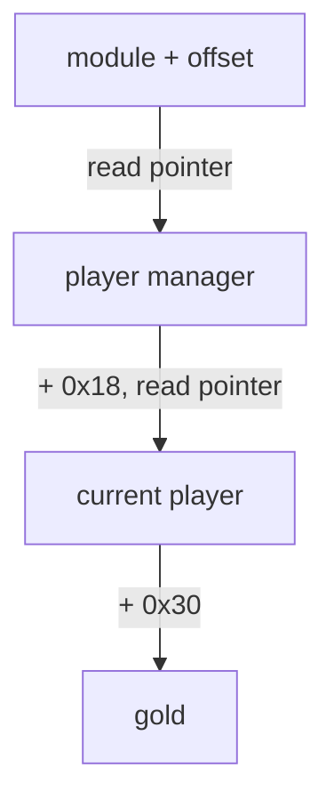

## The disappearing-address problem

You find gold at `0x1234_5678`, restart the game, and the address is different. Nothing is broken. The address was never a permanent identity.

Two common reasons are:

- **dynamic allocation** — the game asks for memory while it runs;
- **ASLR** — Windows loads modules at different base addresses between runs.

Virtual addresses belong to one process. The same numeric address in two different processes can name completely different physical memory, and a freed address can later be reused for another allocation in the same process.

Use a **location, identity, lifetime** model:

- a location is the virtual address used for this access;
- an identity is the game object or field you believe lives there;
- a lifetime is the interval during which that mapping remains valid.

An address proves only the first item. Behavior, object relationships, and repeated
access patterns support the identity. Allocation and game events determine the
lifetime. A reusable tool must rediscover or validate the location instead of
treating yesterday's address as permanent identity.

## Relative locations

Although a module base can move, the distance from the base to a specific item is often stable for one exact build:

```text
module base + relative offset = current address
```

If `wesnoth.exe` loads at `0x1400_0000` and a global pointer is at offset `0x01A2_B3C0`, the current address is:

```text
0x1400_0000 + 0x01A2_B3C0 = 0x15A2_B3C0
```

Rust’s `usize` is the integer type normally used for an address-sized number:

```rust
fn absolute_address(module_base: usize, offset: usize) -> Option<usize> {
    module_base.checked_add(offset)
}
```

`checked_add` returns `None` if the addition overflows instead of silently wrapping.

## Pointer chains

A stable module location may hold a pointer to an object, which holds a pointer to another object, which contains gold:



Each arrow that says “read pointer” means:

1. calculate an address;
2. read a pointer-sized value from it;
3. treat the result as the next address.

The last step may be a field address rather than another pointer.

Pointer size follows the target architecture. A 32-bit process stores a pointer in four bytes; a 64-bit process normally uses eight. Reading eight bytes from a 32-bit pointer field consumes neighboring data, while reading four from a 64-bit pointer truncates the address. The reader must use the target’s bitness, not the host’s.

At every link, distinguish three different numbers:

- the address where a pointer is stored;
- the pointer value read from that address;
- the field offset added to that pointer value.

Writing the chain as numbered equations makes accidental double-dereferences visible.

## Pointer scans are hypotheses

Cheat Engine can search for pointer paths automatically:


A result is not automatically correct. Validate it across several clean restarts. Prefer paths that:

- begin inside a known module;
- use a short chain;
- work on the exact documented game version;
- end at the expected value;
- fail safely when a pointer is null or unreadable.

A pointer scan finds numeric relationships that existed in its snapshots. It does not prove ownership. Large offsets, very long chains, and links through short-lived allocations are more likely to be coincidences. Normal gameplay tests—opening menus, changing maps, loading a save—exercise those ownership assumptions.

## Rust’s safer shape

Do not scatter raw address math around a program. Give it a type:

```rust
#[derive(Clone, Copy, Debug)]
struct Address(usize);

impl Address {
    fn offset(self, amount: usize) -> Option<Self> {
        self.0.checked_add(amount).map(Self)
    }
}
```

This wrapper does not prove that an address is readable. It does stop us from accidentally mixing an address with an ordinary game value, and it gives one place for overflow checks.

The operating-system call that reads another process still belongs behind a carefully reviewed `unsafe` boundary. The rest of the pointer-chain algorithm can remain safe Rust.

## Walk a chain without losing the meaning

Use a function whose name says whether the final offset is dereferenced:

```rust
fn walk_to_field(
    process: &Process,
    module_base: usize,
    root_offset: usize,
    pointer_offsets: &[usize],
    field_offset: usize,
) -> anyhow::Result<usize> {
    let root = module_base.checked_add(root_offset)
        .context("root address overflowed")?;
    let mut object = process.read_pointer(root)?;

    for &offset in pointer_offsets {
        anyhow::ensure!(object != 0, "null object pointer");
        let link = object.checked_add(offset)
            .context("pointer-link address overflowed")?;
        object = process.read_pointer(link)?;
    }

    anyhow::ensure!(object != 0, "null final object pointer");
    object.checked_add(field_offset)
        .context("field address overflowed")
}
```

The final field address is returned without reading another pointer. Keeping that distinction in the function signature and variable names prevents the common “one dereference too many” mistake.

The change from loose arithmetic to a deliberate chain is easier to see as a
diff:

```diff
 fn read_gold(process: &Process, module_base: usize) -> anyhow::Result<u32> {
-    let gold = process.read_u32(module_base + root + a + b + field)?;
+    let root_address = module_base.checked_add(root_offset)
+        .context("root address overflowed")?;
+    let mut object = process.read_pointer(root_address)?;
+    object = process.read_pointer(object.checked_add(a)
+        .context("first link overflowed")?)?;
+    let field_address = object.checked_add(field_offset)
+        .context("field address overflowed")?;
+    let gold = process.read_u32(field_address)?;
     Ok(gold)
 }
```

> **Why this version?** Offsets describe different jobs. `root_offset` locates
> the first pointer, link offsets locate the next pointer, and `field_offset`
> locates data inside the final object. Naming those stages prevents addition
> from being mistaken for dereferencing. It also places an error at the exact
> link that failed instead of returning one mysterious “bad address” message.
{: .block-why }



{% include quiz.html
  id="pointer-chain-dereference"
  type="short-answer"
  title="Name the pointer action"
  prompt="What computer-science word means ‘read the address stored here, then follow it to the next object’?"
  answer="dereference"
  alternatives="dereferencing||pointer dereference"
  explanation="To dereference a pointer is to use the address it contains. In a pointer chain, link offsets usually lead to another pointer that must be dereferenced; the final field offset often leads directly to data and should not be followed again."
%}
