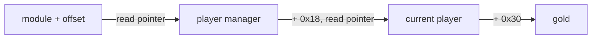

## The disappearing-address problem

You find gold at `0x1234_5678`, restart the game, and the address is different. Nothing is broken. The address was never a permanent identity.

Two common reasons are:

- **dynamic allocation** — the game asks for memory while it runs;
- **ASLR** — Windows loads modules at different base addresses between runs.

Imagine a hotel. The same guest can receive a different room number each visit. Searching for yesterday’s room number does not find the guest.

## Relative locations

Although a module base can move, the distance from the base to a specific item is often stable for one exact build:

```text
module base + relative offset = current address
```

If `wesnoth.exe` loads at `0x1400_0000` and a global pointer is at offset `0x01A2_B3C0`, the current address is:

```text
0x1400_0000 + 0x01A2_B3C0 = 0x15A2_B3C0
```

Rust’s `usize` is the integer type normally used for an address-sized number:

```rust
fn absolute_address(module_base: usize, offset: usize) -> Option<usize> {
    module_base.checked_add(offset)
}
```

`checked_add` returns `None` if the addition overflows instead of silently wrapping.

## Pointer chains

A stable module location may hold a pointer to an object, which holds a pointer to another object, which contains gold:



Each arrow that says “read pointer” means:

1. calculate an address;
2. read a pointer-sized value from it;
3. treat the result as the next address.

The last step may be a field address rather than another pointer.

## Pointer scans are hypotheses

Cheat Engine can search for pointer paths automatically:


A result is not automatically correct. Validate it across several clean restarts. Prefer paths that:

- begin inside a known module;
- use a short chain;
- work on the exact documented game version;
- end at the expected value;
- fail safely when a pointer is null or unreadable.

## Rust’s safer shape

Do not scatter raw address math around a program. Give it a type:

```rust
#[derive(Clone, Copy, Debug)]
struct Address(usize);

impl Address {
    fn offset(self, amount: usize) -> Option<Self> {
        self.0.checked_add(amount).map(Self)
    }
}
```

This wrapper does not prove that an address is readable. It does stop us from accidentally mixing an address with an ordinary game value, and it gives one place for overflow checks.

The operating-system call that reads another process still belongs behind a carefully reviewed `unsafe` boundary. The rest of the pointer-chain algorithm can remain safe Rust.
