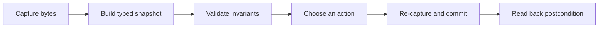

## Advanced means predictable 🧠

A beginner tool often grows as one long function:

```text
find process → read pointer → calculate address → write value → print success
```

That can work once, but every step depends on facts collected earlier. The game may restart, change maps, end a turn, replace an object, or update the value while the tool is still running.

A more reliable tool separates five phases:



The important idea is not extra code. It is that **data crosses a gate before it gains authority**. A raw address is only an observation. A validated `Snapshot` is evidence. A write is allowed only after fresh evidence still matches.

## Give one moment a type

This lesson records the entire Wesnoth pointer path, not only the final gold number:

```rust
#[derive(Clone, Copy, Debug, Eq, PartialEq)]
struct Snapshot {
    player: usize,
    side: usize,
    gold_address: usize,
    gold: u32,
}
```

Why keep all four fields?

- `player` changing means the root now reaches another object.
- `side` changing can mean the active faction or match state changed.
- `gold_address` is the exact destination a later action would touch.
- `gold` is the value the learner actually observed.

Equality now asks a useful question: “Did the whole chain and its value remain the same?” It is stronger than comparing only the final address.

## Two equal reads are useful, not magical

The tool captures twice and accepts the result only when both snapshots agree:

```rust
fn stable_snapshot(process: &Process) -> anyhow::Result<Snapshot> {
    for attempt in 1..=5 {
        let first = capture(process)?;
        let second = capture(process)?;
        if first == second {
            return Ok(first);
        }
        eprintln!("snapshot attempt {attempt} changed while it was being read; retrying");
    }
    anyhow::bail!("Wesnoth state did not stay stable for two consecutive captures")
}
```

This is a small **optimistic consistency check**. The tool does not stop the game. It assumes a short read will usually see a quiet moment, then checks that assumption.

⚠️ Two equal reads are not a mathematical proof that no intermediate state existed. They are a practical gate for a tiny offline lab. A debugger pause, a game-provided snapshot API, or a version counter is stronger when a larger structure must be perfectly atomic.

The retry cap matters too. A loop that waits forever for stability can make a broken tool look frozen.

## Capabilities follow the chosen action

The command has two modes:

```powershell
# Observation only: requests query + read access
snapshot_pipeline.exe

# Explicit local-lab change: also requests operation + write access
snapshot_pipeline.exe --set 888
```

The program decides whether it needs write rights **before** opening the process:

```rust
let process = Process::open_by_name("wesnoth.exe", replacement.is_some())?;
```

This is capability-oriented design in plain English: if the user asked only to look, the handle should be unable to write.

## Treat a write like a tiny transaction

The write path has three gates:

1. re-capture and require the same snapshot;
2. write exactly four little-endian bytes to the verified gold field;
3. read the field back and require the requested result.

```diff
 fn replace_gold(
     process: &Process,
     observed: Snapshot,
     replacement: u32,
 ) -> anyhow::Result<()> {
-    process.write_u32(old_address, replacement)?;
+    let current = stable_snapshot(process)?;
+    anyhow::ensure!(current == observed, "state changed; nothing was written");
+    process.write_u32(observed.gold_address, replacement)?;
+    let written = process.read_u32(observed.gold_address)?;
+    anyhow::ensure!(written == replacement, "write did not reach its postcondition");
     Ok(())
 }
```

This is not a database transaction: Windows cannot automatically roll back the game. It is a **guarded action** with a checked precondition and postcondition. That pattern also fits toggles, patches, save editors, configuration tools, and mod installers.

## Complete buildable tool

The code below is the complete binary used by the lesson.

<details class="lab-source" markdown="1">
<summary>Complete lab source: snapshot_pipeline.rs</summary>

```rust
#[cfg(windows)]
fn main() -> anyhow::Result<()> {
    use anyhow::Context;
    use gha_windows_labs::Process;

    const PLAYER_ROOT: usize = 0x017E_ED18;
    const GAME_OFFSET: usize = 0x0A90;
    const GOLD_OFFSET: usize = 0x0004;
    const MAX_GOLD: u32 = 1_000_000;

    #[derive(Clone, Copy, Debug, Eq, PartialEq)]
    struct Snapshot {
        player: usize,
        side: usize,
        gold_address: usize,
        gold: u32,
    }

    fn pointer32(process: &Process, address: usize, label: &str) -> anyhow::Result<usize> {
        // 📏 Pointer width belongs to the 32-bit game, not to the Rust tool.
        let value = process
            .read_u32(address)
            .with_context(|| format!("could not read {label} at {address:#010x}"))?
            as usize;
        anyhow::ensure!(value != 0, "{label} was null; start a local match first");
        Ok(value)
    }

    fn capture(process: &Process) -> anyhow::Result<Snapshot> {
        // 🧭 Resolve every address with checked arithmetic before reading it.
        let player = pointer32(process, PLAYER_ROOT, "player root")?;
        let side_pointer = player
            .checked_add(GAME_OFFSET)
            .context("player + game offset overflowed")?;
        let side = pointer32(process, side_pointer, "current side")?;
        let gold_address = side
            .checked_add(GOLD_OFFSET)
            .context("side + gold offset overflowed")?;
        let gold = process.read_u32(gold_address)?;

        Ok(Snapshot {
            player,
            side,
            gold_address,
            gold,
        })
    }

    fn stable_snapshot(process: &Process) -> anyhow::Result<Snapshot> {
        for attempt in 1..=5 {
            let first = capture(process)?;
            let second = capture(process)?;
            if first == second {
                return Ok(first);
            }
            eprintln!("snapshot attempt {attempt} changed while it was being read; retrying");
        }
        anyhow::bail!("Wesnoth state did not stay stable for two consecutive captures")
    }

    let mut arguments = std::env::args().skip(1);
    let replacement = match arguments.next().as_deref() {
        None => None,
        Some("--set") => Some(
            arguments
                .next()
                .context("--set requires a gold value")?
                .parse::<u32>()
                .context("gold must be an unsigned decimal number")?,
        ),
        Some(other) => anyhow::bail!("unknown argument {other:?}; use no argument or --set GOLD"),
    };
    anyhow::ensure!(arguments.next().is_none(), "too many arguments");
    if let Some(value) = replacement {
        anyhow::ensure!(
            value <= MAX_GOLD,
            "gold exceeds the lab limit of {MAX_GOLD}"
        );
    }

    // 🔒 Read-only mode never requests VM_WRITE or VM_OPERATION rights.
    let process = Process::open_by_name("wesnoth.exe", replacement.is_some())?;
    anyhow::ensure!(
        process.is_32_bit()?,
        "this profile requires 32-bit Wesnoth 1.14.9"
    );
    let observed = stable_snapshot(&process)?;

    println!("Stable Wesnoth snapshot:");
    println!("  player:      {:#010x}", observed.player);
    println!("  side:        {:#010x}", observed.side);
    println!("  gold address:{:#010x}", observed.gold_address);
    println!("  gold:        {}", observed.gold);

    if let Some(value) = replacement {
        // ⚠️ The game kept running after observation. Rebuild the whole pointer
        // path and require the exact same evidence immediately before writing.
        let current = stable_snapshot(&process)?;
        anyhow::ensure!(
            current == observed,
            "state changed after confirmation; nothing was written"
        );
        process.write_u32(observed.gold_address, value)?;

        // ✅ Read back the postcondition instead of assuming the write succeeded.
        let written = process.read_u32(observed.gold_address)?;
        anyhow::ensure!(
            written == value,
            "read-back value was {written}, expected {value}"
        );
        println!("Changed gold from {} to {written}.", observed.gold);
    } else {
        println!("Observation only. Run with `--set GOLD` for the guarded local-lab write.");
    }
    Ok(())
}

#[cfg(not(windows))]
fn main() {
    eprintln!("This live snapshot pipeline must run on Windows.");
}
```

</details>

The same source is available as [`snapshot_pipeline.rs`]({{ site.baseurl }}/windows-labs/src/bin/snapshot_pipeline.rs).

## Build and run against Wesnoth

Use the exact 32-bit Wesnoth 1.14.9 course build, start a disposable local match, and build the Windows binary:

```powershell
cd windows-labs
cargo build --release --target i686-pc-windows-msvc --bin snapshot_pipeline
.\target\i686-pc-windows-msvc\release\snapshot_pipeline.exe
```

Confirm that the printed address and value match Cheat Engine or x64dbg. Then perform one explicit change:

```powershell
.\target\i686-pc-windows-msvc\release\snapshot_pipeline.exe --set 888
```

The visible gold should become 888. End the match and run it again: the tool should report a null or unstable object instead of writing to address zero.

## Read failures as information

| Failure | What it means | Correct response |
|---|---|---|
| Player root is null | No supported local match is ready | Start the match; do not invent an address |
| Snapshot keeps changing | The observation is not stable enough | Stop after the retry cap |
| Architecture is not 32-bit | This profile does not describe the target | Refuse the run |
| State differs before write | Earlier evidence is stale | Write nothing and capture again |
| Read-back differs | The requested postcondition was not reached | Report failure; do not print success |

A trustworthy tool has more useful stop paths than force paths. 🛡️

## Extend the architecture

Once this pipeline is clear, try these controlled upgrades:

- add a target-profile name and executable hash to the snapshot;
- attach a timestamp and module base to each capture;
- replace two reads with a game-owned frame counter when one is known;
- make `Action::Observe` and `Action::SetGold(u32)` an enum;
- unit-test decision logic with fake snapshots, without opening a process.

Keep remote I/O at the edge. The middle of the program should compare normal Rust data.

{% include quiz.html
  id="advanced-snapshot-write-gate"
  type="multiple-choice"
  title="Choose the final write gate"
  prompt="The tool captured a valid gold address, but the second snapshot has a different side pointer. What should the advanced pipeline do?"
  options="Stop without writing because the object identity changed||Write to the old address because it was valid earlier||Search all writable memory for the old gold number||Ignore the pointer and compare only the PID"
  answer="0"
  explanation="A remote address has meaning only while the object path and target profile still support it. A changed side pointer invalidates the earlier destination, so the correct transaction outcome is no write."
%}

## Checkpoint

You are ready to continue when you can explain:

- why a snapshot contains identity as well as values;
- why double capture is a bounded consistency check rather than a lock;
- why observation mode opens a read-only handle;
- why precondition and postcondition checks surround the only write.
