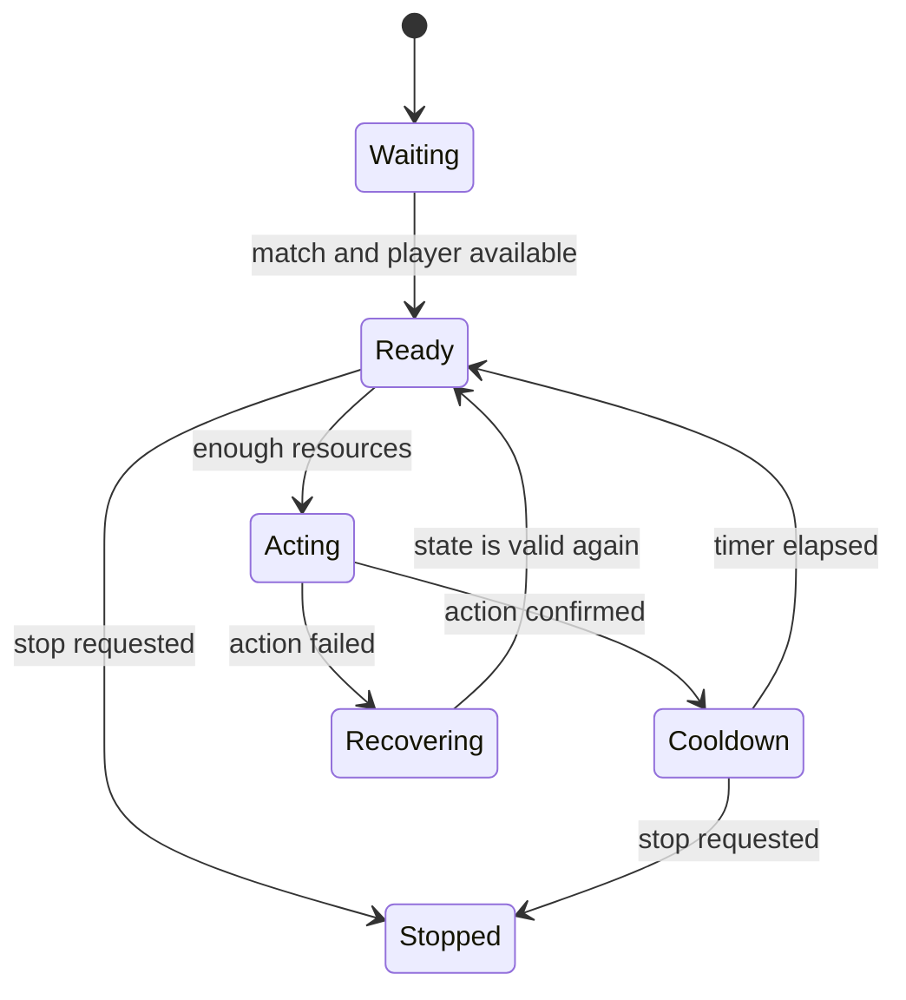

## A macro is not “press keys forever”

A reliable macro knows what state it is in, what evidence allows the next step, and when to stop.

For a local practice target, imagine this loop:



Every arrow has a reason. That is much easier to debug than nested `if` statements and sleeps.

## Find the action, then find its rules

The original lesson traced a unit-creation path:


Do not call an internal function based on one breakpoint. Record several normal calls and identify:

- required thread;
- argument meaning;
- object lifetimes;
- return or error signal;
- resource checks;
- cooldown or event requirements.

An action that works once under the debugger may fail when called at the wrong time.

## Model states with an enum

```rust
#[derive(Debug)]
enum MacroState {
    Waiting,
    Ready,
    Acting { attempt: u32 },
    Cooldown { ticks_left: u32 },
    Recovering { reason: String },
    Stopped,
}
```

Impossible combinations disappear. We cannot accidentally be both `Acting` and `Cooldown`.

## Keep observations separate

```rust
#[derive(Debug)]
struct GameSnapshot {
    match_active: bool,
    player_ready: bool,
    resources: u32,
    action_confirmed: bool,
}

fn next_state(state: MacroState, game: &GameSnapshot, stop: bool) -> MacroState {
    if stop {
        return MacroState::Stopped;
    }

    match state {
        MacroState::Waiting if game.match_active && game.player_ready => {
            MacroState::Ready
        }
        MacroState::Ready if game.resources >= 100 => {
            MacroState::Acting { attempt: 1 }
        }
        MacroState::Acting { .. } if game.action_confirmed => {
            MacroState::Cooldown { ticks_left: 5 }
        }
        MacroState::Cooldown { ticks_left: 0 } => MacroState::Ready,
        MacroState::Cooldown { ticks_left } => {
            MacroState::Cooldown { ticks_left: ticks_left - 1 }
        }
        current => current,
    }
}
```

This transition function is safe, deterministic, and easy to test without a game.

## Test the decision logic

```rust
#[test]
fn stops_from_any_active_state() {
    let snapshot = GameSnapshot {
        match_active: true,
        player_ready: true,
        resources: 500,
        action_confirmed: false,
    };

    assert!(matches!(
        next_state(MacroState::Ready, &snapshot, true),
        MacroState::Stopped
    ));
}
```

The low-level observation and action layers may be version-specific. The state machine should not be.

## Rate limits and stop behavior

Use a bounded tick rate, not a busy loop:

```rust
while !stop.load(std::sync::atomic::Ordering::Relaxed) {
    let snapshot = observer.snapshot()?;
    state = next_state(state, &snapshot, false);
    std::thread::sleep(std::time::Duration::from_millis(100));
}
```

Before unloading an in-process library, set the stop flag, wait for the worker to exit, and restore any temporary state.

## The real lesson

The useful skill is not a version-specific “spawn unit” address. It is turning a behavior into:

- observable inputs;
- named states;
- guarded transitions;
- a bounded action;
- a reliable stop path.

That pattern applies to test bots, accessibility helpers, replay tools, and ordinary game AI.
